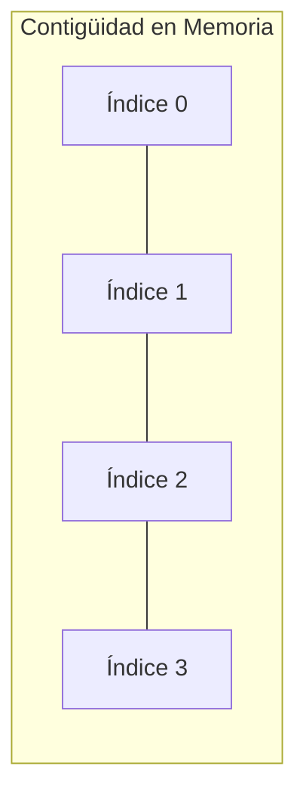
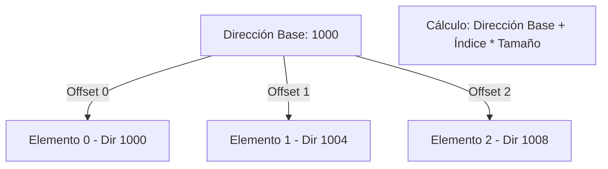
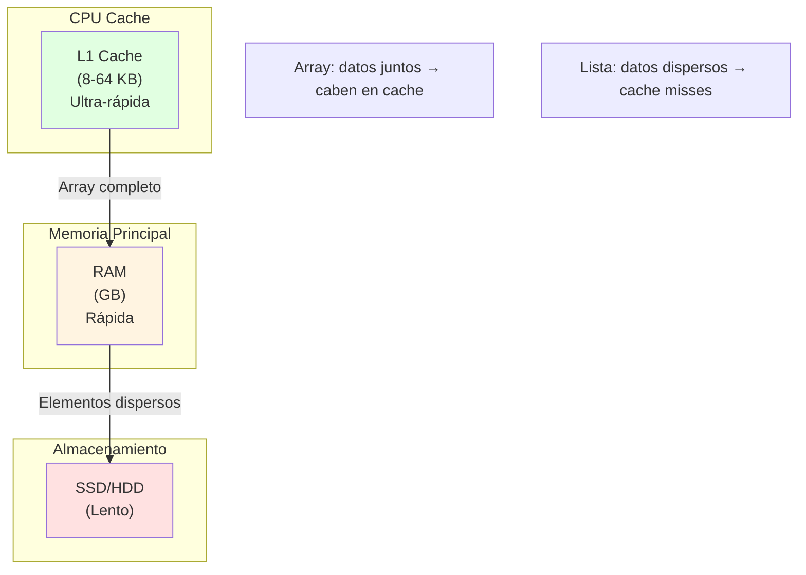

- [1. Arrays. Introducción](#1-arrays-introducción)
    - [1.1. Características Clave](#11-características-clave)
    - [1.2. El Problema de la Indexación (Índice Cero vs. Índice Uno)](#12-el-problema-de-la-indexación-índice-cero-vs-índice-uno)
      - [Indexación Basada en Cero](#indexación-basada-en-cero)
      - [Indexación Basada en Uno](#indexación-basada-en-uno)
    - [1.3. Arrays en DAW](#13-arrays-en-daw)
  - [1.4. El secreto de la velocidad: Localidad de Referencia](#14-el-secreto-de-la-velocidad-localidad-de-referencia)


# 1. Arrays. Introducción

Un array es una estructura de datos estática y fundamental que permite almacenar una colección ordenada de elementos del **mismo tipo**. Es una de las estructuras más antiguas y eficientes en informática para el acceso a datos.

### 1.1. Características Clave

1.  **Homogeneidad (Tipo Fijo):** Todos los elementos deben ser del mismo tipo de dato (por ejemplo, todos `int` o todos `string`).      
2.  **Tamaño Fijo (Inmutabilidad):** El tamaño de un array se establece en el momento de su creación y no puede ser alterado posteriormente. Si se necesita modificar el tamaño, la solución es crear un **nuevo array** con el tamaño deseado y **copiar** los elementos del original al nuevo.
3.  **Contigüidad en Memoria:** Los elementos de un array se almacenan en posiciones de memoria **contiguas** (una al lado de la otra). Esto es lo que permite su alta eficiencia.
4.  **Acceso por Índice:** El acceso a los elementos para lectura o escritura se realiza mediante su posición o **índice**, que siempre es un número entero.
5.  **Eficiencia:** El acceso a cualquier elemento es extremadamente rápido (tiempo constante, $O(1)$) porque su ubicación en memoria se calcula directamente.



>Si una variable es como un cajón de un tamaño del tipo de dato (es decir, el indentificador apunta a la zona de memoria donde se almacena el valor), un array puede verse como un conjunto de cajones (una cajonera) del mismo tamaño del tipo de dato, donde cada cajón tiene un índice que nos permite acceder a él. Por tanto, un array es una estructura de datos que nos permite almacenar un conjunto de datos del mismo tipo.

### 1.2. El Problema de la Indexación (Índice Cero vs. Índice Uno)

Unos de los principales problemas que nos encontramos al trabajar con arrays es la **indexación**, es decir, cómo se numeran las posiciones de los elementos dentro del array y cuál es la posición del primer elemento.

La convención sobre si el primer índice comienza en `0` (Cero-basado) o en `1` (Uno-basado) tiene implicaciones directas en el cálculo de la posición de memoria y es tan antigua como los propios lenguajes de programación.

#### Indexación Basada en Cero

El primer elemento se encuentra en el **índice 0**. Esta convención se basa en el cálculo directo de la dirección de memoria.

  * **Fundamento:** El índice representa el **desplazamiento** (*offset*) desde la dirección de inicio del array. El primer elemento no tiene desplazamiento, por lo que su índice es 0.



  * **Fórmula para calcular la dirección de memoria de un elemento $A[i]$:**
    La fórmula matemática se expresa en un formato de texto compatible con Markdown:

    ```
    Dirección(A[i]) = Dirección Base + (índice_i * Tamaño del Tipo)
    ```

    Donde:

      * `Dirección Base`: Es la dirección de memoria del primer elemento (índice 0).
      * `índice_i`: Es el índice del elemento buscado (ej. 0, 1, 2...).
      * `Tamaño del Tipo`: Es el número de bytes que ocupa el tipo de dato (ej. 4 bytes para `int`).

Este enfoque lo siguen lenguajes que han heredado esta filosofía de C, como C++, Java, JavaScript, Python, Kotlin, entre otros y nuestro lenguaje DAW.

#### Indexación Basada en Uno

En algunos lenguajes de programación o en contextos puramente matemáticos, el primer elemento se encuentra en el **índice 1**.

  * **Fundamento:** El índice representa la **posición ordinal** del elemento dentro de la colección, que es más intuitivo para el humano.

  * **Fórmula para calcular la dirección de memoria de un elemento $A[i]$:**
    Para compensar el índice `i` que empieza en 1, es necesario restarle 1 para obtener el desplazamiento correcto.

    ```
    Dirección(A[i]) = Dirección Base + ((índice_i - 1) * Tamaño del Tipo)
    ```

    Donde se resta **1** al índice (`índice_i`) para obtener el desplazamiento (offset) correcto respecto a la Dirección Base.

Este enfoque tiene el problema de que complica el cálculo de la dirección de memoria y puede llevar a errores si no se maneja con cuidado. Lenguajes como Fortran, MATLAB, Lua y algunos sistemas matemáticos utilizan esta convención o Visual Basic, Pascal, entre otros.       

### 1.3. Arrays en DAW

En el lenguaje DAW, la indexación es **Cero-basada**. Si se accede a un índice negativo o a un índice mayor o igual al tamaño del array, se producirá un error conocido como **`ArrayIndexOutOfBoundsException`** (Excepción de Índice Fuera de Límites del Array). Esto es una medida de seguridad para evitar accesos inválidos a memoria. Recuerda que un Array es como un conjunto de cajones, si intentas abrir un cajón que no existe, el sistema te avisará con una excepción para evitar que "metas la mano" en una zona de memoria que no te pertenece.    

**Uso Recomendado:** Los arrays son la mejor opción de almacenamiento cuando:
* Se conoce el **tamaño máximo de la colección** de antemano.
* Se requiere un **acceso muy rápido** a los elementos por su posición.
* No se requiere añadir o eliminar elementos con frecuencia, ya que esta operación es ineficiente (implica copiar el array).


## 1.4. El secreto de la velocidad: Localidad de Referencia
¿Por qué usamos arrays si son tan rígidos? Por el hardware. Al estar los datos pegados unos a otros en la memoria física, cuando el procesador lee el elemento `[0]`, el sistema aprovecha y carga también los siguientes en la **Memoria Caché**. Esto hace que recorrer un array sea órdenes de magnitud más rápido que saltar por posiciones de memoria dispersas.

> 📝 **Nota del Profesor:** La contigüidad en memoria es la razón por la que los arrays son tan rápidos para el acceso secuencial. Cuando iteras sobre un array, el procesador aprovecha la **prefetching**: anticipa qué datos necesitarás y los carga antes de que los pidas.

```csharp
// DEMOSTRACIÓN: Arrays vs Listas enlazadas en acceso secuencial
int[] array = { 1, 2, 3, 4, 5, 6, 7, 8, 9, 10 };

// Acceso SECUENCIAL (rápido - locality of reference)
for (int i = 0; i < array.Length; i++)
{
    Console.WriteLine(array[i]);  // Cache-friendly
}

// Acceso ALEATORIO (lento)
Console.WriteLine(array[0]);   // Cache miss
Console.WriteLine(array[9]);   // Cache miss
Console.WriteLine(array[5]);   // Cache miss
// Cada acceso puede requerir ir a memoria principal
```



> 💡 **Regla de oro:** Usa arrays cuando:
> 1. Conozcas el tamaño exacto de antemano
> 2. Necesites acceso rápido por índice
> 3. Iteres secuencialmente (for/foreach)
>
> Usa listas cuando:
> 1. Necesitas añadir/quitar elementos frecuentemente
> 2. No conoces el tamaño final
> 3. Solo necesitas acceso secuencial (no por índice)


