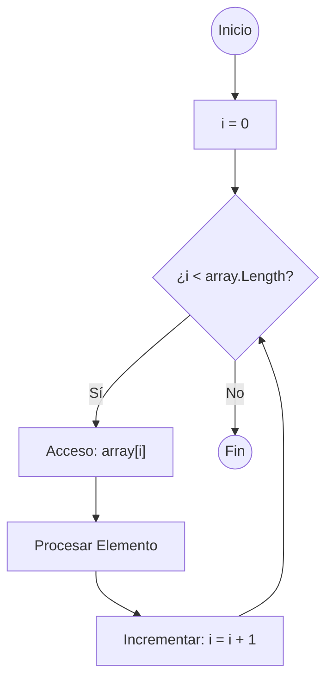
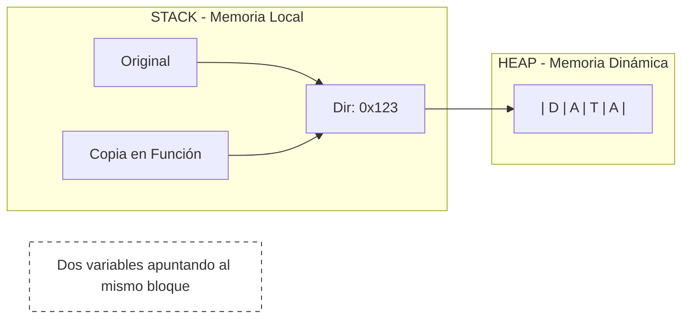
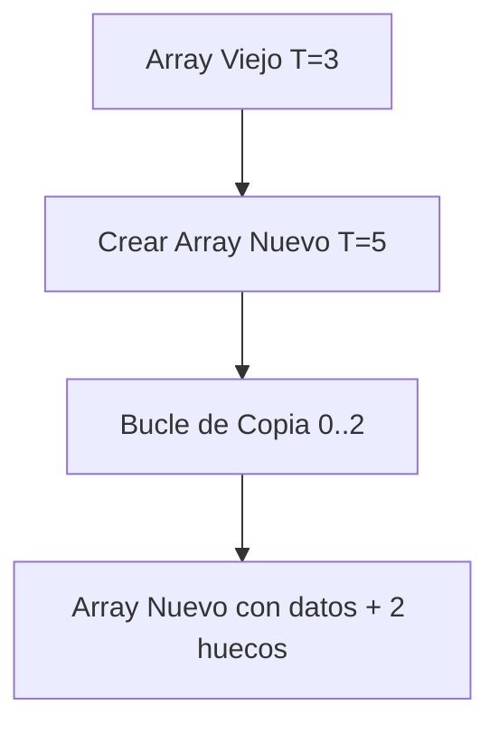
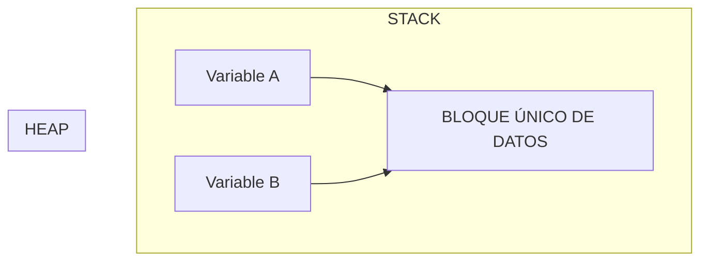
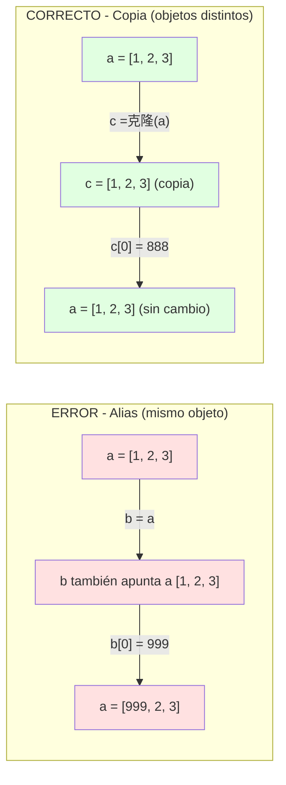

- [2. Arrays Unidimensionales](#2-arrays-unidimensionales)
  - [2.1. Definición, Creación y Valores por Defecto](#21-definición-creación-y-valores-por-defecto)
    - [A. Inmutabilidad del Tamaño y Creación](#a-inmutabilidad-del-tamaño-y-creación)
    - [B. Valores por Defecto y Gestión de la Nulidad](#b-valores-por-defecto-y-gestión-de-la-nulidad)
  - [2.2. Obtener el Tamaño con `.Length` y Recorrido](#22-obtener-el-tamaño-con-length-y-recorrido)
    - [A. `array.Length`](#a-arraylength)
    - [B. Recorrido con Bucle `for` (Precisión y Modificación)](#b-recorrido-con-bucle-for-precisión-y-modificación)
    - [Esquema Lógico del Recorrido 1D](#esquema-lógico-del-recorrido-1d)
    - [C. Recorrido con Bucle `foreach` (Sintaxis Correcta)](#c-recorrido-con-bucle-foreach-sintaxis-correcta)
    - [D. Recorrido con Filtrado de Nulos (Combinando `if`)](#d-recorrido-con-filtrado-de-nulos-combinando-if)
  - [2.3. Paso por Referencia, Devolución y Clonación](#23-paso-por-referencia-devolución-y-clonación)
    - [A. Arrays y el Paso por Referencia (El Modelo de Memoria)](#a-arrays-y-el-paso-por-referencia-el-modelo-de-memoria)
    - [B. Clonación Manual para Romper la Referencia](#b-clonación-manual-para-romper-la-referencia)
    - [C. Devolución de Arrays](#c-devolución-de-arrays)
  - [2.4. Parámetros Variables (`params`)](#24-parámetros-variables-params)
  - [2.5. Identidad vs. Igualdad (Referencia vs. Contenido)](#25-identidad-vs-igualdad-referencia-vs-contenido)
  - [2.6. Copias, Clonación y la Inmutabilidad del Tamaño (DAW)](#26-copias-clonación-y-la-inmutabilidad-del-tamaño-daw)
    - [A. La Inmutabilidad: Simulando el Cambio de Tamaño](#a-la-inmutabilidad-simulando-el-cambio-de-tamaño)
      - [Mecánica de Cambio de Tamaño](#mecánica-de-cambio-de-tamaño)
  - [2.7. ⚠️ La Trampa del Alias](#27-️-la-trampa-del-alias)


# 2. Arrays Unidimensionales

Un array unidimensional, o vector, es una colección ordenada y homogénea (mismo tipo de datos) de elementos almacenados en memoria contigua. Es la estructura de datos fundamental para la gestión de listas de tamaño fijo.

Puedes pensar en ello como una cajonera, es decir, una serie de cajones (elementos) del mismo tamaño (tipo de dato) donde cada cajón tiene un índice que nos permite acceder a él. Por tanto, un array es una estructura de datos que nos permite almacenar un conjunto de datos del mismo tipo.


Como se ha indicado anteriormente, los arrays en DAW tienen las siguientes características clave:
1.  **Homogeneidad:** Todos los elementos deben ser del mismo tipo de dato (por ejemplo, todos `int` o todos `string`).
2.  **Tamaño Fijo:** El tamaño de un array se establece en el momento de su creación y no puede ser alterado posteriormente. Si se necesita modificar el tamaño, la solución es crear un **nuevo array** con el tamaño deseado y **copiar** los elementos del original al nuevo.  
3.  **Contigüidad en Memoria:** Los elementos de un array se almacenan en posiciones de memoria **contiguas** (una al lado de la otra). Esto es lo que permite su alta eficiencia.
4.  **Acceso por Índice:** El acceso a los elementos para lectura o escritura se realiza mediante su posición o **índice**, que siempre es un número entero. El primer elemento está en el índice `0`.
5.  **Eficiencia:** El acceso a cualquier elemento es extremadamente rápido (tiempo constante, $O(1)$) porque su ubicación en memoria se calcula directamente.
6.  **Inmutabilidad:** Una vez creado, el tamaño de un array no puede cambiar. Si se necesita un array más grande o más pequeño, se debe crear uno nuevo y copiar los elementos.
7.  **Tipos de Referencia:** En DAW, los arrays son tipos de referencia, lo que significa que las variables que los contienen almacenan la dirección de memoria donde se encuentran los datos, no los datos en sí.
8.  **Valores por Defecto:** Al crear un array, sus elementos se inicializan automáticamente a valores por defecto según su tipo (0 para `int`, `false` para `bool`, `""` para `string`, y `null` para tipos anulables).
9.  **Acceso no permitido:** No se puede acceder a un elemento de un array utilizando un índice fuera de sus límites. Esto generará un error en tiempo de ejecución llamado `ArrayIndexOutOfBoundsException`.

## 2.1. Definición, Creación y Valores por Defecto

### A. Inmutabilidad del Tamaño y Creación

| Característica | Detalle Didáctico | Sintaxis DAW |
| :--- | :--- | :--- |
| **Tamaño Fijo** | El tamaño se define al crearse y **no puede cambiarse**. | `tipo[] nombre = tipo[tamaño];` |
| **Homogeneidad** | Todos los elementos deben ser del mismo tipo. | `var numeros = int[10];` |
| **Valores Iniciales** | Se puede crear asignando valores directamente. | `var dias = string[] {"Lun", "Mar", "Mié"};` |

### B. Valores por Defecto y Gestión de la Nulidad

Cuando un array se crea solo con su tamaño, DAW lo rellena automáticamente.

| Tipo de Array | Valor por Defecto | Justificación Didáctica |
| :--- | :--- | :--- |
| **Primitivo** (`int[]`, `bool[]`) | **0** / **`false`** | Se inicializa al valor que representa la 'ausencia' de información. |
| **Cadena** (`string[]`) | **`""`** (Cadena vacía) | Es un objeto, pero se inicializa a la cadena sin caracteres. |
| **Anulable** (`T?[]`) | **`null`** | Indica que la posición no tiene ningún valor válido. |

```csharp
Main {
  // Array de tipos anulables: todos los elementos son 'null'
  var numeroOpcionales = int?[3];
  numeroOpcionales[0] = 5;

  // ¡CRÍTICO! Acceder a un método sin verificar lanza una excepción.
  // writeLine("Número: " + (numeroOpcionales[1] + 1)); // Excepción en tiempo de ejecución

  // Solución 1: Operador de Coalescencia (Sustitución rápida)
  writeLine("Número con coalescencia: " + (numeroOpcionales[1] ?? 0 + 1)); // Muestra 1
  // Solución 2: Comprobación explícita con if
  if (numeroOpcionales[1] != null) {
    writeLine("Número con if: " + (numeroOpcionales[1] + 1));
  } else {
    writeLine("Número con if: Valor nulo, no se puede operar.");
  }
  // Operador ternario
  writeLine("Número con ternario: " + (numeroOpcionales[1] != null ? (numeroOpcionales[1] + 1) : "Valor nulo, no se puede operar."));    
}
```

## 2.2. Obtener el Tamaño con `.Length` y Recorrido

### A. `array.Length`

La propiedad `.Length` devuelve el número de elementos. Es la manera fiable de conocer el límite superior del array.

### B. Recorrido con Bucle `for` (Precisión y Modificación)

### Esquema Lógico del Recorrido 1D


El bucle `for` se utiliza principalmente cuando se necesita **modificar** los elementos del array o si se requiere conocer el **índice (`i`)** de la posición actual (ej. para un recorrido inverso).

**Justificación:** El `for` es la herramienta más precisa porque el índice `i` permite el acceso directo a la memoria contigua (`array[i]`).

```csharp
Main {
  var calificaciones = int[5]; // {0, 0, 0, 0, 0}

  writeLine("--- Recorrido FOR y Modificación ---");
  for (int i = 0; i < calificaciones.Length; i++) {
    calificaciones[i] = i * 10; // Modificamos el contenido
    writeLine("Índice " + i + ": " + calificaciones[i]);
  }
}
```

### C. Recorrido con Bucle `foreach` (Sintaxis Correcta)

El bucle `foreach` se utiliza cuando solo se necesita **leer** el valor de cada elemento. Simplifica la sintaxis, ya que no se necesita manejar el índice.

**Justificación:** Es más seguro y legible para la lectura, ya que elimina el riesgo de errores al manejar el contador (`i`).

```csharp
Main {
  var diasSemana = string[] {"L", "M", "X", "J", "V"};

  writeLine("--- Recorrido FOREACH ---");
  foreach (var dia in diasSemana) {
    writeLine("Día: " + dia);
  }
}
```

### D. Recorrido con Filtrado de Nulos (Combinando `if`)

Para arrays de tipos anulables, el `foreach` es ideal para la lectura, pero debemos usar el `if` para el filtrado, o el operador de coalescencia (`??`) para evitar excepciones al acceder a métodos o propiedades de un valor nulo. También podemos usar el operador ternario.   

```csharp
Main {
  string?[] nombres = string?[3];
  nombres[0] = "Pepe";

  writeLine("--- Recorrido FOREACH con IF de Nulos ---");
  foreach (var nombre in nombres) {
    if (nombre != null) { // CRÍTICO: Solo se procesa si el valor NO es nulo
      writeLine("Usuario: " + nombre);
    } else {
      writeLine("Posición vacía.");
    }
    // Alternativa con coalescencia
    writeLine("Usuario con coalescencia: " + (nombre ?? "Posición vacía."));
    // Alternativa con ternario
    writeLine("Usuario con ternario: " + (nombre != null ? nombre : "Posición vacía."));
  }
}
```

## 2.3. Paso por Referencia, Devolución y Clonación

### A. Arrays y el Paso por Referencia (El Modelo de Memoria)

**Concepto Clave:** En DAW, los arrays son **tipos de referencia**. La variable que guarda el array (`arrayOriginal`) en realidad guarda la **dirección de memoria** donde están los datos.

**Al pasar a una función:** Se pasa una **copia de esa dirección** (referencia). Como dos variables apuntan al mismo sitio, cualquier modificación de los **elementos internos** dentro de la función afecta al array **original**.



```csharp
procedure modificarContenido(int[] array) {
    // Modifica los datos apuntados por la referencia
    array[0] = 999;
}

Main {
    var arrayOriginal = int[] {1, 2, 3};
    modificarContenido(arrayOriginal);
    // El arrayOriginal ha cambiado porque se modificó la zona de memoria
    writeLine("Original[0] después: " + arrayOriginal[0]); // Muestra 999
}
```

### B. Clonación Manual para Romper la Referencia

Para obtener un array completamente independiente, es necesario crear un nuevo array y **copiar manualmente** el contenido elemento por elemento. Esto se conoce como **copia profunda** (deep copy).

```csharp
// Clonación Manual: Proporciona una nueva referencia con copia de datos
function int[] clonar(int[] origen) {
    var arrayClonado = int[origen.Length];
    for (int i = 0; i < origen.Length; i++) {
        arrayClonado[i] = origen[i]; // Copia del valor (copia superficial del array)
    }
    return arrayClonado;
}

Main {
    var arrayA = int[] {10, 20};
    var arrayClon = clonar(arrayA);

    arrayClon[0] = 500;
    // El arrayA no cambia porque arrayClon apunta a una memoria distinta.
    writeLine("Original A[0]: " + arrayA[0]);     // Muestra 10
    writeLine("Clon[0]: " + arrayClon[0]); // Muestra 500
}
```

### C. Devolución de Arrays

Una función que devuelve un array retorna la **referencia**. Si modificas la variable que recibe el retorno, estás modificando el array original.

## 2.4. Parámetros Variables (`params`)

El uso de **`params`** es una característica sintáctica de DAW que permite a una función aceptar un número variable de argumentos.       

**Justificación Didáctica:** Es una abstracción útil para el desarrollador. Internamente, el compilador recoge todos los argumentos y los convierte en un **array** que es pasado a la función, facilitando su recorrido con `foreach`.

```csharp
function int sumarTodos(params int numeros) {
    // 'numeros' se trata como un array int[]
    int suma = 0;
    foreach (var num in numeros) {
        suma = suma + num;
    }
    return suma;
}
```

## 2.5. Identidad vs. Igualdad (Referencia vs. Contenido)

Esta distinción es crítica para entender los tipos de referencia.

| Concepto | Significado | Operador de Prueba en DAW | Justificación |
| :--- | :--- | :--- | :--- |
| **Identidad** | ¿Apuntan las variables a la **misma dirección**? | **`==`** | Compara la referencia, no el contenido. |
| **Igualdad** | ¿Tienen las variables el **mismo contenido**? | Función manual | Requiere un bucle elemento a elemento. |

```csharp
// Función que verifica la igualdad de contenido
function bool sonIguales(int[] a, int[] b) {
  if (a.Length != b.Length) {
    return false;
  }
  for (int i = 0; i < a.Length; i++) {
    if (a[i] != b[i]) {
      return false;
    }
  }
  return true;
}

Main {
    var arrayA = int[] {1};
    var arrayB = int[] {1}; 
    var arrayC = arrayA;    

    writeLine("A == C (Identidad/Ref): " + (arrayA == arrayC)); // true
    writeLine("A == B (Identidad/Ref): " + (arrayA == arrayB)); // false
    writeLine("A y B son Iguales (Contenido): " + sonIguales(arrayA, arrayB)); // true
}
```

## 2.6. Copias, Clonación y la Inmutabilidad del Tamaño (DAW)

### A. La Inmutabilidad: Simulando el Cambio de Tamaño

La propiedad `.Length` de un array es de **solo lectura**. Esto significa que es imposible modificar el tamaño de un array ya existente. 

| Escenario | Solución en DAW | Justificación Didáctica |
| :--- | :--- | :--- |
| **Cambio de tamaño** | **Crear un Array Nuevo** y copiar los datos. | Garantiza bloque contiguo de memoria eficiente. |

#### Mecánica de Cambio de Tamaño



```csharp
Main {
    var arrayAntiguo = int[] {10, 20, 30}; 
    var nuevoTamano = 5;
    var arrayNuevo = int[nuevoTamano]; 

    for (int i = 0; i < arrayAntiguo.Length; i++) {
        arrayNuevo[i] = arrayAntiguo[i];
    }
}
```

## 2.7. ⚠️ La Trampa del Alias
Un error muy común es pensar que al hacer `var b = a` hemos creado una copia. En realidad, hemos creado un **Alias**.


**Consecuencia:** Si cambias `b[0]`, el valor de `a[0]` también cambia. No son dos arrays, son dos nombres para la misma "cajonera".

> 📝 **Truco del Examinador:** Pregunta típica: "¿Por qué al modificar un array se modifica el otro?"
> **Respuesta:** Los arrays son tipos por referencia. Cuando asignas `b = a`, solo copias la referencia (la dirección), no los datos. Ambos punteros van al mismo objeto en el Heap.

```csharp
// ERROR COMÚN: Aliasing
int[] a = { 1, 2, 3 };
int[] b = a;  // b es un ALIAS de a, NO una copia

b[0] = 999;
Console.WriteLine(a[0]);  // 999 - ¡También cambió!

// CORRECTO: Clonación
int[] c = new int[a.Length];
for (int i = 0; i < a.Length; i++)
    c[i] = a[i];

c[0] = 888;
Console.WriteLine(a[0]);  // 999 - a NO cambia
Console.WriteLine(c[0]);  // 888 - c es independiente
```



> 💡 **Analogía del piso compartido:** Imagina que `a` es una dirección de piso. Cuando escribes `b = a`, no estás comprtando un piso nuevo, estás dando otra llave al mismo piso. Si `b` entra y mueve los muebles, `a` también ve los cambios.
