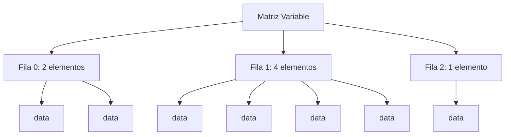
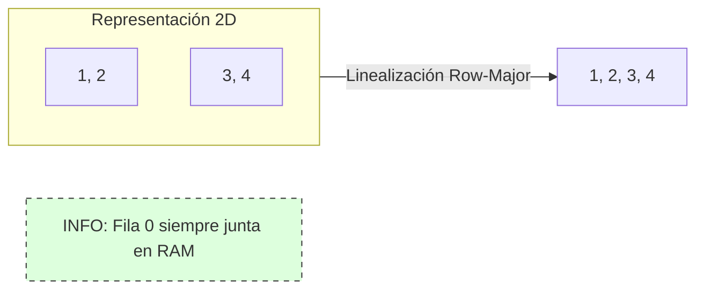
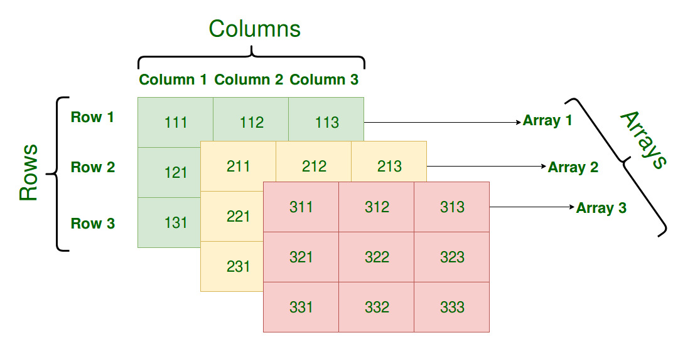
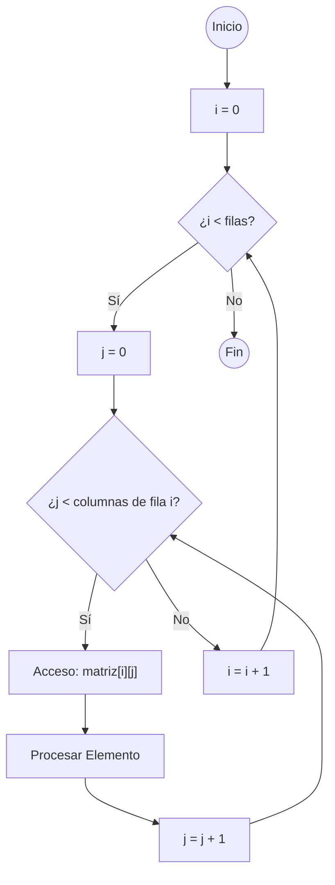

- [3. Arrays multidimensionales](#3-arrays-multidimensionales)
  - [3.1. Conceptos Fundamentales](#31-conceptos-fundamentales)
    - [A. Tipos de Matrices](#a-tipos-de-matrices)
    - [B. Mecanismos de Almacenamiento y Rendimiento](#b-mecanismos-de-almacenamiento-y-rendimiento)
  - [3.2. Arrays Multidimensionales en el Lenguaje DAW](#32-arrays-multidimensionales-en-el-lenguaje-daw)
    - [A. Definición, Creación y Valores por Defecto](#a-definición-creación-y-valores-por-defecto)
    - [B. Valores Anulables (`T?`)](#b-valores-anulables-t)
  - [3.3. Recorrido con `for` y `foreach`](#33-recorrido-con-for-y-foreach)
    - [A. Bucle `for` (Acceso por Índice)](#a-bucle-for-acceso-por-índice)
    - [Esquema Lógico del Recorrido 2D (Anidado)](#esquema-lógico-del-recorrido-2d-anidado)
    - [B. Bucle `foreach` (Lectura con Anidación)](#b-bucle-foreach-lectura-con-anidación)
  - [3.4. Identidad, Igualdad y Clonación en Matrices](#34-identidad-igualdad-y-clonación-en-matrices)
    - [A. Identidad vs. Igualdad (Doble Referencia)](#a-identidad-vs-igualdad-doble-referencia)
    - [B. Clonación (Copia Profunda)](#b-clonación-copia-profunda)
  - [3.5. Paso por Referencia y Devolución de Matrices](#35-paso-por-referencia-y-devolución-de-matrices)
  - [3.6. Copias, Clonación Profunda y Gestión del Tamaño en Matrices](#36-copias-clonación-profunda-y-gestión-del-tamaño-en-matrices)
    - [A. La Doble Referencia (Copia Superficial vs. Copia Profunda)](#a-la-doble-referencia-copia-superficial-vs-copia-profunda)
        - [Demostración de la Peligrosa Copia Superficial](#demostración-de-la-peligrosa-copia-superficial)
    - [B. Clonación Profunda Manual (Técnica Correcta)](#b-clonación-profunda-manual-técnica-correcta)
    - [C. Modificación del Tamaño (Recreación de la Matriz)](#c-modificación-del-tamaño-recreación-de-la-matriz)
        - [Ejemplo: Añadir una Fila a la Matriz](#ejemplo-añadir-una-fila-a-la-matriz)
        - [Ejemplo de Cambio de Tamaño: Migrar de 3x3 a 5x5 (Escalado)](#ejemplo-de-cambio-de-tamaño-migrar-de-3x3-a-5x5-escalado)
  - [3.8. Rendimiento: El orden de los índices](#38-rendimiento-el-orden-de-los-índices)


# 3. Arrays multidimensionales
Los arrays multidimensionales son una extensión natural de los arrays unidimensionales. Permiten almacenar datos en una estructura más compleja, como matrices o tablas, donde cada elemento puede ser accedido mediante múltiples índices.

Para poder identificar un elemento en un array multidimensional, necesitamos tantos índices como dimensiones tenga el array. Por ejemplo, en un array de dos dimensiones (una matriz), cada elemento se identifica con dos índices: uno para la fila y otro para la columna.      

>Piensa en ello como un aramario donde tenemos varias cajoneras (filas) y cada cajonera tiene varios cajones (columnas). O el famoso juego de los barcos donde tenemos un tablero con filas y columnas y para disparar a una posición necesitamos dos coordenadas (índices).      

## 3.1. Conceptos Fundamentales

### A. Tipos de Matrices

En la programación existen principalmente dos modelos para representar datos multidimensionales:

| Modelo                                                  | Descripción                                                                                                                                        | Sintaxis Típica (ej. Java, C\#)  | Propiedad en DAW            | 
| :------------------------------------------------------ | :------------------------------------------------------------------------------------------------------------------------------------------------- | :------------------------------- | :-------------------------- | 
| **Array Rectangular** (*Rectangular Array*)             | Una cuadrícula perfecta. Todas las filas tienen **exactamente la misma longitud**, formando un bloque contiguo uniforme.                           | `int[,] matriz = new int[3, 5];` | **NO es el modelo de DAW.** | 
| **Array Escalonado** (*Jagged Array* o Array de Arrays) | Es un **array de arrays**. La primera dimensión contiene referencias a otros arrays. **Cada sub-array (fila) puede tener una longitud diferente.** | `int[][] matriz = new int[3][];` | **Es el modelo de DAW.**    | 

**Justificación de DAW (Array Escalonado):** El modelo escalonado ofrece mayor **flexibilidad** (filas de distinto tamaño) y permite una mejor **optimización de la memoria**, ya que cada sub-array se asigna solo con el espacio que necesita, sin dejar huecos obligatorios. Además, es el modelo que usan internamente lenguajes como Java y C\# cuando se anidan corchetes (`[][]`), lo que facilita la comprensión del paso a estos lenguajes.



### B. Mecanismos de Almacenamiento y Rendimiento

La memoria del ordenador es lineal (una secuencia de direcciones). Para almacenar una matriz, esta debe **linealizarse**. Las dos estrategias principales para esta linealización son:

1.  **Almacenamiento por Filas (*Row-Major Order*):** Es el método más común en lenguajes como DAW, C, C++, Java y C\#.
      * **Mecánica:** Se almacenan todos los elementos de la **primera fila**, seguidos de todos los elementos de la **segunda fila**, y así sucesivamente.
      * **Rendimiento:** Es óptimo cuando el código accede a los datos **secuencialmente por filas**. La lectura consecutiva es muy rápida (*cache friendly*), ya que los datos están contiguos en la memoria caché del procesador.
2.  **Almacenamiento por Columnas (*Column-Major Order*):** Utilizado históricamente por lenguajes como Fortran y, actualmente, en herramientas de computación numérica (ej. MATLAB).
      * **Mecánica:** Se almacenan todos los elementos de la **primera columna**, seguidos de la segunda columna, etc.
      * **Rendimiento:** Óptimo cuando el código itera sobre los datos **secuencialmente por columnas**.

**En DAW (y en la mayoría de la programación orientada a objetos):** La matriz se almacena **por filas**. Esto significa que es **más eficiente** recorrer y procesar los datos iterando primero sobre el índice de la fila y luego sobre el de la columna (el orden natural `matriz[i][j]`).



Por lo tanto debes tener en cuenta como ya indicamos a nivel generico con los arrays las siguientes directrices:
* **Acceso por Índice:** El primer elemento está en el índice `0`, esta vez tenemos tantos índices como dimensiones tenga el array.
* **Eficiencia:** El acceso a cualquier elemento es extremadamente rápido (tiempo constante, $O(1)$) porque su ubicación en memoria se calcula directamente.
* **Inmutabilidad:** Una vez creado, el tamaño de un array no puede cambiar. Si se necesita un array más grande o más pequeño, se debe crear uno nuevo y copiar los elementos.
* **Tipos de Referencia:** En DAW, los arrays son tipos de referencia, lo que significa que las variables que los contienen almacenan la dirección de memoria donde se encuentran los datos, no los datos en sí.
* **Valores por Defecto:** Al crear un array, sus elementos se inicializan automáticamente a valores por defecto según su tipo (0 para `int`, `false` para `bool`, `""` para `string`, y `null` para tipos anulables).
* **Acceso no permitido:** No se puede acceder a un elemento de un array utilizando un índice fuera de sus límites en alguna de sus dimensiones. Esto generará un error en tiempo de ejecución llamado `ArrayIndexOutOfBoundsException`.





## 3.2. Arrays Multidimensionales en el Lenguaje DAW

En DAW se utiliza la sintaxis del **Array Escalonado** (`[][]`) para cualquier dimensión superior a uno.

### A. Definición, Creación y Valores por Defecto

La creación de matrices de dos dimensiones (bidimensionales) requiere dos pares de corchetes.

| Sintaxis DAW                               | Propósito                                                                                           | Valor por defecto                              |
| :----------------------------------------- | :-------------------------------------------------------------------------------------------------- | :--------------------------------------------- |
| `tipo[][] nombre = tipo[filas][columnas];` | **Creación simplificada de una matriz** (todos los sub-arrays se crean con el mismo tamaño inicial). | **0** para `int`, **`""`** para `string`, etc. |
| `tipo[][] nombre = { {v1, v2}, {v3} };`    | Creación con valores específicos, permitiendo tamaños de fila variables.                            | N/A                                            |

```csharp
Main {
  // 1. Matriz de 2x3 (todos se inicializan a 0)
  var matrizEnteros = int[2][3];

  // 2. Matriz inicializada directamente (Array Escalonado)
  var matrizDatos = string[][] {
      string[] {"Ana", "Pérez"}, // Fila 0: Tamaño 2
      string[] {"Luis"}         // Fila 1: Tamaño 1
  };

  // Acceso: Se usa un par de corchetes por cada dimensión
  writeLine("Elemento [0][1]: " + matrizDatos[0][1]); // Muestra: Pérez

  // Si accedes a una posición fuera de los límites, lanza una excepción
  // writeLine("Elemento [1][2]: " + matrizDatos[1][2); // Excepción en tiempo de ejecución `ArrayIndexOutOfBoundsException`
}
```

### B. Valores Anulables (`T?`)

Al igual que en los unidimensionales, un array de elementos anulables se inicializa a **`null`** en todas sus posiciones.

```csharp
Main {
  // Matriz de enteros anulables 2x2: todos son null.
  var notasOpcionales = int?[2][2];

  // Acceso con gestión de nulidad
  // Se usa ?? para proporcionar un valor seguro (0)
  var notaSegura = notasOpcionales[0][0] ?? 0;
  writeLine("Nota segura: " + notaSegura); // Muestra 0

  // Si no se gestiona, lanza excepción
  // writeLine("Nota directa: " + (notasOpcionales[0][0] + 1)); // Excepción en tiempo de ejecución `NullPointerException`
}
```

## 3.3. Recorrido con `for` y `foreach`

Para recorrer una matriz, se necesita anidar bucles: un bucle exterior para las **filas** y un bucle interior para las **columnas** de la fila actual.

### A. Bucle `for` (Acceso por Índice)

### Esquema Lógico del Recorrido 2D (Anidado)


Es el método más utilizado para matrices, ya que permite acceder al tamaño exacto de cada fila (`matriz[i].Length`) y **modificar** los valores.

```csharp
Main {
  var matriz = int[][] { {1, 2}, {3, 4, 5} };

  writeLine("--- Recorrido FOR (Fila por Fila) ---");
  for (int i = 0; i < matriz.Length; i++) { // Bucle exterior: número de filas
    for (int j = 0; j < matriz[i].Length; j++) { // Bucle interior: longitud de la fila 'i'
      matriz[i][j] = matriz[i][j] * 2; // Modificación
      writeLine($"Elemento [{i}][{j}]: {matriz[i][j]}");
    }
  }
}
```

### B. Bucle `foreach` (Lectura con Anidación)

El `foreach` se anida dos veces: el bucle exterior itera sobre los **sub-arrays** (filas), y el interior itera sobre los **elementos** de la fila actual.

```csharp
Main {
  var matriz = int[][] { {10, 20}, {30, 40} };

  writeLine("--- Recorrido FOREACH (Lectura) ---");
  foreach (var fila in matriz) { // 'fila' es un array int[]
    foreach (var elemento in fila) { // 'elemento' es un int
      writeLine("Valor: " + elemento);
    }
  }
}
```

Si tenemos valores anulables, debemos gestionar la nulidad dentro del bucle.

```csharp
Main {
  var matrizNulos = int?[][] { {10, null}, {null, 40} };

  writeLine("--- Recorrido FOREACH con Nulos ---");
  foreach (var fila in matrizNulos) {
    foreach (var elemento in fila) {
      // Gestión de nulidad
      if (elemento != null) {
        writeLine("Valor: " + elemento);
      } else {
        writeLine("Valor nulo.");
      }
      // Alternativa con coalescencia
      writeLine("Valor con coalescencia: " + (elemento ?? "Valor nulo."));
      // Alternativa con ternario
      writeLine("Valor con ternario: " + (elemento != null ? elemento : "Valor nulo."));
    }
  }
}
```

## 3.4. Identidad, Igualdad y Clonación en Matrices

Las matrices, al ser arrays de arrays, son **doblemente tipos de referencia**. Esto hace que los conceptos de copia y clonación sean más complejos. Al igual que con los arrays unidimensionales, es crucial entender la diferencia entre **identidad** (referencia) e **igualdad** (contenido), pero ahora debemos considerar tanto el array exterior como los sub-arrays internos.

### A. Identidad vs. Igualdad (Doble Referencia)

  * **Identidad (`==`):** El operador `==` solo compara si las variables apuntan al mismo array externo (la misma *caja* de filas).      
  * **Igualdad (Contenido):** Requiere una función que compare el tamaño y el contenido de **cada sub-array**.

### B. Clonación (Copia Profunda)

La **clonación manual** es la única manera de garantizar la independencia total. Si solo copias el array exterior, los arrays internos siguen siendo compartidos (copia superficial de la segunda dimensión).

| Tipo de Copia                     | Mecánica                                                                      | Efecto en Matrices                                                                                            |
| :-------------------------------- | :---------------------------------------------------------------------------- | :------------------------------------------------------------------------------------------------------------ |
| **Copia por Referencia**          | `matrizB = matrizA;`                                                          | **Total dependencia:** Ambas variables son la misma matriz.                                                   |
| **Copia Superficial Engañosa**    | `matrizB = clonar(matrizA)` (función anterior)                                | **¡Cuidado\!** El array exterior es nuevo, pero los sub-arrays internos siguen siendo las mismas referencias. |
| **Clonación Profunda (Correcta)** | Clonar el array exterior **Y** clonar manualmente **cada sub-array** interno. | **Total Independencia:** Se garantiza que todos los elementos y referencias internas sean nuevos.             |

```csharp
// Función para realizar la CLONACIÓN PROFUNDA
function int[][] clonarMatriz(int[][] origen) {
    // 1. Clonar el Array Exterior (la 'caja' de filas)
    var matrizClonada = int[origen.Length][];

    // 2. Clonar cada Array Interno (la 'fila')
    for (int i = 0; i < origen.Length; i++) {
        // Se crea un NUEVO array para la fila actual y se copian los valores
        matrizClonada[i] = int[origen[i].Length];
        for (int j = 0; j < origen[i].Length; j++) {
            matrizClonada[i][j] = origen[i][j];
        }
    }
    return matrizClonada;
}

function bool sonMatricesIguales(int[][] a, int[][] b){
    if (a.Length != b.Length) {
        return false;
    }
    for (int i = 0; i < a.Length; i++) {
        if (a[i].Length != b[i].Length) {
            return false;
        }
        for (int j = 0; j < a[i].Length; j++) {
            if (a[i][j] != b[i][j]) {
                return false;
            }
        }
    }
    return true;
}

Main {
    var original = int[][] { {10, 20}, {30, 40} };
    var clon = clonarMatriz(original);

    clon[0][0] = 999; // Modificamos el clon

    writeLine("Original[0][0]: " + original[0][0]); // Muestra 10 (INDEPENDIENTE)
    writeLine("Clon[0][0]: " + clon[0][0]);         // Muestra 999
    writeLine("Identidad del array externo: " + (original == clon)); // Muestra false
    writeLine("Son iguales (Contenido): " + sonMatricesIguales(original, clon)); // Muestra false
}
```

## 3.5. Paso por Referencia y Devolución de Matrices
Al igual que con los arrays unidimensionales, las matrices se pasan a funciones por referencia. Cualquier modificación dentro de la función afectará al array original, a menos que se realice una clonación profunda antes de pasarla.

```csharp
procedure modificarMatriz(int[][] matriz) {
    matriz[0][0] = 555; // Modifica el contenido del array original
}

function int[][] clonarMatriz(int[][] origen) {
    var matrizClonada = int[origen.Length][];
    for (int i = 0; i < origen.Length; i++) {
        matrizClonada[i] = int[origen[i].Length];
        for (int j = 0; j < origen[i].Length; j++) {
            matrizClonada[i][j] = origen[i][j];
        }
    }
    return matrizClonada;
}

Main {
    var matrizOriginal = int[][] { {1, 2}, {3, 4} };
    modificarMatriz(matrizOriginal);
    writeLine("Matriz Original[0][0] después de modif.: " + matrizOriginal[0][0]); // Muestra 555

    var matrizClon = clonarMatriz(matrizOriginal);
    matrizClon[0][0] = 999;
    writeLine("Matriz Original[0][0] después de modif. clon: " + matrizOriginal[0][0]); // Muestra 555 (INDEPENDIENTE)
}
```
## 3.6. Copias, Clonación Profunda y Gestión del Tamaño en Matrices

El manejo de copias y el tamaño de las matrices es más complejo que en los arrays unidimensionales, debido a que las matrices en DAW son **arrays de arrays** (doble referencia).

### A. La Doble Referencia (Copia Superficial vs. Copia Profunda)

Dado que un array escalonado (`int[][]`) es un array de referencias a otros arrays (las filas), una simple copia o clonación superficial es insuficiente y peligrosa.

| Tipo de Copia                     | Mecanismo                                                                            | Efecto en la Memoria                                                                                                          | Consecuencia Didáctica                                                                                           |
| :-------------------------------- | :----------------------------------------------------------------------------------- | :---------------------------------------------------------------------------------------------------------------------------- | :--------------------------------------------------------------------------------------------------------------- |
| **Copia por Referencia**          | `matrizB = matrizA;`                                                                 | Se copia la referencia al array exterior.                                                                                     | **Total dependencia:** Modificar `matrizB[i][j]` modifica `matrizA[i][j]`.                                       |
| **Copia Superficial Engañosa**    | Clonar solo el array exterior (`int[filas][]`).                                      | Se crea un nuevo array de filas, pero las **referencias a las filas internas (los arrays `int[]`) siguen siendo las mismas.** | **Dependencia Parcial:** Modificar `matrizB[i][j]` sigue modificando `matrizA[i][j]` porque se comparte la fila. |
| **Clonación Profunda (Correcta)** | Clonar el array exterior **Y** clonar manualmente **cada sub-array** (fila) interno. | Se crean nuevas referencias para el array principal y para cada fila.                                                         | **Total Independencia:** Se garantiza una matriz completamente nueva e independiente.                            |

##### Demostración de la Peligrosa Copia Superficial

Si solo clonamos la primera dimensión, las filas (sub-arrays) siguen siendo compartidas:

```csharp
Main {
    var original = int[][] { int[] {10, 20}, int[] {30, 40} };

    // Clonación superficial (solo se clona el array externo)
    var superficial = int[original.Length][];
    for (int i = 0; i < original.Length; i++) {
        superficial[i] = original[i]; // Copia la REFERENCIA de la fila, no el contenido
    }

    superficial[0][0] = 999; // Modificamos el clon

    writeLine("Original[0][0]: " + original[0][0]); // Muestra 999
    // ¡El array original ha cambiado! La fila interna se compartió.
}
```

### B. Clonación Profunda Manual (Técnica Correcta)

La única forma de garantizar la independencia total es utilizando la técnica de **Clonación Profunda**, que requiere anidar dos bucles para copiar cada valor.

**Justificación:** El alumnado debe entender que un tipo de referencia anidado requiere una clonación anidada.

```csharp
// Función para realizar la CLONACIÓN PROFUNDA y correcta
function int[][] clonarMatriz(int[][] origen) {
    // 1. Crear el Array Exterior (la 'caja' de referencias a las filas)
    var matrizClonada = int[origen.Length][];

    // 2. Clonar CADA Array Interno (la 'fila')
    for (int i = 0; i < origen.Length; i++) {
        // Clonar la fila: crear un nuevo array int[] para esta posición de fila
        matrizClonada[i] = int[origen[i].Length];

        // Copiar el contenido (valores) de la fila actual
        for (int j = 0; j < origen[i].Length; j++) {
            matrizClonada[i][j] = origen[i][j];
        }
    }
    return matrizClonada;
}
```

### C. Modificación del Tamaño (Recreación de la Matriz)

El tamaño de la matriz principal (`matriz.Length`) y el de cada fila interna (`matriz[i].Length`) son **inmutables** después de su creación.

Para cualquier cambio de tamaño (aumentar filas, reducir columnas, etc.), se debe aplicar el mismo principio que en los arrays unidimensionales: **crear una nueva matriz y copiar selectivamente los datos**.

##### Ejemplo: Añadir una Fila a la Matriz

Para "añadir una fila", se requiere crear una nueva matriz con una dimensión más y copiar todas las referencias o contenidos:

```csharp
function int[][] anadirFila(int[][] matrizOriginal, int[] nuevaFila) {
    // 1. Definir el nuevo tamaño (una fila más)
    var nuevasFilas = matrizOriginal.Length + 1;

    // 2. Crear la nueva matriz (la 'caja' exterior)
    var matrizNueva = int[nuevasFilas][];

    // 3. Copiar las REFERENCIAS de las filas antiguas (copia superficial del array externo)
    for (int i = 0; i < matrizOriginal.Length; i++) {
        // Copiamos la referencia a la fila
        matrizNueva[i] = matrizOriginal[i];
    }

    // 4. Asignar la nueva fila al final
    matrizNueva[nuevasFilas - 1] = nuevaFila;

    return matrizNueva;
}

Main {
    var m1 = int[][] { int[] {1, 2}, int[] {3, 4} };
    var filaExtra = int[] {5, 6};

    var m2 = anadirFila(m1, filaExtra); // m2 es { {1, 2}, {3, 4}, {5, 6} }

    writeLine("Filas de m2: " + m2.Length); // Muestra 3
}
```

##### Ejemplo de Cambio de Tamaño: Migrar de 3x3 a 5x5 (Escalado)

Para simular un cambio de tamaño de una matriz, se debe realizar un proceso de copia que maneje la creación del nuevo array principal y la copia de los elementos internos.

**Objetivo Didáctico:** Demostrar que el cambio de tamaño es una **operación costosa** que implica doble anidamiento (doble bucle) y asignación de nueva memoria.

```csharp
Main {
    // Matriz Original 3x3 (Todas las filas del mismo tamaño en este ejemplo)
    var original = int[][] {
        int[] {1, 2, 3},
        int[] {4, 5, 6},
        int[] {7, 8, 9}
    };

    var tamanoAntiguo = original.Length;   // 3
    var tamanoNuevo = 5;

    // 1. Crear la Nueva Matriz con el tamaño final (5x5)
    // Se inicializa el array exterior con 5 filas.
    var matrizNueva = int[tamanoNuevo][];

    // 2. Iterar sobre las filas de la matriz nueva (hasta el tamaño nuevo)
    for (int i = 0; i < tamanoNuevo; i++) {

        // Crear cada fila interna de la matriz nueva con el tamaño final (5)
        matrizNueva[i] = int[tamanoNuevo]; // {0, 0, 0, 0, 0}

        // 3. Copiar solo los datos de la matriz antigua que existan (para i < 3)
        if (i < tamanoAntiguo) {
            // Se itera sobre las columnas de la matriz antigua
            var limiteColumnas = tamanoAntiguo;

            for (int j = 0; j < limiteColumnas; j++) {
                // Copia el valor de la matriz antigua al nuevo array
                matrizNueva[i][j] = original[i][j];
            }
        }
        // Las filas restantes (i=3, i=4) ya tienen sus elementos inicializados a 0
    }

    // Comprobación de los resultados
    writeLine("Tamaño de la matriz nueva: " + matrizNueva.Length + "x" + matrizNueva[0].Length); // 5x5
    writeLine("Valor original [0][0]: " + matrizNueva[0][0]); // Muestra 1
    writeLine("Valor rellenado [4][4]: " + matrizNueva[4][4]); // Muestra 0 (por defecto)
}
```

## 3.8. Rendimiento: El orden de los índices
Como DAW almacena matrices por filas, el acceso `matriz[i][j]` (donde `i` es fila) es mucho más rápido que `matriz[j][i]`. 
*   **Recorrido por filas**: El procesador lee memoria contigua (Rápido - Cache Friendly).
*   **Recorrido por columnas**: El procesador tiene que dar saltos enormes en la memoria para encontrar el siguiente elemento (Lento).

**Aplanamiento en memoria:**

