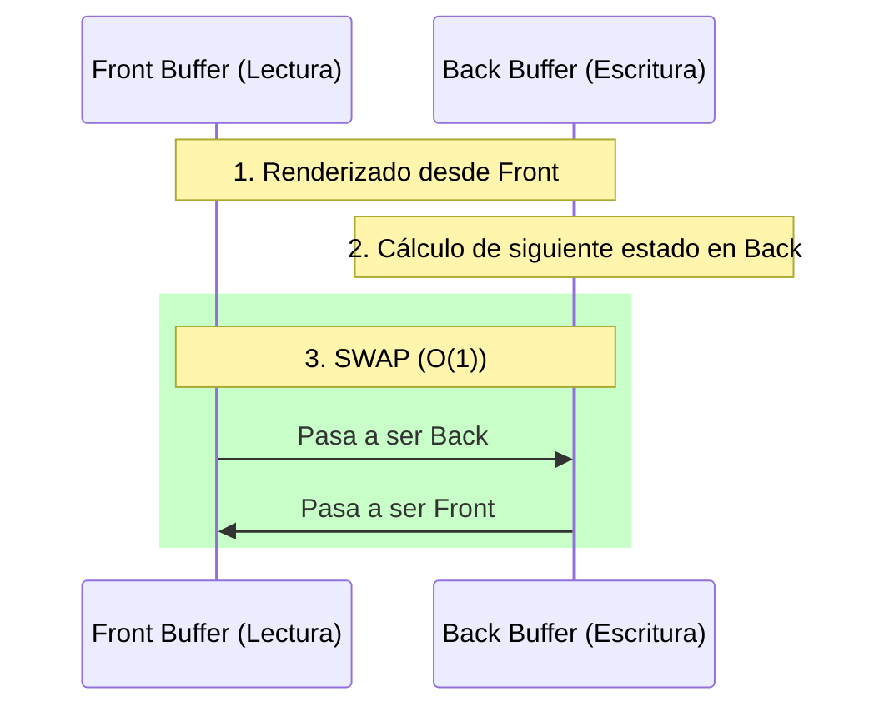
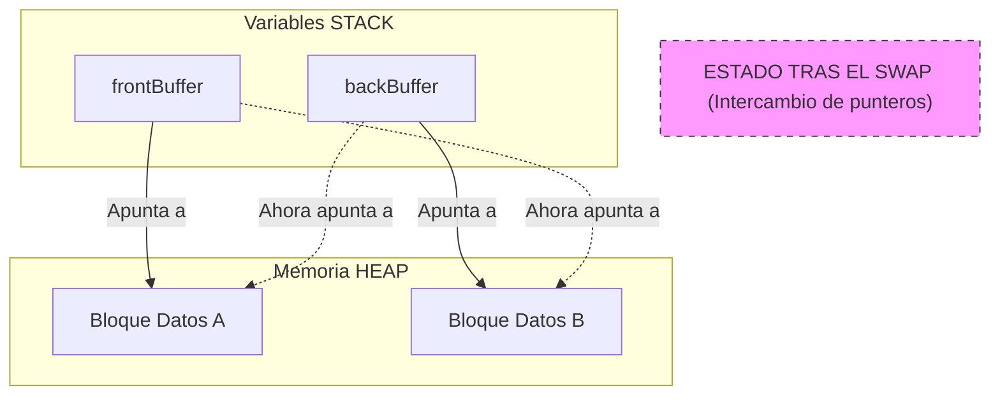

- [4. Doble Búfer (Double Buffering)](#4-doble-búfer-double-buffering)
  - [Teoría de la Técnica](#teoría-de-la-técnica)
  - [Aplicación Didáctica: Simulación de Propagación de Estado](#aplicación-didáctica-simulación-de-propagación-de-estado)
  - [Mecanismo en Lenguaje DAW](#mecanismo-en-lenguaje-daw)
  - [Mecanismo de Intercambio (Swap) y Justificación de la Eficiencia](#mecanismo-de-intercambio-swap-y-justificación-de-la-eficiencia)
  - [4.4. Entendiendo el Doble Búfer: La Analogía del Pintor](#44-entendiendo-el-doble-búfer-la-analogía-del-pintor)
  - [4.5. ¿Por qué es vital en DAW? El problema del Tearing](#45-por-qué-es-vital-en-daw-el-problema-del-tearing)
  - [4.6. Análisis Detallado del Mecanismo de Intercambio (Swap)](#46-análisis-detallado-del-mecanismo-de-intercambio-swap)


# 4. Doble Búfer (Double Buffering)

## Teoría de la Técnica

El **Doble Búfer** es un patrón de diseño que utiliza dos áreas de memoria (dos *búferes* o dos matrices idénticas) para gestionar datos que se están leyendo y escribiendo concurrentemente. Es la solución estándar para evitar la corrupción de datos y los artefactos visuales (*tearing*) que ocurren cuando una matriz se modifica al mismo tiempo que se está leyendo. Esta técnica es ampliamente utilizada en gráficos por computadora, simulaciones y juegos.

**El Principio:**

1.  **Búfer de Lectura (Front Buffer):** La matriz que se está **leyendo** y/o mostrando en pantalla en el momento actual.
2.  **Búfer de Escritura (Back Buffer):** La matriz donde se están aplicando **todas las modificaciones** o los cálculos de la siguiente *iteración* de la simulación.
3.  **Intercambio (Swap):** Cuando el Búfer de Escritura ha completado su actualización, los roles se **intercambian atómicamente** (de forma instantánea). El Búfer de Escritura pasa a ser el de Lectura, y viceversa.

El Doble Búfer asegura que el lector (o la función de impresión) siempre tenga acceso a una matriz **completa y consistente**, evitando la lectura de datos a medio modificar.



## Aplicación Didáctica: Simulación de Propagación de Estado

Imaginemos una simulación simple en una matriz 2D donde cada celda tiene un estado (0 o 1). Cada segundo, queremos calcular la siguiente generación de estados basándonos en la matriz actual, y luego mostrar esa nueva matriz.

**Problema sin Doble Búfer:**
Si intentamos actualizar la matriz mientras la leemos, un cambio en la posición $(i, j)$ podría afectar inmediatamente el cálculo de la posición adyacente $(i, j+1)$ en la misma iteración, rompiendo la lógica de la simulación.

**Solución con Doble Búfer en DAW:**
La solución requiere dos matrices de la misma dimensión y el método de arrays para clonar y gestionar las referencias correctamente.     

## Mecanismo en Lenguaje DAW

```csharp
// Función para clonar una matriz (Copia Profunda)
function int[][] cloneMatrix(int[][] source, int f, int c) {
    // 1. Crear la NUEVA matriz (nueva referencia de memoria para las filas)
    var target = int[f][];

    // 2. Copia Profunda: Inicializar columnas y copiar el VALOR de cada celda
    for (int i = 0; i < f; i++) {
        // Inicializar cada fila (nueva referencia de memoria para las columnas)
        target[i] = int[c];

        for (int j = 0; j < c; j++) {
            // Copia del valor
            target[i][j] = source[i][j];
        }
    }
    return target;
}


// Función para imprimir una matriz (simula la lectura/renderizado)
procedure printMatrix(int[][] matriz, int FILAS, int COLUMNAS) {
    writeLine("--- Rendering Matriz Actual ---");
    for (int i = 0; i < FILAS; i++) {
        for (int j = 0; j < COLUMNAS; j++) {
            write(matriz[i][j] + " "); // Acceso con doble corchete
        }
        writeLine("");
    }
}

// Lógica de la simulación: Propagación de estado
procedure updateSimulation(int[][] lectura, int[][] escritura, int FILAS, int COLUMNAS) {
    // Lectura: frontBuffer | Escritura: backBuffer
    for (int i = 0; i < FILAS; i++) {
        for (int j = 0; j < COLUMNAS; j++) {

            // Si la celda actual del BÚFER DE LECTURA tiene estado 1...
            if (lectura[i][j] == 1) {
                // ...activar la celda central y sus adyacentes en el BÚFER DE ESCRITURA

                // 1. Mantiene la célula que desencadenó la propagación
                escritura[i][j] = 1;

                // 2. Propaga el estado a los 4 vecinos cardinales, comprobando los límites:
                if (i > 0) escritura[i - 1][j] = 1;  // Arriba
                if (i < FILAS - 1) escritura[i + 1][j] = 1;  // Abajo
                if (j > 0) escritura[i][j - 1] = 1;  // Izquierda
                if (j < COLUMNAS - 1) escritura[i][j + 1] = 1;  // Derecha
            }
        }
    }
}

Main {

    // Dimensiones de la matriz
    const int FILAS = 5;
    const int COLUMNAS = 5;

    // Estado inicial de la simulación (Front Buffer)
    var frontBuffer = int[][] {
        {0, 0, 0, 0, 0},
        {0, 1, 0, 1, 0},
        {0, 0, 0, 0, 0},
        {0, 1, 0, 1, 0},
        {0, 0, 0, 0, 0}
    };

    // Inicialización del Back Buffer usando nuestra función de CLONACIÓN explícita
    var backBuffer = cloneMatrix(frontBuffer, FILAS, COLUMNAS);

    // Simulación de 3 ciclos
    for (int ciclo = 1; ciclo <= 3; ciclo++) {
        writeLine("\n======== Ciclo " + ciclo + " ========");

        // 1. LECTURA Y VISUALIZACIÓN
        printMatrix(frontBuffer, FILAS, COLUMNAS);

        // 2. ESCRITURA: El cálculo de la próxima generación se hace *siempre* en el Back Buffer
        updateSimulation(frontBuffer, backBuffer, FILAS, COLUMNAS);

        // 3. INTERCAMBIO (SWAP): Se intercambian los punteros de los búferes atómicamente.
        //  Esta operación es O(1) (Constante): Solo se copian 3 referencias de memoria.
        var temp = frontBuffer; // 1. Guardar referencia vieja.
        frontBuffer = backBuffer; // 2. BackBuffer pasa a ser la visible.
        backBuffer = temp; // 3. El antiguo frontBuffer se recicla.  
    }
    writeLine("\n======== Fin de la Simulación ========");
    printMatrix(frontBuffer, FILAS, COLUMNAS);
}
```

## Mecanismo de Intercambio (Swap) y Justificación de la Eficiencia

El **Intercambio (*Swap*)** es el corazón del patrón Doble Búfer y la clave de su rendimiento. Consiste en intercambiar las **referencias de memoria** de las dos matrices, lo que se realiza en un tiempo constante, independientemente del tamaño de la matriz.

| Técnica                | Descripción | Complejidad | Por qué el SWAP es superior |
| :--------------------- | :--- | :--- | :--- |
| **Intercambio (Swap)** | Solo se manipulan los **punteros**. | **$O(1)$** | El tiempo es instantáneo e independiente del tamaño. |
| **Clonación Repetida** | **Copia cada celda** del array. | **$O(n^2)$** | El tiempo crece exponencialmente con la resolución. |

## 4.4. Entendiendo el Doble Búfer: La Analogía del Pintor

Imagina que tienes una **pizarra** y un **público** mirando. Si quieres cambiar el dibujo completo, el público verá cómo borras y cómo vas dibujando trazo a trazo. Esto genera una sensación de parpadeo y desorden.

Con **Doble Búfer**, tienes **dos pizarras**:
1.  Una está de cara al público (**Front Buffer**). El público la ve terminada y perfecta.
2.  La otra está detrás, oculta al público (**Back Buffer**). Tú borras y dibujas en esta con total tranquilidad.
3.  Cuando terminas el dibujo, simplemente **giras el soporte** (haces el **Swap**). La que estaba detrás pasa adelante instantáneamente. El público nunca vio el proceso de "borrar y pintar", solo vio el resultado final de golpe.

---

## 4.5. ¿Por qué es vital en DAW? El problema del Tearing

Si procesamos una matriz directamente mientras la mostramos (ej. en un juego web o una simulación compleja), el usuario puede ver la matriz a "medio procesar". Esto se conoce como **Tearing** o artefactos visuales. 

En simulaciones lógicas, el problema es aún más grave: si la celda `[1][1]` depende de la celda `[1][0]`, y ya hemos actualizado `[1][0]`, el cálculo de `[1][1]` será erróneo porque estará usando un dato de la "nueva generación" cuando debería usar uno de la "actual". El Doble Búfer garantiza la **integridad de la generación**.

---

## 4.6. Análisis Detallado del Mecanismo de Intercambio (Swap)

En el código DAW, el intercambio no mueve los datos de sitio, solo cambia "hacia dónde miran" nuestras variables. Es una operación de **reasignación de referencias**.



**Paso a paso del código:**
1.  `var temp = frontBuffer;`: Guardamos la dirección de la pizarra que el público está viendo.
2.  `frontBuffer = backBuffer;`: Le decimos al público que ahora mire la pizarra que acabamos de terminar de pintar detrás.
3.  `backBuffer = temp;`: Cogemos la pizarra vieja (que ya no se ve) y la ponemos detrás para borrarla y volver a pintar en el siguiente ciclo.

**Impacto en el rendimiento**: Como solo movemos "punteros" (direcciones), la operación tarda lo mismo si la matriz es de 3x3 que si es de 10.000x10.000. Por eso decimos que es **O(1) (Tiempo Constante)**.
