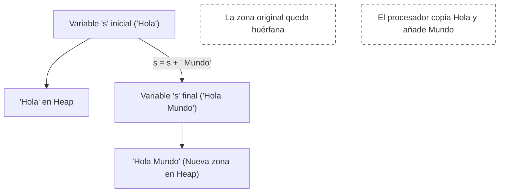

- [5. Cadenas de Texto (`string`) y Manejo del Texto](#5-cadenas-de-texto-string-y-manejo-del-texto)
  - [5.1. Definición, Inmutabilidad y Tipo de Referencia](#51-definición-inmutabilidad-y-tipo-de-referencia)
  - [5.2. Acceso y Recorrido de Cadenas](#52-acceso-y-recorrido-de-cadenas)
    - [A. Propiedad `Length` y Acceso por Índice](#a-propiedad-length-y-acceso-por-índice)
    - [B. Recorrido con Bucles](#b-recorrido-con-bucles)
  - [5.3. Métodos y Operadores Esenciales](#53-métodos-y-operadores-esenciales)
    - [Ejemplo de Flujo de Datos](#ejemplo-de-flujo-de-datos)
  - [5.4. `StringBuilder`: Construcción de Cadenas Mutables y Rendimiento](#54-stringbuilder-construcción-de-cadenas-mutables-y-rendimiento)
    - [A. El Problema del Rendimiento (`+` vs. `StringBuilder`)](#a-el-problema-del-rendimiento--vs-stringbuilder)
    - [B. Uso Correcto de `StringBuilder`](#b-uso-correcto-de-stringbuilder)
  - [5.5. Curiosidad: String Interning (Pool de Cadenas)](#55-curiosidad-string-interning-pool-de-cadenas)


# 5. Cadenas de Texto (`string`) y Manejo del Texto

Las cadenas de texto (`string`) son la estructura fundamental para manejar y manipular el texto en programación. Son una secuencia ordenada de caracteres. Se comportan de manera similar a los arrays, pero con características especiales que las hacen únicas. Estas características incluyen su inmutabilidad, métodos específicos para manipulación de texto, y un conjunto de operadores diseñados para trabajar con ellas de manera eficiente.

## 5.1. Definición, Inmutabilidad y Tipo de Referencia

El concepto más importante a entender sobre las cadenas en DAW es la **inmutabilidad**, que tiene grandes implicaciones en el rendimiento.

| Característica | Detalle Didáctico | Justificación Pedagógica |
| :--- | :--- | :--- |
| **Inmutabilidad** | Una vez que una cadena se crea, su valor no puede ser alterado. Cualquier método que parezca modificarla en realidad **devuelve una nueva cadena**, dejando la original intacta. | **Seguridad y Previsibilidad:** Garantiza que los valores de texto pasados sean seguros. |
| **Tipo de Referencia** | Los `string` son tipos de referencia. Sin embargo, en DAW, el operador de igualdad **`==`** realiza una **comparación de valor** (contenido). | Simplifica la programación. |
| **El Carácter (`char`)** | Un carácter individual se representa como una **cadena (`string`) de longitud 1**. | **Simplificación Didáctica:** Trata todo el texto de manera uniforme. |



## 5.2. Acceso y Recorrido de Cadenas

Una cadena se comporta lógicamente como un **array de caracteres**.

### A. Propiedad `Length` y Acceso por Índice

La propiedad **`.Length`** devuelve el número de caracteres. El acceso es **cero-basado**. El resultado de `palabra[i]` es una **cadena (`string`) de longitud 1**.

```csharp
Main {
  var palabra = "Clave";
  writeLine("Longitud de 'Clave': " + palabra.Length); // Muestra 5
  string primerLetra = palabra[0];
  writeLine("Primer carácter: " + primerLetra); // Muestra C
}
```

### B. Recorrido con Bucles

| Bucle | Uso Recomendado | Justificación Didáctica |
| :--- | :--- | :--- |
| **`for`** | Cuando se necesita la **posición exacta (índice)**. | Ofrece el control más fino, esencial para cifrados o inversiones. |
| **`foreach`** | Cuando solo se necesita **leer** cada carácter secuencialmente. | Método más legible y seguro, minimizando errores de límites. |

```csharp
Main {
  var texto = "DAW";
  for (int i = 0; i < texto.Length; i++) {
    writeLine("Índice " + i + ": " + texto[i]);
  }
}
```

## 5.3. Métodos y Operadores Esenciales

| Tipo de Operación | Método/Operador | Descripción Detallada | Devuelve |
| :--- | :--- | :--- | :--- |
| **Concatenación** | **`+`** | Une dos o más cadenas, creando una **nueva**. | `string` |
| **Limpieza** | **`.Trim()`** | Elimina los espacios en blanco del **inicio** y **final**. | `string` |
| **Transformación** | **`.ToUpper()`** | Devuelve una nueva cadena con todos los caracteres en **mayúsculas**. | `string` |
| **Transformación** | **`.ToLower()`** | Devuelve una nueva cadena con todos los caracteres en **minúsculas**. | `string` |
| **Búsqueda** | **`.Contains(subcadena)`** | Verifica si la cadena contiene la `subcadena` especificada. | `bool` |
| **Búsqueda** | **`.IndexOf(subcadena)`** | Devuelve la posición del primer carácter o `-1` si no existe. | `int` |
| **Extracción** | **`.Substring(inicio, [long])`** | Extrae una porción de la cadena. | `string` |
| **Sustitución** | **`.Replace(viejo, nuevo)`** | Devuelve nueva cadena reemplazando todas las ocurrencias. | `string` |
| **Separación** | **`.Split(delimitador)`** | Divide la cadena en un **array de `string`s**. | `string[]` |

### Ejemplo de Flujo de Datos

```csharp
Main {
  var entrada = "  Producto|123.50|3 "; 
  string limpio = entrada.Trim().Replace("|", ","); 
  string[] partes = limpio.Split(',');
  string nombre = partes[0].ToUpper(); 
  decimal precio = (decimal) partes[1]; 
  int cantidad = (int) partes[2]; 
  writeLine($"Item: {nombre}, Total: {precio * cantidad}");
}
```

## 5.4. `StringBuilder`: Construcción de Cadenas Mutables y Rendimiento

El uso de **`StringBuilder`** es una práctica obligatoria cuando se requiere construir una cadena mediante muchas operaciones de concatenación.

### A. El Problema del Rendimiento (`+` vs. `StringBuilder`)

| Operación | Complejidad | Justificación de la Ineficiencia |
| :--- | :--- | :--- |
| **Concatenación `+`** | **$O(n^2)$** | Por cada paso, se **crea una nueva cadena**. 1000 iteraciones = 1000 asignaciones. |
| **`StringBuilder.Append()`** | **$O(n)$** | Modifica una única estructura de *buffer* interno de forma eficiente. |

### B. Uso Correcto de `StringBuilder`

| Método | Descripción | Retorno |
| :--- | :--- | :--- |
| **`StringBuilder()`** | Constructor, crea una instancia. | `StringBuilder` |
| **`.Append(valor)`** | Añade texto al *buffer* interno sin crear nuevas copias. | `StringBuilder` |
| **`.ToString()`** | Convierte el contenido interno mutable en una cadena final. | `string` |

```csharp
Main {
    var log = StringBuilder();
    for (int i = 0; i < 100; i++) {
        log.Append("ERROR - Línea ").Append(i).Append(": Archivo no encontrado.\n");
    }
    string logCompleto = log.ToString();
    writeLine("Log creado. Caracteres totales: " + logCompleto.Length);
}
```

## 5.5. Curiosidad: String Interning (Pool de Cadenas)
¿Sabías que si creas dos variables con el literal `"Hola"`, a menudo el sistema las hace apuntar a la **misma dirección** de memoria para ahorrar espacio? Al ser inmutables, no hay peligro. Esto se conoce como el Pool de Cadenas.

