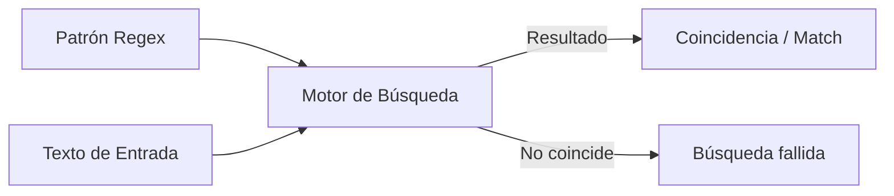

- [6. Expresiones Regulares (`Regex`)](#6-expresiones-regulares-regex)
  - [6.1. Explicación Teórica y Conceptos Clave](#61-explicación-teórica-y-conceptos-clave)
    - [A. ¿Qué es una Expresión Regular?](#a-qué-es-una-expresión-regular)
    - [B. Metacaracteres Esenciales (Modelo de Búsqueda)](#b-metacaracteres-esenciales-modelo-de-búsqueda)
  - [6.2. Uso de Expresiones Regulares en el Lenguaje DAW](#62-uso-de-expresiones-regulares-en-el-lenguaje-daw)
    - [A. Creación y Definición del Patrón](#a-creación-y-definición-del-patrón)
    - [B. Métodos de Uso y Mecanismos de Coincidencia](#b-métodos-de-uso-y-mecanismos-de-coincidencia)
    - [C. Ejemplos de Búsqueda y Extracción](#c-ejemplos-de-búsqueda-y-extracción)
    - [D. Ejemplo de Validación y Sustitución](#d-ejemplo-de-validación-y-sustitución)
  - [6.3. Tabla Maestra de Validaciones Comunes](#63-tabla-maestra-de-validaciones-comunes)
  - [6.4. El concepto de Codicia (Greediness)](#64-el-concepto-de-codicia-greediness)


# 6. Expresiones Regulares (`Regex`)

Las expresiones regulares (a menudo abreviadas como *Regex* o *RegExp*) son patrones utilizados para encontrar combinaciones de subcadenas dentro de textos. Son una herramienta esencial para la validación de datos, la búsqueda avanzada y la manipulación compleja de cadenas.

## 6.1. Explicación Teórica y Conceptos Clave

### A. ¿Qué es una Expresión Regular?

Una expresión regular es esencialmente un **lenguaje de programación en miniatura** que describe un conjunto de cadenas. Permiten definir reglas de búsqueda de forma concisa. Puedes ayudarte a costruirlas [aquí](https://regex101.com/).

| Concepto | Detalle Didáctico | Justificación de su Uso |
| :--- | :--- | :--- |
| **Patrón** | Secuencia de caracteres especiales y literales que define la regla de búsqueda. | Permite buscar **estructuras**, no solo coincidencias exactas. |
| **Búsqueda con Patrón** | El motor de Regex recorre la cadena, intentando hacer coincidir el patrón en cada posición. | Forma más potente de validar formatos complejos (emails, fechas). |



### B. Metacaracteres Esenciales (Modelo de Búsqueda)

| Metacarácter | Descripción | Equivalente en DAW |
| :--- | :--- | :--- |
| **`\d`** | Coincide con cualquier **dígito** (0-9). | `[0-9]` |
| **`\w`** | Cualquier **carácter de palabra** (letras, números y guion bajo). | `[a-zA-Z0-9_]` |
| **`+`** | Coincide con el elemento anterior **una o más veces**. | Cuantificador |
| **`*`** | Coincide con el elemento anterior **cero o más veces**. | Cuantificador |
| **`?`** | Coincide con el anterior **cero o una vez** (opcional). | Cuantificador |
| **`.`** | Coincide con **cualquier carácter** (excepto salto de línea). | Comodín |

## 6.2. Uso de Expresiones Regulares en el Lenguaje DAW

En DAW, las expresiones regulares se manejan a través de la clase **`Regex`**. Se utiliza la sintaxis de **`string` sin procesar (`@""`)** para evitar problemas con la barra invertida (`\`).

### A. Creación y Definición del Patrón

| Sintaxis DAW | Propósito | Justificación |
| :--- | :--- | :--- |
| `var regex = Regex(patron);` | Crea el objeto con la lógica de búsqueda. | El objeto `Regex` compila el patrón internamente para optimizar. |
| `var patron = @""...;` | Utiliza el string sin procesar. | El prefijo `@` trata la cadena literalmente, vital para las `\`. |

### B. Métodos de Uso y Mecanismos de Coincidencia

| Método DAW | Descripción | Devuelve | Uso Recomendado |
| :--- | :--- | :--- | :--- |
| **`.IsMatch(cadena)`** | Comprueba si el patrón se encuentra **en alguna parte**. | `bool` | Validación rápida. |
| **`.Match(cadena)`** | Encuentra **la primera** coincidencia. | Objeto `Match` | Extracción simple. |
| **`.Matches(cadena)`** | Encuentra **todas** las coincidencias. | Colección de `Match` | Extracción múltiple. |
| **`.Replace(cadena, nuevo)`** | Reemplaza las subcadenas que coinciden por el `nuevo` texto. | `string` | Limpieza de datos. |

### C. Ejemplos de Búsqueda y Extracción

```csharp
Main {
  var patron = @"\d+";
  var regex = Regex(patron);
  string texto = "El año 2024 tiene 366 días.";
  var coincidencias = regex.Matches(texto);

  foreach (var match in coincidencias) {
      writeLine("Número encontrado: " + match.Value);
  }
}
```

### D. Ejemplo de Validación y Sustitución

```csharp
Main {
  var patronHora = @"^\d{2}:\d{2}$";
  var regexHora = Regex(patronHora);
  string tiempo = "14:30";
  bool esValido = regexHora.IsMatch(tiempo);
  writeLine($"'{tiempo}' es una hora válida: {esValido}"); // true

  string cadenaSucio = "La fruta (manzana) y la verdura (lechuga) son sanas.";
  var regexParentesis = Regex(@"\(.*?\)");
  string cadenaLimpia = regexParentesis.Replace(cadenaSucio, "");
  writeLine("Cadena limpia: " + cadenaLimpia);
}
```

## 6.3. Tabla Maestra de Validaciones Comunes

| Objetivo | Patrón DAW (`@""`) | Explicación del Patrón |
| :--- | :--- | :--- |
| **Solo Dígitos** | `@"\d+"` | Cualquier dígito, una o más veces. |
| **Solo Minúsculas** | `@"[a-z]+"` | Letras de 'a' a 'z', una o más veces. |
| **Solo Mayúsculas** | `@"[A-Z]+"` | Letras de 'A' a 'Z', una o más veces. |
| **Teléfono (9 dígitos)** | `@"\d{9}"` | Dígito exactamente 9 veces. |
| **DNI (8 Números y Letra)** | `@"\d{8}[A-Z]"` | 8 dígitos y una letra mayúscula final. |
| **Email Básico** | `@"[a-zA-Z0-9._%+-]+@[a-zA-Z0-9.-]+\.[a-zA-Z]{2,}"` | Parte local + @ + dominio + . + TLD. |
| **Fecha (DD/MM/AAAA)** | `@"\d{2}/\d{2}/\d{4}"` | 2 d (día) / 2 d (mes) / 4 d (año). |
| **URL (HTTP/HTTPS)** | `@"(http|https)://\w+\.\w+"` | http o https literal seguido de dominio. |
| **Tarjeta de Crédito** | `@"\d{4} \d{4} \d{4} \d{4}"` | Cuatro bloques de 4 dígitos con espacios. |

## 6.4. El concepto de Codicia (Greediness)
Por defecto, cuantificadores como `+` o `*` son **codiciosos**: intentan capturar la mayor parte del texto posible. 
*   *Ejemplo*: En `"<div>Hola</div>"`, la regex `<.*>` capturaría TODO el texto, no solo el primer tag. 
*   *Solución*: Añade un `?` tras el cuantificador (`<.*?>`) para convertirlo en "no codicioso" (Lazy).
