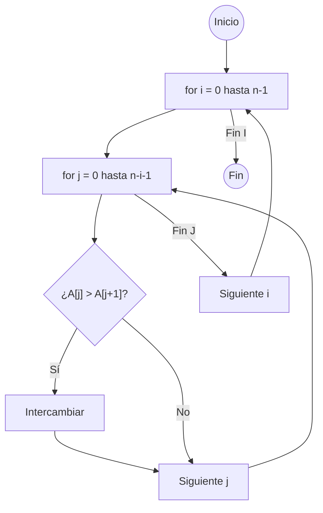
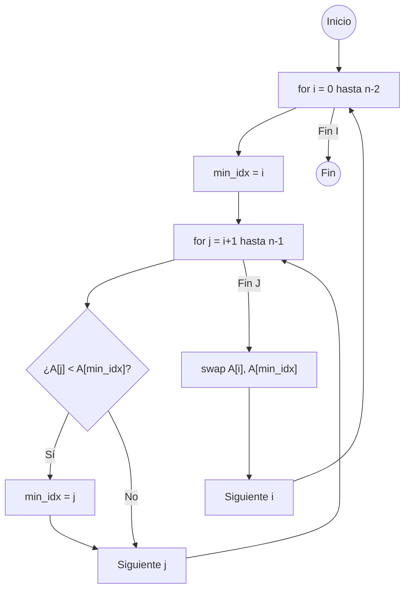
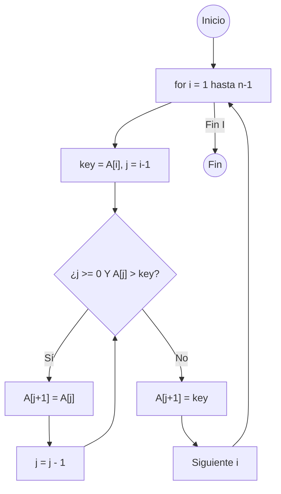
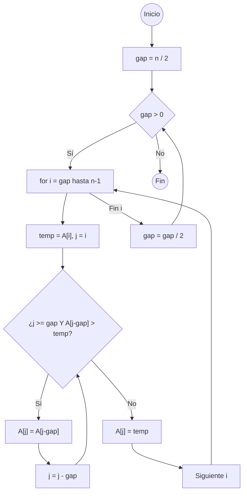
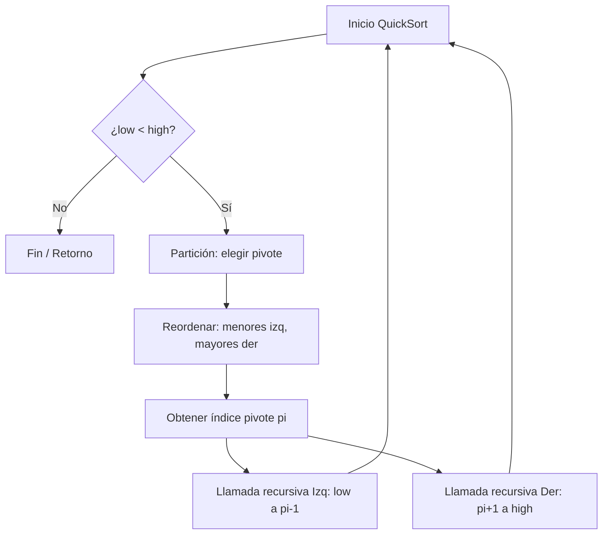
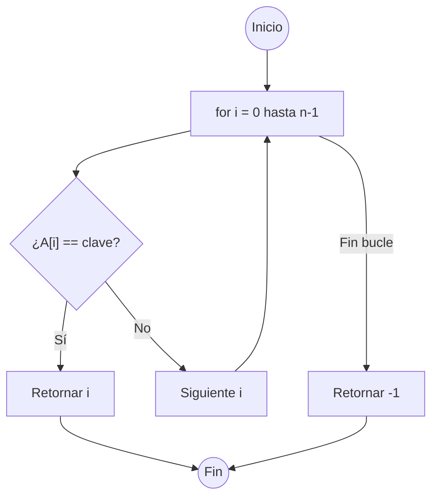
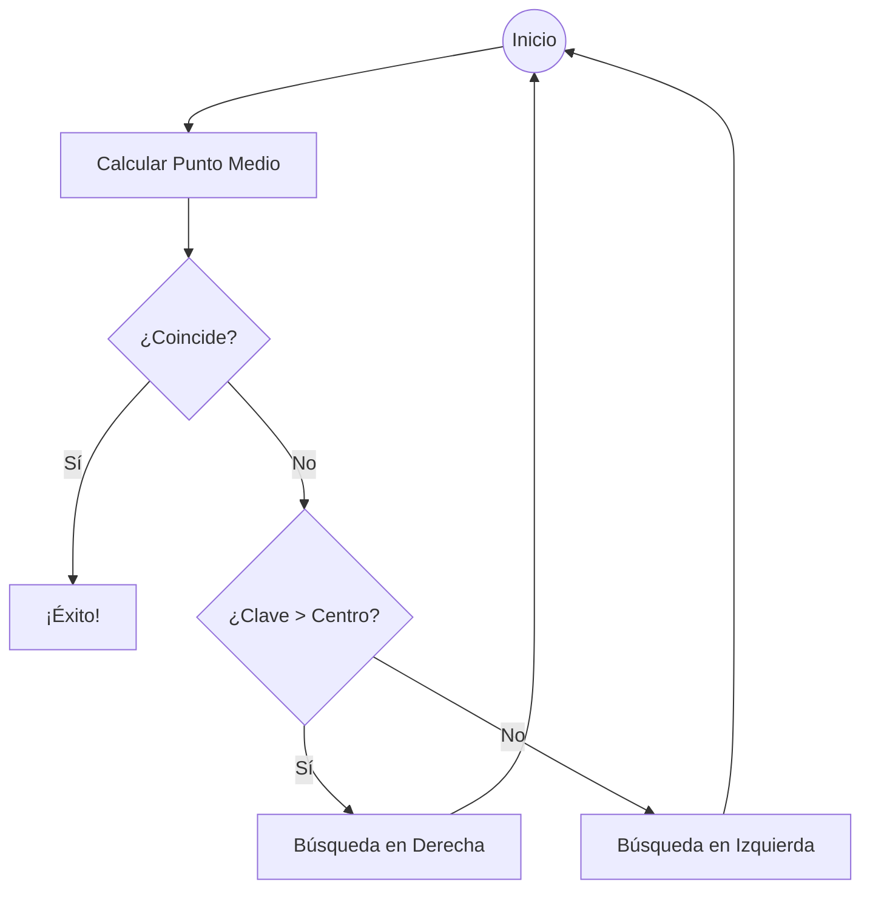

- [7. Algoritmos y Métodos de Ordenación y Búsqueda](#7-algoritmos-y-métodos-de-ordenación-y-búsqueda)
  - [7.1. Algoritmos y Métodos de Ordenación (Sorting)](#71-algoritmos-y-métodos-de-ordenación-sorting)
    - [7.1.1. Algoritmo de Burbuja (Bubble Sort)](#711-algoritmo-de-burbuja-bubble-sort)
      - [Teoría](#teoría)
      - [Pros y Contras](#pros-y-contras)
      - [Visualización](#visualización)
      - [Implementación en Lenguaje DAW](#implementación-en-lenguaje-daw)
    - [7.1.2. Algoritmo de Selección (Selection Sort)](#712-algoritmo-de-selección-selection-sort)
      - [Teoría](#teoría-1)
      - [Pros y Contras](#pros-y-contras-1)
      - [Visualización](#visualización-1)
      - [Implementación en Lenguaje DAW](#implementación-en-lenguaje-daw-1)
    - [7.1.3. Algoritmo de Inserción (Insertion Sort)](#713-algoritmo-de-inserción-insertion-sort)
      - [Teoría](#teoría-2)
      - [Pros y Contras](#pros-y-contras-2)
      - [Visualización](#visualización-2)
      - [Implementación en Lenguaje DAW](#implementación-en-lenguaje-daw-2)
    - [7.1.4. Algoritmo Shell Sort](#714-algoritmo-shell-sort)
      - [Teoría](#teoría-3)
      - [Pros y Contras](#pros-y-contras-3)
      - [Visualización](#visualización-3)
      - [Estructura en Lenguaje DAW](#estructura-en-lenguaje-daw)
    - [7.1.5. Algoritmo QuickSort (Ordenación Rápida)](#715-algoritmo-quicksort-ordenación-rápida)
      - [Teoría](#teoría-4)
      - [Pros y Contras](#pros-y-contras-4)
      - [Visualización](#visualización-4)
      - [Diagrama de Flujo Mejorado (QuickSort)](#diagrama-de-flujo-mejorado-quicksort)
      - [Estructura en Lenguaje DAW (Concepto Recursivo)](#estructura-en-lenguaje-daw-concepto-recursivo)
  - [7.2. Algoritmos de Búsqueda (Searching)](#72-algoritmos-de-búsqueda-searching)
    - [7.2.1. Búsqueda Lineal o Secuencial (Linear Search)](#721-búsqueda-lineal-o-secuencial-linear-search)
      - [Teoría](#teoría-5)
      - [Pros y Contras](#pros-y-contras-5)
      - [Visualización](#visualización-5)
      - [Implementación en Lenguaje DAW](#implementación-en-lenguaje-daw-3)
    - [7.2.2. Búsqueda Binaria o Dicotómica (Binary Search)](#722-búsqueda-binaria-o-dicotómica-binary-search)
      - [Teoría](#teoría-6)
      - [Pros y Contras](#pros-y-contras-6)
      - [Visualización](#visualización-6)
      - [Implementación en Lenguaje DAW](#implementación-en-lenguaje-daw-4)
  - [7.3. Tabla Comparativa de Complejidad (Big O)](#73-tabla-comparativa-de-complejidad-big-o)


# 7. Algoritmos y Métodos de Ordenación y Búsqueda

Los algoritmos de ordenación son procedimientos sistemáticos para organizar los elementos de una colección (como un array) en un orden específico, ya sea ascendente o descendente. La elección del algoritmo adecuado depende de varios factores, incluyendo la eficiencia, la estabilidad y la simplicidad.

| Concepto        | Explicación |
| :-------------- | :--- |
| **Ordenación**  | Proceso de organizar los elementos de una colección según una clave específica (ej. valor numérico, orden alfabético). |
| **Estabilidad** | Un algoritmo es **estable** si mantiene el orden relativo original de los elementos que tienen valores iguales. (Ej. Si dos "5" estaban en orden A, B, tras la ordenación seguirán en orden A, B). |
| **Complejidad** | Se mide por el número de comparaciones e intercambios. Es crucial para elegir el algoritmo adecuado para grandes volúmenes de datos. |

De todos los algoritmos de ordenación, los más comunes y didácticos que veremos, puedes visualizarlos [aquí](https://www.cs.usfca.edu/~galles/visualization/Algorithms.html) o [aquí](https://visualgo.net/en/sorting) y [aquí](https://algorithm-visualizer.org/).

## 7.1. Algoritmos y Métodos de Ordenación (Sorting)

### 7.1.1. Algoritmo de Burbuja (Bubble Sort)

#### Teoría
El algoritmo de [burbuja](https://es.wikipedia.org/wiki/Ordenamiento_de_burbuja) compara repetidamente **elementos adyacentes** y los intercambia si están en el orden incorrecto. El proceso se repite hasta que el array está completamente ordenado. En cada pasada, el elemento más grande "flota" o "sube" hasta su posición final. Es uno de los algoritmos más simples, pero también uno de los menos eficientes para grandes conjuntos de datos.

#### Pros y Contras
| Aspecto               | Evaluación | Uso Habitual |
| :-------------------- | :--- | :--- |
| **Fácil de entender** | **✅ Pro:** Es el algoritmo de ordenación más sencillo de explicar y visualizar para principiantes. | **Uso Didáctico:** Ideal para introducir el concepto de ordenación y la complejidad $O(n^2)$. |
| **Eficiencia**        | **❌ Contra:** Su complejidad en el peor y caso promedio es **$O(n^2)$** (cuadrática), lo que lo hace inutilizable para grandes conjuntos de datos. | **Array casi ordenado:** Rinde sorprendentemente bien si el array está *casi* ordenado (su mejor caso es $O(n)$). |

#### Visualización


**Visualización del Algoritmo de Burbuja**: https://www.youtube.com/watch?v=lyZQPjUT5B4



#### Implementación en Lenguaje DAW
```csharp
// Función auxiliar para intercambiar dos elementos
procedure swap(int[] arr, int i, int j) {
    var temp = arr[i];
    arr[i] = arr[j];
    arr[j] = temp;
}

procedure bubbleSort(int[] arr) {
    var n = arr.Length;
    var swapped = bool; // Inicializado a false

    for (int i = 0; i < n - 1; i++) {
        swapped = false; 
        for (int j = 0; j < n - i - 1; j++) {
            if (arr[j] > arr[j + 1]) {
                swap(arr, j, j + 1);
                swapped = true; 
            }
        }
        if (!swapped) {
            break;
        }
    }
}
```

---

### 7.1.2. Algoritmo de Selección (Selection Sort)

#### Teoría
El algoritmo de [selección](https://es.wikipedia.org/wiki/Ordenamiento_por_selecci%C3%B3n) divide el array en dos partes: una ordenada y otra sin ordenar. En cada iteración, busca el **elemento más pequeño** de la parte sin ordenar y lo **intercambia** con el primer elemento de la parte sin ordenar. Este método es más eficiente que el método de la burbuja, ya que solo hace una comparación por cada iteración.

#### Pros y Contras
| Aspecto          | Evaluación | Uso Habitual |
| :--------------- | :--- | :--- |
| **Intercambios** | **✅ Pro:** Realiza el **mínimo número de intercambios** posibles ($O(n)$ swaps). Esto es ventajoso si la escritura a memoria es costosa. | **Operaciones de Escritura Costosas:** Útil en sistemas donde el coste de la escritura es mucho mayor que el de la lectura. |
| **Eficiencia**   | **❌ Contra:** Su complejidad es siempre **$O(n^2)$**, incluso si ya está ordenado. | **Uso Didáctico:** Ideal para enseñar la optimización del número de intercambios. |

#### Visualización


**Visualización del Algoritmo de Selección**: https://www.youtube.com/watch?v=Ns4TPTC8whw



#### Implementación en Lenguaje DAW
```csharp
procedure selectionSort(int[] arr) {
    var n = arr.Length;
    for (int i = 0; i < n - 1; i++) {
        var min_idx = i;
        for (int j = i + 1; j < n; j++) {
            if (arr[j] < arr[min_idx]) {
                min_idx = j;
            }
        }
        swap(arr, min_idx, i);
    }
}
```

---

### 7.1.3. Algoritmo de Inserción (Insertion Sort)

#### Teoría
El algoritmo de [insercción](https://es.wikipedia.org/wiki/Ordenamiento_por_inserci%C3%B3n) es similar a cómo un humano ordena un mazo de cartas: toma un elemento y lo **inserta en su lugar correcto** dentro de la sub-lista que ya está ordenada, desplazando los elementos mayores a la derecha.

#### Pros y Contras
| Aspecto                  | Evaluación | Uso Habitual |
| :----------------------- | :--- | :--- |
| **Datos Casi Ordenados** | **✅ Pro:** Extremadamente eficiente en el **mejor caso ($O(n)$)** y con datos casi ordenados. Es **estable**. | **Conjuntos de datos pequeños** y para **actualizar colecciones** donde el nuevo elemento se inserta en una lista ya ordenada. |
| **Eficiencia**           | **❌ Contra:** Su complejidad en el peor y caso promedio es **$O(n^2)$**. | **Uso Didáctico:** Ideal para ilustrar el concepto de sub-lista ordenada. |

#### Visualización


**Visualización del Algoritmo de Inserción**: https://www.youtube.com/watch?v=ROalU379l3U



#### Implementación en Lenguaje DAW
```csharp
procedure insertionSort(int[] arr) {
    var n = arr.Length;
    for (int i = 1; i < n; i++) {
        var key = arr[i]; 
        var j = i - 1; 
        while (j >= 0 && arr[j] > key) {
            arr[j + 1] = arr[j];
            j = j - 1;
        }
        arr[j + 1] = key;
    }
}
```

---

### 7.1.4. Algoritmo Shell Sort

#### Teoría
El [Shell Short](https://es.wikipedia.org/wiki/Ordenamiento_Shell) es una **mejora del Insertion Sort**. En lugar de comparar e intercambiar elementos adyacentes, compara elementos separados por un **intervalo (`gap`)** mayor a 1. El intervalo se reduce progresivamente hasta que es 1.

#### Pros y Contras
| Aspecto | Evaluación | Uso Habitual |
| :--- | :--- | :--- |
| **Velocidad** | **✅ Pro:** Significativamente más rápido que los métodos $O(n^2)$ puros. Se sitúa entre $O(n \log^2 n)$ y $O(n^{1.3})$. | **Conjuntos de datos de tamaño medio.** |
| **Complejidad** | **❌ Contra:** Más complejo de implementar que Inserción Pura. | **Uso Didáctico.** |

#### Visualización


**Visualización del Algoritmo Shell Sort**: https://youtu.be/J-t4OIdqs5c



#### Estructura en Lenguaje DAW
```csharp
procedure shellSort(int[] arr) {
    var n = arr.Length;
    var gap = n / 2;
    while (gap > 0) {
        for (int i = gap; i < n; i++) {
            var temp = arr[i];
            var j = i;
            while (j >= gap && arr[j - gap] > temp) {
                arr[j] = arr[j - gap];
                j = j - gap;
            }
            arr[j] = temp;
        }
        gap = gap / 2;
    }
}
```

---

### 7.1.5. Algoritmo QuickSort (Ordenación Rápida)

#### Teoría
El método [quicksort](https://es.wikipedia.org/wiki/Quicksort) es el algoritmo de ordenación por **"Divide y Vencerás"** más utilizado. Consiste en dividir el array en dos partes, una con los elementos menores que el pivote y otra con los elementos mayores. Luego se ordenan las dos partes de forma recursiva.

#### Pros y Contras
| Aspecto | Evaluación | Uso Habitual |
| :--- | :--- | :--- |
| **Velocidad (Promedio)** | **✅ Pro:** Es el algoritmo más rápido ($O(n \log n)$). | **Grandes volúmenes de datos.** |
| **Velocidad (Peor Caso)** | **❌ Contra:** Si el pivote se elige mal, degenera a $O(n^2)$. No es estable. | **Estándar industrial.** |

#### Visualización


**Visualización del Algoritmo QuickSort**: https://www.youtube.com/watch?v=ywWBy6J5gz8

#### Diagrama de Flujo Mejorado (QuickSort)


#### Estructura en Lenguaje DAW (Concepto Recursivo)
```csharp
function int partition(int[] arr, int low, int high) {
    var pivot = arr[high];
    var i = low - 1; 
    for (int j = low; j < high; j++) {
        if (arr[j] <= pivot) {
            i = i + 1;
            swap(arr, i, j); 
        }
    }
    swap(arr, i + 1, high); 
    return i + 1;
}

procedure quickSort(int[] arr, int low, int high) {
    if (low < high) {
        var pi = partition(arr, low, high);
        quickSort(arr, low, pi - 1);
        quickSort(arr, pi + 1, high);
    }
}
```

---

## 7.2. Algoritmos de Búsqueda (Searching)

| Concepto | Explicación |
| :--- | :--- |
| **Elemento Clave** | Es el valor que estamos intentando encontrar. |
| **Precondición** | La búsqueda binaria exige que la colección esté **ordenada**. |

### 7.2.1. Búsqueda Lineal o Secuencial (Linear Search)

#### Teoría
Recorre el array **elemento por elemento**, comparando cada valor con el elemento clave. Se detiene en la primera coincidencia o al final.

#### Pros y Contras
| Aspecto | Evaluación | Uso Habitual |
| :--- | :--- | :--- |
| **Simplicidad** | **✅ Pro:** Sin precondiciones. Extremadamente fácil de implementar. | **Arrays Pequeños y Desordenados.** |
| **Eficiencia** | **❌ Contra:** Su complejidad es $O(n)$. No escala bien. | **Uso Didáctico.** |

#### Visualización


**Visualización de Búsqueda Lineal**: https://www.youtube.com/watch?v=-PuqKbu9K3U



#### Implementación en Lenguaje DAW
```csharp
function int linearSearch(int[] arr, int key) {
    for (int i = 0; i < arr.Length; i++) {
        if (arr[i] == key) return i;
    }
    return -1;
}
```

---

### 7.2.2. Búsqueda Binaria o Dicotómica (Binary Search)

#### Teoría
Algoritmo **altamente eficiente** basado en "Divide y Vencerás". Requiere array **ordenado**. Compara con el centro y reduce el espacio de búsqueda a la mitad.

#### Pros y Contras
| Aspecto | Evaluación | Uso Habitual |
| :--- | :--- | :--- |
| **Eficiencia** | **✅ Pro:** Complejidad $O(\log n)$. Muy rápida. | **Grandes Bases de Datos.** |
| **Precondición** | **❌ Contra:** Exige que el array esté ordenado. | **Uso Didáctico.** |

#### Visualización


**Visualización de Búsqueda Binaria**: https://www.youtube.com/watch?v=iP897Z5Nerk



#### Implementación en Lenguaje DAW
```csharp
function int binarySearch(int[] arr, int key) {
    var low = 0;
    var high = arr.Length - 1;
    while (low <= high) {
        var mid = (low + high) / 2;
        if (arr[mid] == key) return mid;
        else if (arr[mid] > key) high = mid - 1;
        else low = mid + 1;
    }
    return -1;
}
```

---

## 7.3. Tabla Comparativa de Complejidad (Big O)

| Algoritmo | Mejor Caso | Caso Promedio | Peor Caso | Estabilidad |
| :--- | :---: | :---: | :---: | :---: |
| **Burbuja** | $O(n)$ | $O(n^2)$ | $O(n^2)$ | ✅ Sí |
| **Selección** | $O(n^2)$ | $O(n^2)$ | $O(n^2)$ | ❌ No |
| **Inserción** | $O(n)$ | $O(n^2)$ | $O(n^2)$ | ✅ Sí |
| **QuickSort** | $O(n \log n)$ | $O(n \log n)$ | $O(n^2)$ | ❌ No |
| **Búsqueda Lineal** | $O(1)$ | $O(n)$ | $O(n)$ | N/A |
| **Búsqueda Binaria**| $O(1)$ | $O(\log n)$ | $O(\log n)$ | N/A |
