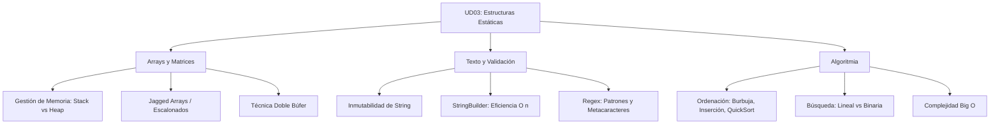

- [8. Resumen y Conclusiones UD03](#8-resumen-y-conclusiones-ud03)
  - [8.1. Resumen de la Unidad](#81-resumen-de-la-unidad)
  - [8.2. Mapa Conceptual Maestro](#82-mapa-conceptual-maestro)
  - [8.3. Tabla de Referencia: Eficiencia de Algoritmos (Big O)](#83-tabla-de-referencia-eficiencia-de-algoritmos-big-o)
  - [5.4. ⚠️ Top 5 Errores Comunes en UD03](#54-️-top-5-errores-comunes-en-ud03)
  - [🚩 Checklist de Supervivencia UD03](#-checklist-de-supervivencia-ud03)

# 8. Resumen y Conclusiones UD03

## 8.1. Resumen de la Unidad
En esta unidad hemos dominado el manejo de estructuras de almacenamiento estático y los algoritmos fundamentales que operan sobre ellas:
- **Arrays**: Entendimiento profundo de la memoria contigua, el cálculo de direcciones y la diferencia entre **Identidad** (referencia) e **Igualdad** (contenido).
- **Matrices**: Uso profesional de arrays escalonados (**Jagged Arrays**) y optimización de rendimiento mediante el acceso por filas (Row-Major).
- **Doble Búfer**: Implementación del patrón de diseño para asegurar la consistencia de datos en sistemas de lectura/escritura concurrente.
- **Cadenas y Regex**: Manipulación de `string` inmutables, uso de `StringBuilder` para eficiencia y validación robusta mediante Expresiones Regulares.
- **Algoritmia**: Análisis de la eficiencia de los métodos de ordenación y búsqueda mediante la notación Big O.

## 8.2. Mapa Conceptual Maestro

## 8.3. Tabla de Referencia: Eficiencia de Algoritmos (Big O)

| Algoritmo | Mejor Caso | Caso Promedio | Peor Caso | Estabilidad |
| :--- | :---: | :---: | :---: | :---: |
| **Burbuja** | $O(n)$ | $O(n^2)$ | $O(n^2)$ | ✅ Sí |
| **Selección** | $O(n^2)$ | $O(n^2)$ | $O(n^2)$ | ❌ No |
| **Inserción** | $O(n)$ | $O(n^2)$ | $O(n^2)$ | ✅ Sí |
| **QuickSort** | $O(n \log n)$ | $O(n \log n)$ | $O(n^2)$ | ❌ No |
| **Búsqueda Lineal** | $O(1)$ | $O(n)$ | $O(n)$ | N/A |
| **Búsqueda Binaria**| $O(1)$ | $O(\log n)$ | $O(\log n)$ | N/A |

## 5.4. ⚠️ Top 5 Errores Comunes en UD03
1.  **ArrayIndexOutOfBounds**: Intentar acceder a `array[Length]`. Recuerda que el último es `Length - 1`.
2.  **Alias Inesperado**: Hacer `b = a` y pensar que son independientes. ¡Usa clonación profunda!
3.  **Concatenación en Bucle**: Usar `+` dentro de un `for` de 1000 iteraciones. ¡Usa `StringBuilder`!
4.  **Regex sin Anclas**: Olvidar `^` y `$` en una validación, permitiendo que entre basura antes o después del dato.
5.  **Búsqueda Binaria Desordenada**: Intentar usar búsqueda binaria en un array que no ha sido ordenado previamente.

## 🚩 Checklist de Supervivencia UD03

- [ ] ¿Sé dibujar en un papel cómo apunta una variable del Stack a los datos del Heap?
- [ ] ¿Entiendo por qué cambiar el tamaño de un array obliga a crear uno nuevo y copiar?
- [ ] ¿Soy capaz de explicar el mecanismo de Swap (intercambio de punteros) del Doble Búfer?
- [ ] ¿Diferencio entre una búsqueda logarítmica ($O(\log n)$) y una lineal ($O(n)$)?
- [ ] ¿Recuerdo por qué recorrer una matriz por filas es más rápido que por columnas?
