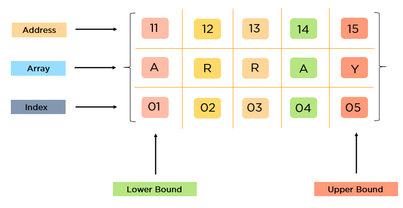
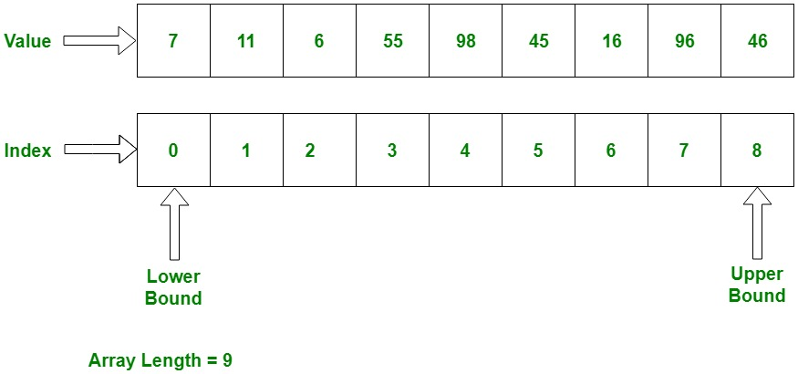
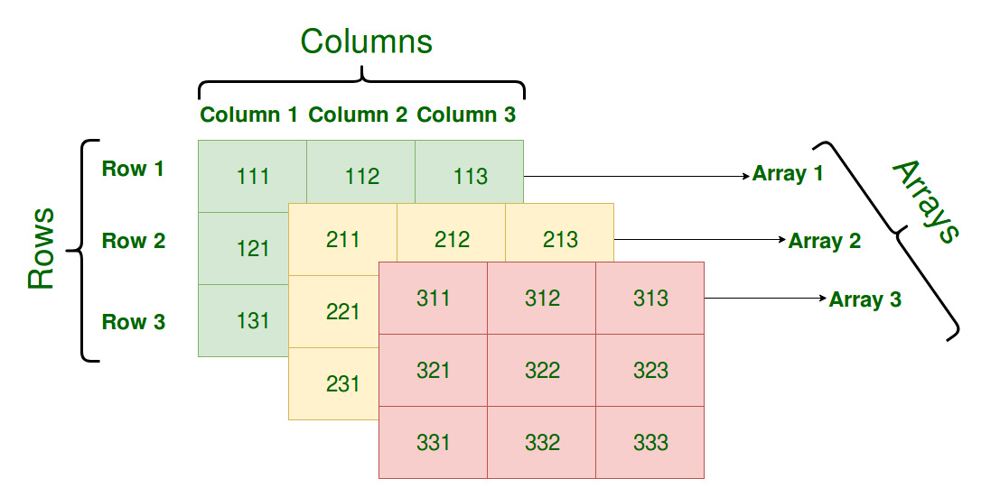

# Programación - 03 Aplicación de Estructuras de Almacenamiento Estáticas

Tema 03 Aplicación de Estructuras de Almacenamiento Estáticas. 1DAW. Curso 2025/2026.


- [Programación - 03 Aplicación de Estructuras de Almacenamiento Estáticas](#programación---03-aplicación-de-estructuras-de-almacenamiento-estáticas)
  - [Contenido en Youtube](#contenido-en-youtube)
  - [1. Arrays. Introducción](#1-arrays-introducción)
    - [1.1. Características Clave](#11-características-clave)
    - [1.2. El Problema de la Indexación (Índice Cero vs. Índice Uno)](#12-el-problema-de-la-indexación-índice-cero-vs-índice-uno)
      - [Indexación Basada en Cero](#indexación-basada-en-cero)
      - [Indexación Basada en Uno](#indexación-basada-en-uno)
    - [1.3. Arrays en DAW](#13-arrays-en-daw)
  - [2. Arrays Unidimensionales](#2-arrays-unidimensionales)
    - [2.1. Definición, Creación y Valores por Defecto](#21-definición-creación-y-valores-por-defecto)
      - [A. Inmutabilidad del Tamaño y Creación](#a-inmutabilidad-del-tamaño-y-creación)
      - [B. Valores por Defecto y Gestión de la Nulidad](#b-valores-por-defecto-y-gestión-de-la-nulidad)
    - [2.2. Obtener el Tamaño con `.Length` y Recorrido](#22-obtener-el-tamaño-con-length-y-recorrido)
      - [A. `array.Length`](#a-arraylength)
      - [B. Recorrido con Bucle `for`](#b-recorrido-con-bucle-for)
      - [C. Recorrido con Bucle `foreach` (Sintaxis Correcta)](#c-recorrido-con-bucle-foreach-sintaxis-correcta)
      - [D. Recorrido con Filtrado de Nulos (Combinando `if`)](#d-recorrido-con-filtrado-de-nulos-combinando-if)
    - [2.3. Paso por Referencia, Devolución y Clonación](#23-paso-por-referencia-devolución-y-clonación)
      - [A. Arrays y el Paso por Referencia (El Modelo de Memoria)](#a-arrays-y-el-paso-por-referencia-el-modelo-de-memoria)
      - [B. Clonación Manual para Romper la Referencia](#b-clonación-manual-para-romper-la-referencia)
      - [C. Devolución de Arrays](#c-devolución-de-arrays)
    - [2.4. Parámetros Variables (`params`)](#24-parámetros-variables-params)
    - [2.5. Identidad vs. Igualdad (Referencia vs. Contenido)](#25-identidad-vs-igualdad-referencia-vs-contenido)
    - [2.6. Copias, Clonación y la Inmutabilidad del Tamaño (DAW)](#26-copias-clonación-y-la-inmutabilidad-del-tamaño-daw)
      - [A. La Inmutabilidad: Simulando el Cambio de Tamaño](#a-la-inmutabilidad-simulando-el-cambio-de-tamaño)
        - [Mecánica de Cambio de Tamaño](#mecánica-de-cambio-de-tamaño)
      - [B. Copias: Referencia vs. Clonación (Valor)](#b-copias-referencia-vs-clonación-valor)
        - [Demostración de la Copia por Referencia](#demostración-de-la-copia-por-referencia)
        - [Demostración de la Clonación Manual (Copia Profunda)](#demostración-de-la-clonación-manual-copia-profunda)
  - [3. Arrays multidimensionales](#3-arrays-multidimensionales)
    - [3.1. Conceptos Fundamentales](#31-conceptos-fundamentales)
      - [A. Tipos de Matrices](#a-tipos-de-matrices)
      - [B. Mecanismos de Almacenamiento y Rendimiento](#b-mecanismos-de-almacenamiento-y-rendimiento)
    - [3.2. Arrays Multidimensionales en el Lenguaje DAW](#32-arrays-multidimensionales-en-el-lenguaje-daw)
      - [A. Definición, Creación y Valores por Defecto](#a-definición-creación-y-valores-por-defecto)
      - [B. Valores Anulables (`T?`)](#b-valores-anulables-t)
    - [3.3. Recorrido con `for` y `foreach`](#33-recorrido-con-for-y-foreach)
      - [A. Bucle `for` (Acceso por Índice)](#a-bucle-for-acceso-por-índice)
      - [B. Bucle `foreach` (Lectura con Anidación)](#b-bucle-foreach-lectura-con-anidación)
    - [3.4. Identidad, Igualdad y Clonación en Matrices](#34-identidad-igualdad-y-clonación-en-matrices)
      - [A. Identidad vs. Igualdad (Doble Referencia)](#a-identidad-vs-igualdad-doble-referencia)
      - [B. Clonación (Copia Profunda)](#b-clonación-copia-profunda)
    - [3.5. Paso por Referencia y Devolución de Matrices](#35-paso-por-referencia-y-devolución-de-matrices)
    - [3.6. Copias, Clonación Profunda y Gestión del Tamaño en Matrices](#36-copias-clonación-profunda-y-gestión-del-tamaño-en-matrices)
      - [A. La Doble Referencia (Copia Superficial vs. Copia Profunda)](#a-la-doble-referencia-copia-superficial-vs-copia-profunda)
        - [Demostración de la Peligrosa Copia Superficial](#demostración-de-la-peligrosa-copia-superficial)
      - [B. Clonación Profunda Manual (Técnica Correcta)](#b-clonación-profunda-manual-técnica-correcta)
      - [C. Modificación del Tamaño (Recreación de la Matriz)](#c-modificación-del-tamaño-recreación-de-la-matriz)
        - [Ejemplo: Añadir una Fila a la Matriz](#ejemplo-añadir-una-fila-a-la-matriz)
        - [Ejemplo de Cambio de Tamaño: Migrar de 3x3 a 5x5 (Escalado)](#ejemplo-de-cambio-de-tamaño-migrar-de-3x3-a-5x5-escalado)
    - [3.7. Doble Búfer (Double Buffering)](#37-doble-búfer-double-buffering)
      - [Teoría de la Técnica](#teoría-de-la-técnica)
      - [Aplicación Didáctica: Simulación de Propagación de Estado](#aplicación-didáctica-simulación-de-propagación-de-estado)
      - [Mecanismo en Lenguaje DAW](#mecanismo-en-lenguaje-daw)
      - [Mecanismo de Intercambio (Swap) y Justificación de la Eficiencia (O(1) vs O($n^2$))](#mecanismo-de-intercambio-swap-y-justificación-de-la-eficiencia-o1-vs-on2)
  - [4. Cadenas de Texto (`string`) y Manejo del Texto](#4-cadenas-de-texto-string-y-manejo-del-texto)
    - [4.1. Definición, Inmutabilidad y Tipo de Referencia](#41-definición-inmutabilidad-y-tipo-de-referencia)
    - [4.2. Acceso y Recorrido de Cadenas](#42-acceso-y-recorrido-de-cadenas)
      - [A. Propiedad `Length` y Acceso por Índice](#a-propiedad-length-y-acceso-por-índice)
      - [B. Recorrido con Bucles](#b-recorrido-con-bucles)
    - [4.3. Métodos y Operadores Esenciales](#43-métodos-y-operadores-esenciales)
      - [Ejemplo de Flujo de Datos](#ejemplo-de-flujo-de-datos)
    - [4.4. `StringBuilder`: Construcción de Cadenas Mutables y Rendimiento](#44-stringbuilder-construcción-de-cadenas-mutables-y-rendimiento)
      - [A. El Problema del Rendimiento (`+` vs. `StringBuilder`)](#a-el-problema-del-rendimiento--vs-stringbuilder)
      - [B. Uso Correcto de `StringBuilder`](#b-uso-correcto-de-stringbuilder)
      - [Ejemplo de Uso Eficiente en Código DAW](#ejemplo-de-uso-eficiente-en-código-daw)
  - [5. Expresiones Regulares (`Regex`)](#5-expresiones-regulares-regex)
    - [5.1. Explicación Teórica y Conceptos Clave](#51-explicación-teórica-y-conceptos-clave)
      - [A. ¿Qué es una Expresión Regular?](#a-qué-es-una-expresión-regular)
      - [B. Metacaracteres Esenciales (Modelo de Búsqueda)](#b-metacaracteres-esenciales-modelo-de-búsqueda)
    - [5.2. Uso de Expresiones Regulares en el Lenguaje DAW](#52-uso-de-expresiones-regulares-en-el-lenguaje-daw)
      - [A. Creación y Definición del Patrón](#a-creación-y-definición-del-patrón)
      - [B. Métodos de Uso y Mecanismos de Coincidencia](#b-métodos-de-uso-y-mecanismos-de-coincidencia)
      - [C. Ejemplo de Búsqueda y Extracción](#c-ejemplo-de-búsqueda-y-extracción)
      - [D. Ejemplo de Validación y Sustitución](#d-ejemplo-de-validación-y-sustitución)
    - [5.3. Aplicación Práctica en Lenguaje DAW](#53-aplicación-práctica-en-lenguaje-daw)
  - [6. Algoritmos y Métodos de Ordenación (Sorting)](#6-algoritmos-y-métodos-de-ordenación-sorting)
    - [6.1. Algoritmo de Burbuja (Bubble Sort)](#61-algoritmo-de-burbuja-bubble-sort)
      - [Teoría](#teoría)
      - [Pros y Contras](#pros-y-contras)
      - [Visualización](#visualización)
      - [Implementación en Lenguaje DAW](#implementación-en-lenguaje-daw)
    - [6.2. Algoritmo de Selección (Selection Sort)](#62-algoritmo-de-selección-selection-sort)
      - [Teoría](#teoría-1)
      - [Pros y Contras](#pros-y-contras-1)
      - [Visualización](#visualización-1)
      - [Implementación en Lenguaje DAW](#implementación-en-lenguaje-daw-1)
    - [6.3. Algoritmo de Inserción (Insertion Sort)](#63-algoritmo-de-inserción-insertion-sort)
      - [Teoría](#teoría-2)
      - [Pros y Contras](#pros-y-contras-2)
      - [Visualización](#visualización-2)
      - [Implementación en Lenguaje DAW](#implementación-en-lenguaje-daw-2)
    - [6.4. Algoritmo Shell Sort](#64-algoritmo-shell-sort)
      - [Teoría](#teoría-3)
      - [Pros y Contras](#pros-y-contras-3)
      - [Visualización](#visualización-3)
      - [Estructura en Lenguaje DAW](#estructura-en-lenguaje-daw)
    - [6.5. Algoritmo QuickSort (Ordenación Rápida)](#65-algoritmo-quicksort-ordenación-rápida)
      - [Teoría](#teoría-4)
      - [Pros y Contras](#pros-y-contras-4)
      - [Visualización](#visualización-4)
      - [Estructura en Lenguaje DAW (Concepto Recursivo)](#estructura-en-lenguaje-daw-concepto-recursivo)
  - [7. Algoritmos de Búsqueda (Searching)](#7-algoritmos-de-búsqueda-searching)
    - [7.1. Búsqueda Lineal o Secuencial (Linear Search)](#71-búsqueda-lineal-o-secuencial-linear-search)
      - [Teoría](#teoría-5)
      - [Pros y Contras](#pros-y-contras-5)
      - [Visualización](#visualización-5)
      - [Implementación en Lenguaje DAW](#implementación-en-lenguaje-daw-3)
    - [7.2. Búsqueda Binaria o Dicotómica (Binary Search)](#72-búsqueda-binaria-o-dicotómica-binary-search)
      - [Teoría](#teoría-6)
      - [Pros y Contras](#pros-y-contras-6)
      - [Visualización](#visualización-6)
      - [Implementación en Lenguaje DAW](#implementación-en-lenguaje-daw-4)
  - [Autor](#autor)
    - [Contacto](#contacto)
  - [Licencia de uso](#licencia-de-uso)


## Contenido en Youtube

- [Podcast](https://youtu.be/rQ4tlnVeTYQ)
- [Resumen](https://youtu.be/092HimAhjog)
- [Arrays](https://youtu.be/K9n_Plv0CYU)
- [Strings](https://youtu.be/fTFaNeDxgvU)
- [Algoritmos de Ordenación y Búsqueda](https://youtu.be/_z3R-pQSD50)
- [Lista de Reproducción](https://www.youtube.com/watch?v=wKCdgacEr4Q&list=PLGIH-7eZDbVw6q2AdcAUe2r6YxJYBkfCi)


## 1. Arrays. Introducción

Un array es una estructura de datos estática y fundamental que permite almacenar una colección ordenada de elementos del **mismo tipo**. Es una de las estructuras más antiguas y eficientes en informática para el acceso a datos.

### 1.1. Características Clave

1.  **Homogeneidad (Tipo Fijo):** Todos los elementos deben ser del mismo tipo de dato (por ejemplo, todos `int` o todos `string`).
2.  **Tamaño Fijo (Inmutabilidad):** El tamaño de un array se establece en el momento de su creación y no puede ser alterado posteriormente. Si se necesita modificar el tamaño, la solución es crear un **nuevo array** con el tamaño deseado y **copiar** los elementos del original al nuevo.
3.  **Contigüidad en Memoria:** Los elementos de un array se almacenan en posiciones de memoria **contiguas** (una al lado de la otra). Esto es lo que permite su alta eficiencia.
4.  **Acceso por Índice:** El acceso a los elementos para lectura o escritura se realiza mediante su posición o **índice**, que siempre es un número entero.
5.  **Eficiencia:** El acceso a cualquier elemento es extremadamente rápido (tiempo constante, $O(1)$) porque su ubicación en memoria se calcula directamente.


>Si una variable es como un cajón de un tamaño del tipo de dato (es decir, el indentificador apunta a la zona de memoria donde se almacena el valor), un array puede verse como un conjunto de cajones (una cajonera) del mismo tamaño del tipo de dato, donde cada cajón tiene un índice que nos permite acceder a él. Por tanto, un array es una estructura de datos que nos permite almacenar un conjunto de datos del mismo tipo.


### 1.2. El Problema de la Indexación (Índice Cero vs. Índice Uno)

Unos de los principales problemas que nos encontramos al trabajar con arrays es la **indexación**, es decir, cómo se numeran las posiciones de los elementos dentro del array y cuál es la posición del primer elemento.

La convención sobre si el primer índice comienza en `0` (Cero-basado) o en `1` (Uno-basado) tiene implicaciones directas en el cálculo de la posición de memoria y es tan antigua como los propios lenguajes de programación.


#### Indexación Basada en Cero

El primer elemento se encuentra en el **índice 0**. Esta convención se basa en el cálculo directo de la dirección de memoria.

  * **Fundamento:** El índice representa el **desplazamiento** (*offset*) desde la dirección de inicio del array. El primer elemento no tiene desplazamiento, por lo que su índice es 0.

  * **Fórmula para calcular la dirección de memoria de un elemento $A[i]$:**
    La fórmula matemática se expresa en un formato de texto compatible con Markdown:

    ```
    Dirección(A[i]) = Dirección Base + (índice_i * Tamaño del Tipo)
    ```

    Donde:

      * `Dirección Base`: Es la dirección de memoria del primer elemento (índice 0).
      * `índice_i`: Es el índice del elemento buscado (ej. 0, 1, 2...).
      * `Tamaño del Tipo`: Es el número de bytes que ocupa el tipo de dato (ej. 4 bytes para `int`).

Este enfoque lo siguen lenguajes que han heredado esta filosofía de C, como C++, Java, JavaScript, Python, Kotlin, entre otros y nuestro lenguaje DAW.

#### Indexación Basada en Uno

En algunos lenguajes de programación o en contextos puramente matemáticos, el primer elemento se encuentra en el **índice 1**.

  * **Fundamento:** El índice representa la **posición ordinal** del elemento dentro de la colección, que es más intuitivo para el humano.

  * **Fórmula para calcular la dirección de memoria de un elemento $A[i]$:**
    Para compensar el índice `i` que empieza en 1, es necesario restarle 1 para obtener el desplazamiento correcto.

    ```
    Dirección(A[i]) = Dirección Base + ((índice_i - 1) * Tamaño del Tipo)
    ```

    Donde se resta **1** al índice (`índice_i`) para obtener el desplazamiento (offset) correcto respecto a la Dirección Base.

Este enfoque tiene el problema de que complica el cálculo de la dirección de memoria y puede llevar a errores si no se maneja con cuidado. Lenguajes como Fortran, MATLAB, Lua y algunos sistemas matemáticos utilizan esta convención o Visual Basic, Pascal, entre otros.

### 1.3. Arrays en DAW

En el lenguaje DAW, la indexación es **Cero-basada**. Si se accede a un índice negativo o a un índice mayor o igual al tamaño del array, se producirá un error conocido como **`ArrayIndexOutOfBoundsException`** (Excepción de Índice Fuera de Límites del Array). Esto es una medida de seguridad para evitar accesos inválidos a memoria. Recuerda que un Array es como un conjunto de cajones, si intentas abrir un cajón que no existe, el sistema te avisará con una excepción para evitar que "metas la mano" en una zona de memoria que no te pertenece.

**Uso Recomendado:** Los arrays son la mejor opción de almacenamiento cuando:
* Se conoce el **tamaño máximo de la colección** de antemano.
* Se requiere un **acceso muy rápido** a los elementos por su posición.
* No se requiere añadir o eliminar elementos con frecuencia, ya que esta operación es ineficiente (implica copiar el array).




## 2. Arrays Unidimensionales

Un array unidimensional, o vector, es una colección ordenada y homogénea (mismo tipo de datos) de elementos almacenados en memoria contigua. Es la estructura de datos fundamental para la gestión de listas de tamaño fijo.

Puedes pensar en ello como una cajonera, es decir, una serie de cajones (elementos) del mismo tamaño (tipo de dato) donde cada cajón tiene un índice que nos permite acceder a él. Por tanto, un array es una estructura de datos que nos permite almacenar un conjunto de datos del mismo tipo. 



Como se ha indicado anteriormente, los arrays en DAW tienen las siguientes características clave:
1.  **Homogeneidad:** Todos los elementos deben ser del mismo tipo de dato (por ejemplo, todos `int` o todos `string`).
2.  **Tamaño Fijo:** El tamaño de un array se establece en el momento de su creación y no puede ser alterado posteriormente. Si se necesita modificar el tamaño, la solución es crear un **nuevo array** con el tamaño deseado y **copiar** los elementos del original al nuevo.
3.  **Contigüidad en Memoria:** Los elementos de un array se almacenan en posiciones de memoria **contiguas** (una al lado de la otra). Esto es lo que permite su alta eficiencia.
4.  **Acceso por Índice:** El acceso a los elementos para lectura o escritura se realiza mediante su posición o **índice**, que siempre es un número entero. El primer elemento está en el índice `0`.
5.  **Eficiencia:** El acceso a cualquier elemento es extremadamente rápido (tiempo constante, $O(1)$) porque su ubicación en memoria se calcula directamente.
6.  **Inmutabilidad:** Una vez creado, el tamaño de un array no puede cambiar. Si se necesita un array más grande o más pequeño, se debe crear uno nuevo y copiar los elementos.
7.  **Tipos de Referencia:** En DAW, los arrays son tipos de referencia, lo que significa que las variables que los contienen almacenan la dirección de memoria donde se encuentran los datos, no los datos en sí.
8.  **Valores por Defecto:** Al crear un array, sus elementos se inicializan automáticamente a valores por defecto según su tipo (0 para `int`, `false` para `bool`, `""` para `string`, y `null` para tipos anulables).
9.  **Acceso no permitido:** No se puede acceder a un elemento de un array utilizando un índice fuera de sus límites. Esto generará un error en tiempo de ejecución llamado `ArrayIndexOutOfBoundsException`.

### 2.1. Definición, Creación y Valores por Defecto

#### A. Inmutabilidad del Tamaño y Creación

| Característica        | Detalle Didáctico                                                                                                                                                                          | Sintaxis DAW                                 |
| :-------------------- | :----------------------------------------------------------------------------------------------------------------------------------------------------------------------------------------- | :------------------------------------------- |
| **Tamaño Fijo**       | El tamaño se define al crearse y **no puede cambiarse**. Para simular un cambio, debes crear un **array nuevo** y copiar los datos (ver apartado 3.4.4).                                  | `tipo[] nombre = tipo[tamaño];`              |
| **Homogeneidad**      | Todos los elementos deben ser del mismo tipo (`int`, `string`, `bool`, etc.) para asegurar que ocupen el mismo espacio en memoria, lo que permite el cálculo rápido de su posición (O(1)). | `var numeros = int[10];`                     |
| **Valores Iniciales** | Se puede crear asignando valores directamente, lo que define automáticamente el tamaño del array.                                                                                          | `var dias = string[] {"Lun", "Mar", "Mié"};` |

#### B. Valores por Defecto y Gestión de la Nulidad

Cuando un array se crea solo con su tamaño, DAW lo rellena automáticamente.

| Tipo de Array                     | Valor por Defecto       | Justificación Didáctica                                                                                                 |
| :-------------------------------- | :---------------------- | :---------------------------------------------------------------------------------------------------------------------- |
| **Primitivo** (`int[]`, `bool[]`) | **0** / **`false`**     | Se inicializa al valor que representa la 'ausencia' de información.                                                     |
| **Cadena** (`string[]`)           | **`""`** (Cadena vacía) | Es un objeto, pero se inicializa a la cadena sin caracteres.                                                            |
| **Anulable** (`T?[]`)             | **`null`**              | Indica que la posición no tiene ningún valor válido, solo existe la variable. Esto obliga al programador a gestionarla. |

```csharp
Main {
  // Array de tipos anulables: todos los elementos son 'null'
  var numeroOpcionales = int?[3]; 
  numeroOpcionales[0] = 5;
  
  // ¡CRÍTICO! Acceder a un método sin verificar lanza una excepción.
  // writeLine("Número: " + (numeroOpcionales[1] + 1)); // Excepción en tiempo de ejecución
  
  // Solución 1: Operador de Coalescencia (Sustitución rápida)
  writeLine("Número con coalescencia: " + (numeroOpcionales[1] ?? 0 + 1)); // Muestra 1
  // Solución 2: Comprobación explícita con if
  if (numeroOpcionales[1] != null) {
    writeLine("Número con if: " + (numeroOpcionales[1] + 1)); 
  } else {
    writeLine("Número con if: Valor nulo, no se puede operar.");
  }
  // Operador ternario
  writeLine("Número con ternario: " + (numeroOpcionales[1] != null ? (numeroOpcionales[1] + 1) : "Valor nulo, no se puede operar."));
}
```

### 2.2. Obtener el Tamaño con `.Length` y Recorrido

#### A. `array.Length`

La propiedad `.Length` devuelve el número de elementos. Es la manera fiable de conocer el límite superior del array.

#### B. Recorrido con Bucle `for`

El bucle `for` se utiliza principalmente cuando se necesita **modificar** los elementos del array o si se requiere conocer el **índice (`i`)** de la posición actual (ej. para un recorrido inverso). ¿Por qué es el más preciso? Porque el índice `i` permite el acceso directo a la memoria contigua (`array[i]`) y con esto evitamos salir fuera de los límites del array (índices negativos o mayores que el tamaño del array y con ello una excepción `ArrayIndexOutOfBoundsException`).

**Justificación:** El `for` es la herramienta más precisa porque el índice `i` permite el acceso directo a la memoria contigua (`array[i]`).

```csharp
Main {
  var calificaciones = int[5]; // {0, 0, 0, 0, 0}
  
  writeLine("--- Recorrido FOR y Modificación ---");
  for (int i = 0; i < calificaciones.Length; i++) {
    calificaciones[i] = i * 10; // Modificamos el contenido
    writeLine("Índice " + i + ": " + calificaciones[i]); 
  }
}
```

#### C. Recorrido con Bucle `foreach` (Sintaxis Correcta)

El bucle `foreach` se utiliza cuando solo se necesita **leer** el valor de cada elemento. Simplifica la sintaxis, ya que no se necesita manejar el índice.

**Justificación:** Es más seguro y legible para la lectura, ya que elimina el riesgo de errores al manejar el contador (`i`).

```csharp
Main {
  var diasSemana = string[] {"L", "M", "X", "J", "V"};
  
  writeLine("--- Recorrido FOREACH ---");
  foreach (var dia in diasSemana) { 
    writeLine("Día: " + dia);
  }
}
```

#### D. Recorrido con Filtrado de Nulos (Combinando `if`)

Para arrays de tipos anulables, el `foreach` es ideal para la lectura, pero debemos usar el `if` para el filtrado, o el operador de coalescencia (`??`) para evitar excepciones al acceder a métodos o propiedades de un valor nulo. También podemos usar el operador ternario.

```csharp
Main {
  string?[] nombres = string?[3]; 
  nombres[0] = "Pepe";
  
  writeLine("--- Recorrido FOREACH con IF de Nulos ---");
  foreach (var nombre in nombres) { 
    if (nombre != null) { // CRÍTICO: Solo se procesa si el valor NO es nulo
      writeLine("Usuario: " + nombre); 
    } else {
      writeLine("Posición vacía.");
    }
    // Alternativa con coalescencia
    writeLine("Usuario con coalescencia: " + (nombre ?? "Posición vacía."));
    // Alternativa con ternario
    writeLine("Usuario con ternario: " + (nombre != null ? nombre : "Posición vacía."));
  }
}
```

### 2.3. Paso por Referencia, Devolución y Clonación

#### A. Arrays y el Paso por Referencia (El Modelo de Memoria)

**Concepto Clave:** En DAW, los arrays son **tipos de referencia**. La variable que guarda el array (`arrayOriginal`) en realidad guarda la **dirección de memoria** donde están los datos, porque los arrays pueden ser muy grandes y no es eficiente copiar todos sus datos cada vez que se pasa a una función o se asigna a otra variable. Además, recuerda que es una cajonera, noun solo cajón, por lo que apuntamos a la cajonera (que los contiene a todos), no a un cajón.

**Al pasar a una función:** Se pasa una **copia de esa dirección** (referencia). Como dos variables apuntan al mismo sitio, cualquier modificación de los **elementos internos** dentro de la función afecta al array **original**.

```csharp
procedure modificarContenido(int[] array) { 
    // Modifica los datos apuntados por la referencia
    array[0] = 999; 
}

Main {
    var arrayOriginal = int[] {1, 2, 3};
    modificarContenido(arrayOriginal);
    // El arrayOriginal ha cambiado porque se modificó la zona de memoria
    writeLine("Original[0] después: " + arrayOriginal[0]); // Muestra 999
}
```

#### B. Clonación Manual para Romper la Referencia

Para obtener un array completamente independiente, es necesario crear un nuevo array y **copiar manualmente** el contenido elemento por elemento. Esto se conoce como **copia profunda** (deep copy).

```csharp
// Clonación Manual: Proporciona una nueva referencia con copia de datos
function int[] clonar(int[] origen) {
    var arrayClonado = int[origen.Length];
    for (int i = 0; i < origen.Length; i++) {
        arrayClonado[i] = origen[i]; // Copia del valor (copia superficial del array)
    }
    return arrayClonado;
}

Main {
    var arrayA = int[] {10, 20};
    var arrayClon = clonar(arrayA); 
    
    arrayClon[0] = 500;
    // El arrayA no cambia porque arrayClon apunta a una memoria distinta.
    writeLine("Original A[0]: " + arrayA[0]);     // Muestra 10
    writeLine("Clon[0]: " + arrayClon[0]); // Muestra 500
}
```

#### C. Devolución de Arrays

Una función que devuelve un array retorna la **referencia**. Si modificas la variable que recibe el retorno, estás modificando el array original.

### 2.4. Parámetros Variables (`params`)

El uso de **`params`** es una característica sintáctica de DAW que permite a una función aceptar un número variable de argumentos.

**Justificación Didáctica:** Es una abstracción útil para el desarrollador. Internamente, el compilador recoge todos los argumentos y los convierte en un **array** que es pasado a la función, facilitando su recorrido con `foreach`.

```csharp
function int sumarTodos(params int numeros) {
    // 'numeros' se trata como un array int[]
    int suma = 0;
    foreach (var num in numeros) {
        suma = suma + num;
    }
    return suma;
}
```

### 2.5. Identidad vs. Igualdad (Referencia vs. Contenido)

Esta distinción es crítica para entender los tipos de referencia.

| Concepto      | Significado                                                                        | Operador de Prueba en DAW     | Justificación                                                                                             |
| :------------ | :--------------------------------------------------------------------------------- | :---------------------------- | :-------------------------------------------------------------------------------------------------------- |
| **Identidad** | ¿Apuntan las variables a la **misma dirección de memoria**? (¿Es el mismo objeto?) | **`==`**                      | El operador `==` en arrays **compara la referencia**, no el contenido.                                    |
| **Igualdad**  | ¿Tienen las variables el **mismo contenido** (mismos valores, mismo tamaño)?       | Función manual (`sonIguales`) | Se debe implementar un bucle para comparar elemento por elemento, ya que `==` solo compara la referencia. |

```csharp
// Función que verifica la igualdad de contenido
function bool sonIguales(int[] a, int[] b) {
  if (a.Length != b.Length) {
    return false;
  }
  for (int i = 0; i < a.Length; i++) {
    if (a[i] != b[i]) {
      return false;
    }
  }
  return true;
}

Main {
    var arrayA = int[] {1};
    var arrayB = int[] {1}; // Mismo contenido, distinta memoria
    var arrayC = arrayA;    // Mismo contenido, misma memoria (misma referencia)
  
    writeLine("A == C (Identidad/Ref): " + (arrayA == arrayC)); // true
    writeLine("A == B (Identidad/Ref): " + (arrayA == arrayB)); // false
    writeLine("A y B son Iguales (Contenido): " + sonIguales(arrayA, arrayB)); // true
}
```

### 2.6. Copias, Clonación y la Inmutabilidad del Tamaño (DAW)

Este apartado aborda cómo manejar la característica más restrictiva de los arrays en DAW: su **tamaño fijo e inmutable**. Es fundamental diferenciar entre asignar una referencia (copia superficial) y clonar el contenido (copia profunda).

#### A. La Inmutabilidad: Simulando el Cambio de Tamaño

La propiedad `.Length` de un array es de **solo lectura**. Esto significa que es imposible modificar el tamaño de un array ya existente.

| Escenario                                   | Solución en DAW                                                         | Justificación Didáctica                                                                                                                                                                                                                                  |
| :------------------------------------------ | :---------------------------------------------------------------------- | :------------------------------------------------------------------------------------------------------------------------------------------------------------------------------------------------------------------------------------------------------- |
| **Necesidad de aumentar/reducir el tamaño** | **Crear un Array Nuevo** y copiar los datos del array antiguo al nuevo. | La inmutabilidad garantiza que el array siempre ocupe un bloque contiguo de memoria. Si se ampliara, el sistema operativo tendría que mover todo el bloque a una nueva ubicación, lo cual es ineficiente. Es mejor crear el nuevo bloque explícitamente. |

##### Mecánica de Cambio de Tamaño

El proceso debe ser manual y explícito para el alumno:

```csharp
Main {
    var arrayAntiguo = int[] {10, 20, 30}; // Tamaño 3
    var nuevoTamano = 5; 
    
    // 1. Declaración del nuevo array (siempre es un paso obligatorio)
    var arrayNuevo = int[nuevoTamano]; // {0, 0, 0, 0, 0}
    
    // 2. Copia de elementos (se copia hasta el tamaño más pequeño de los dos)
    var limite = arrayAntiguo.Length;
    
    for (int i = 0; i < limite; i++) {
        arrayNuevo[i] = arrayAntiguo[i];
    }
    
    writeLine("Antiguo[0]: " + arrayAntiguo[0]); // Muestra 10
    writeLine("Nuevo[0]: " + arrayNuevo[0]);     // Muestra 10
    writeLine("Nuevo[4]: " + arrayNuevo[4]);     // Muestra 0 (Valor por defecto)
}
```

#### B. Copias: Referencia vs. Clonación (Valor)

Cuando se trabaja con arrays (que son tipos de referencia), hay dos formas de "copiar" un array, y solo una crea un objeto independiente:

| Tipo de Copia                                | Mecanismo                                                                                    | Efecto en la Memoria                                     | Código DAW                    |
| :------------------------------------------- | :------------------------------------------------------------------------------------------- | :------------------------------------------------------- | :---------------------------- |
| **Copia por Referencia** (Copia Superficial) | Se copia la **dirección de memoria**. Ambas variables apuntan al mismo array.                | ¡Peligro\! Si modificas una, se modifica la otra.        | `var arrayB = arrayA;`        |
| **Clonación** (Copia Profunda)               | Se crea un **nuevo array** y se copian los **valores** (el contenido) elemento por elemento. | El nuevo array es totalmente independiente del original. | Función `clonar` (ver abajo). |

##### Demostración de la Copia por Referencia

```csharp
Main {
    var arrayA = int[] {1, 2};
    var arrayB = arrayA; // Copia por REFERENCIA. arrayB y arrayA son la misma identidad.

    arrayB[0] = 99; // Modificamos B

    writeLine("Array A después de modif. B: " + arrayA[0]); // Muestra 99
    writeLine("Identidad (A == B): " + (arrayA == arrayB)); // Muestra true
}
```

##### Demostración de la Clonación Manual (Copia Profunda)

La **clonación manual** es la técnica obligatoria en DAW para garantizar la independencia entre arrays.

**Justificación:** El programador debe ser consciente de cuándo rompe la vinculación de la referencia. El acto de clonar a mano refuerza el entendimiento del concepto de identidad en memoria.

```csharp
// Función que realiza una copia elemento a elemento (Clonación)
function int[] clonar(int[] origen) {
    // 1. Crear el nuevo array (nueva referencia)
    var arrayClonado = int[origen.Length];
    
    // 2. Copiar el contenido (valores)
    for (int i = 0; i < origen.Length; i++) {
        arrayClonado[i] = origen[i];
    }
    return arrayClonado;
}

Main {
    var arrayOriginal = int[] {10, 20};
    var arrayClon = clonar(arrayOriginal); 

    arrayClon[0] = 500; // Modificamos el clon
    
    writeLine("Original[0]: " + arrayOriginal[0]); // Muestra 10 (INDEPENDIENTE)
    writeLine("Clon[0]: " + arrayClon[0]);         // Muestra 500
    writeLine("Identidad (Original == Clon): " + (arrayOriginal == arrayClon)); // Muestra false
}
```

## 3. Arrays multidimensionales
Los arrays multidimensionales son una extensión natural de los arrays unidimensionales. Permiten almacenar datos en una estructura más compleja, como matrices o tablas, donde cada elemento puede ser accedido mediante múltiples índices. 

Para poder identificar un elemento en un array multidimensional, necesitamos tantos índices como dimensiones tenga el array. Por ejemplo, en un array de dos dimensiones (una matriz), cada elemento se identifica con dos índices: uno para la fila y otro para la columna.

>Piensa en ello como un aramario donde tenemos varias cajoneras (filas) y cada cajonera tiene varios cajones (columnas). O el famoso juego de los barcos donde tenemos un tablero con filas y columnas y para disparar a una posición necesitamos dos coordenadas (índices).

### 3.1. Conceptos Fundamentales

#### A. Tipos de Matrices

En la programación existen principalmente dos modelos para representar datos multidimensionales:

| Modelo                                                  | Descripción                                                                                                                                        | Sintaxis Típica (ej. Java, C\#)  | Propiedad en DAW            |
| :------------------------------------------------------ | :------------------------------------------------------------------------------------------------------------------------------------------------- | :------------------------------- | :-------------------------- |
| **Array Rectangular** (*Rectangular Array*)             | Una cuadrícula perfecta. Todas las filas tienen **exactamente la misma longitud**, formando un bloque contiguo uniforme.                           | `int[,] matriz = new int[3, 5];` | **NO es el modelo de DAW.** |
| **Array Escalonado** (*Jagged Array* o Array de Arrays) | Es un **array de arrays**. La primera dimensión contiene referencias a otros arrays. **Cada sub-array (fila) puede tener una longitud diferente.** | `int[][] matriz = new int[3][];` | **Es el modelo de DAW.**    |

**Justificación de DAW (Array Escalonado):** El modelo escalonado ofrece mayor **flexibilidad** (filas de distinto tamaño) y permite una mejor **optimización de la memoria**, ya que cada sub-array se asigna solo con el espacio que necesita, sin dejar huecos obligatorios. Además, es el modelo que usan internamente lenguajes como Java y C\# cuando se anidan corchetes (`[][]`), lo que facilita la comprensión del paso a estos lenguajes.

#### B. Mecanismos de Almacenamiento y Rendimiento

La memoria del ordenador es lineal (una secuencia de direcciones). Para almacenar una matriz, esta debe **linealizarse**. Las dos estrategias principales para esta linealización son:

1.  **Almacenamiento por Filas (*Row-Major Order*):** Es el método más común en lenguajes como DAW, C, C++, Java y C\#.
      * **Mecánica:** Se almacenan todos los elementos de la **primera fila**, seguidos de todos los elementos de la **segunda fila**, y así sucesivamente.
      * **Rendimiento:** Es óptimo cuando el código accede a los datos **secuencialmente por filas**. La lectura consecutiva es muy rápida (*cache friendly*), ya que los datos están contiguos en la memoria caché del procesador.
2.  **Almacenamiento por Columnas (*Column-Major Order*):** Utilizado históricamente por lenguajes como Fortran y, actualmente, en herramientas de computación numérica (ej. MATLAB).
      * **Mecánica:** Se almacenan todos los elementos de la **primera columna**, seguidos de la segunda columna, etc.
      * **Rendimiento:** Óptimo cuando el código itera sobre los datos **secuencialmente por columnas**.

**En DAW (y en la mayoría de la programación orientada a objetos):** La matriz se almacena **por filas**. Esto significa que es **más eficiente** recorrer y procesar los datos iterando primero sobre el índice de la fila y luego sobre el de la columna (el orden natural `matriz[i][j]`).


Por lo tanto debes tener en cuenta como ya indicamos a nivel generico con los arrays las siguientes directrices:
* **Acceso por Índice:** El acceso a los elementos para lectura o escritura se realiza mediante su posición o **índice**, que siempre es un número entero. El primer elemento está en el índice `0`, esta vez tenemos tantos índices como dimensiones tenga el array.
* **Eficiencia:** El acceso a cualquier elemento es extremadamente rápido (tiempo constante, $O(1)$) porque su ubicación en memoria se calcula directamente.
* **Inmutabilidad:** Una vez creado, el tamaño de un array no puede cambiar. Si se necesita un array más grande o más pequeño, se debe crear uno nuevo y copiar los elementos.
* **Tipos de Referencia:** En DAW, los arrays son tipos de referencia, lo que significa que las variables que los contienen almacenan la dirección de memoria donde se encuentran los datos, no los datos en sí.
* **Valores por Defecto:** Al crear un array, sus elementos se inicializan automáticamente a valores por defecto según su tipo (0 para `int`, `false` para `bool`, `""` para `string`, y `null` para tipos anulables).
* **Acceso no permitido:** No se puede acceder a un elemento de un array utilizando un índice fuera de sus límites en alguna de sus dimensiones. Esto generará un error en tiempo de ejecución llamado `ArrayIndexOutOfBoundsException`.





### 3.2. Arrays Multidimensionales en el Lenguaje DAW

En DAW se utiliza la sintaxis del **Array Escalonado** (`[][]`) para cualquier dimensión superior a uno.

#### A. Definición, Creación y Valores por Defecto

La creación de matrices de dos dimensiones (bidimensionales) requiere dos pares de corchetes.

| Sintaxis DAW                               | Propósito                                                                                            | Valor por defecto                              |
| :----------------------------------------- | :--------------------------------------------------------------------------------------------------- | :--------------------------------------------- |
| `tipo[][] nombre = tipo[filas][columnas];` | **Creación simplificada de una matriz** (todos los sub-arrays se crean con el mismo tamaño inicial). | **0** para `int`, **`""`** para `string`, etc. |
| `tipo[][] nombre = { {v1, v2}, {v3} };`    | Creación con valores específicos, permitiendo tamaños de fila variables.                             | N/A                                            |

```csharp
Main {
  // 1. Matriz de 2x3 (todos se inicializan a 0)
  var matrizEnteros = int[2][3]; 
  
  // 2. Matriz inicializada directamente (Array Escalonado)
  var matrizDatos = string[][] {
      string[] {"Ana", "Pérez"}, // Fila 0: Tamaño 2
      string[] {"Luis"}         // Fila 1: Tamaño 1
  }; 

  // Acceso: Se usa un par de corchetes por cada dimensión
  writeLine("Elemento [0][1]: " + matrizDatos[0][1]); // Muestra: Pérez

  // Si accedes a una posición fuera de los límites, lanza una excepción
  // writeLine("Elemento [1][2]: " + matrizDatos[1][2); // Excepción en tiempo de ejecución `ArrayIndexOutOfBoundsException`
}
```

#### B. Valores Anulables (`T?`)

Al igual que en los unidimensionales, un array de elementos anulables se inicializa a **`null`** en todas sus posiciones.

```csharp
Main {
  // Matriz de enteros anulables 2x2: todos son null.
  var notasOpcionales = int?[2][2]; 
  
  // Acceso con gestión de nulidad
  // Se usa ?? para proporcionar un valor seguro (0)
  var notaSegura = notasOpcionales[0][0] ?? 0;
  writeLine("Nota segura: " + notaSegura); // Muestra 0

  // Si no se gestiona, lanza excepción
  // writeLine("Nota directa: " + (notasOpcionales[0][0] + 1)); // Excepción en tiempo de ejecución `NullPointerException`
}
```

### 3.3. Recorrido con `for` y `foreach`

Para recorrer una matriz, se necesita anidar bucles: un bucle exterior para las **filas** y un bucle interior para las **columnas** de la fila actual.

#### A. Bucle `for` (Acceso por Índice)

Es el método más utilizado para matrices, ya que permite acceder al tamaño exacto de cada fila (`matriz[i].Length`) y **modificar** los valores.

```csharp
Main {
  var matriz = int[][] { {1, 2}, {3, 4, 5} };
  
  writeLine("--- Recorrido FOR (Fila por Fila) ---");
  for (int i = 0; i < matriz.Length; i++) { // Bucle exterior: número de filas
    for (int j = 0; j < matriz[i].Length; j++) { // Bucle interior: longitud de la fila 'i'
      matriz[i][j] = matriz[i][j] * 2; // Modificación
      writeLine($"Elemento [{i}][{j}]: {matriz[i][j]}");
    }
  }
}
```

#### B. Bucle `foreach` (Lectura con Anidación)

El `foreach` se anida dos veces: el bucle exterior itera sobre los **sub-arrays** (filas), y el interior itera sobre los **elementos** de la fila actual.

```csharp
Main {
  var matriz = int[][] { {10, 20}, {30, 40} };

  writeLine("--- Recorrido FOREACH (Lectura) ---");
  foreach (var fila in matriz) { // 'fila' es un array int[]
    foreach (var elemento in fila) { // 'elemento' es un int
      writeLine("Valor: " + elemento);
    }
  }
}
```

Si tenemos valores anulables, debemos gestionar la nulidad dentro del bucle.

```csharp
Main {
  var matrizNulos = int?[][] { {10, null}, {null, 40} };

  writeLine("--- Recorrido FOREACH con Nulos ---");
  foreach (var fila in matrizNulos) {
    foreach (var elemento in fila) {
      // Gestión de nulidad
      if (elemento != null) {
        writeLine("Valor: " + elemento);
      } else {
        writeLine("Valor nulo.");
      }
      // Alternativa con coalescencia
      writeLine("Valor con coalescencia: " + (elemento ?? "Valor nulo."));
      // Alternativa con ternario
      writeLine("Valor con ternario: " + (elemento != null ? elemento : "Valor nulo.")
    }
  }
}
```

### 3.4. Identidad, Igualdad y Clonación en Matrices

Las matrices, al ser arrays de arrays, son **doblemente tipos de referencia**. Esto hace que los conceptos de copia y clonación sean más complejos. Al igual que con los arrays unidimensionales, es crucial entender la diferencia entre **identidad** (referencia) e **igualdad** (contenido), pero ahora debemos considerar tanto el array exterior como los sub-arrays internos.

#### A. Identidad vs. Igualdad (Doble Referencia)

  * **Identidad (`==`):** El operador `==` solo compara si las variables apuntan al mismo array externo (la misma *caja* de filas).
  * **Igualdad (Contenido):** Requiere una función que compare el tamaño y el contenido de **cada sub-array**.

#### B. Clonación (Copia Profunda)

La **clonación manual** es la única manera de garantizar la independencia total. Si solo copias el array exterior, los arrays internos siguen siendo compartidos (copia superficial de la segunda dimensión).

| Tipo de Copia                     | Mecánica                                                                      | Efecto en Matrices                                                                                            |
| :-------------------------------- | :---------------------------------------------------------------------------- | :------------------------------------------------------------------------------------------------------------ |
| **Copia por Referencia**          | `matrizB = matrizA;`                                                          | **Total dependencia:** Ambas variables son la misma matriz.                                                   |
| **Copia Superficial Engañosa**    | `matrizB = clonar(matrizA)` (función anterior)                                | **¡Cuidado\!** El array exterior es nuevo, pero los sub-arrays internos siguen siendo las mismas referencias. |
| **Clonación Profunda (Correcta)** | Clonar el array exterior **Y** clonar manualmente **cada sub-array** interno. | **Total Independencia:** Se garantiza que todos los elementos y referencias internas sean nuevos.             |

```csharp
// Función para realizar la CLONACIÓN PROFUNDA
function int[][] clonarMatriz(int[][] origen) {
    // 1. Clonar el Array Exterior (la 'caja' de filas)
    var matrizClonada = int[origen.Length][];
    
    // 2. Clonar cada Array Interno (la 'fila')
    for (int i = 0; i < origen.Length; i++) {
        // Se crea un NUEVO array para la fila actual y se copian los valores
        matrizClonada[i] = int[origen[i].Length];
        for (int j = 0; j < origen[i].Length; j++) {
            matrizClonada[i][j] = origen[i][j];
        }
    }
    return matrizClonada;
}

function bool sonMatricesIguales(int[][] a, int[][] b){
    if (a.Length != b.Length) {
        return false;
    }
    for (int i = 0; i < a.Length; i++) {
        if (a[i].Length != b[i].Length) {
            return false;
        }
        for (int j = 0; j < a[i].Length; j++) {
            if (a[i][j] != b[i][j]) {
                return false;
            }
        }
    }
    return true;
}

Main {
    var original = int[][] { {10, 20}, {30, 40} };
    var clon = clonarMatriz(original); 
    
    clon[0][0] = 999; // Modificamos el clon
    
    writeLine("Original[0][0]: " + original[0][0]); // Muestra 10 (INDEPENDIENTE)
    writeLine("Clon[0][0]: " + clon[0][0]);         // Muestra 999
    writeLine("Identidad del array externo: " + (original == clon)); // Muestra false
    writeLine("Son iguales (Contenido): " + sonMatricesIguales(original, clon)); // Muestra false
}
```

### 3.5. Paso por Referencia y Devolución de Matrices
Al igual que con los arrays unidimensionales, las matrices se pasan a funciones por referencia. Cualquier modificación dentro de la función afectará al array original, a menos que se realice una clonación profunda antes de pasarla.

```csharp
procedure modificarMatriz(int[][] matriz) { 
    matriz[0][0] = 555; // Modifica el contenido del array original
}

function int[][] clonarMatriz(int[][] origen) {
    var matrizClonada = int[origen.Length][];
    for (int i = 0; i < origen.Length; i++) {
        matrizClonada[i] = int[origen[i].Length];
        for (int j = 0; j < origen[i].Length; j++) {
            matrizClonada[i][j] = origen[i][j];
        }
    }
    return matrizClonada;
}

Main {
    var matrizOriginal = int[][] { {1, 2}, {3, 4} };
    modificarMatriz(matrizOriginal);
    writeLine("Matriz Original[0][0] después de modif.: " + matrizOriginal[0][0]); // Muestra 555

    var matrizClon = clonarMatriz(matrizOriginal);
    matrizClon[0][0] = 999;
    writeLine("Matriz Original[0][0] después de modif. clon: " + matrizOriginal[0][0]); // Muestra 555 (INDEPENDIENTE)
}
```
### 3.6. Copias, Clonación Profunda y Gestión del Tamaño en Matrices

El manejo de copias y el tamaño de las matrices es más complejo que en los arrays unidimensionales, debido a que las matrices en DAW son **arrays de arrays** (doble referencia).

#### A. La Doble Referencia (Copia Superficial vs. Copia Profunda)

Dado que un array escalonado (`int[][]`) es un array de referencias a otros arrays (las filas), una simple copia o clonación superficial es insuficiente y peligrosa.

| Tipo de Copia                     | Mecanismo                                                                            | Efecto en la Memoria                                                                                                          | Consecuencia Didáctica                                                                                           |
| :-------------------------------- | :----------------------------------------------------------------------------------- | :---------------------------------------------------------------------------------------------------------------------------- | :--------------------------------------------------------------------------------------------------------------- |
| **Copia por Referencia**          | `matrizB = matrizA;`                                                                 | Se copia la referencia al array exterior.                                                                                     | **Total dependencia:** Modificar `matrizB[i][j]` modifica `matrizA[i][j]`.                                       |
| **Copia Superficial Engañosa**    | Clonar solo el array exterior (`int[filas][]`).                                      | Se crea un nuevo array de filas, pero las **referencias a las filas internas (los arrays `int[]`) siguen siendo las mismas.** | **Dependencia Parcial:** Modificar `matrizB[i][j]` sigue modificando `matrizA[i][j]` porque se comparte la fila. |
| **Clonación Profunda (Correcta)** | Clonar el array exterior **Y** clonar manualmente **cada sub-array** (fila) interno. | Se crean nuevas referencias para el array principal y para cada fila.                                                         | **Total Independencia:** Se garantiza una matriz completamente nueva e independiente.                            |

##### Demostración de la Peligrosa Copia Superficial

Si solo clonamos la primera dimensión, las filas (sub-arrays) siguen siendo compartidas:

```csharp
Main {
    var original = int[][] { int[] {10, 20}, int[] {30, 40} };
    
    // Clonación superficial (solo se clona el array externo)
    var superficial = int[original.Length][]; 
    for (int i = 0; i < original.Length; i++) {
        superficial[i] = original[i]; // Copia la REFERENCIA de la fila, no el contenido
    }
    
    superficial[0][0] = 999; // Modificamos el clon

    writeLine("Original[0][0]: " + original[0][0]); // Muestra 999
    // ¡El array original ha cambiado! La fila interna se compartió.
}
```

#### B. Clonación Profunda Manual (Técnica Correcta)

La única forma de garantizar la independencia total es utilizando la técnica de **Clonación Profunda**, que requiere anidar dos bucles para copiar cada valor.

**Justificación:** El alumnado debe entender que un tipo de referencia anidado requiere una clonación anidada.

```csharp
// Función para realizar la CLONACIÓN PROFUNDA y correcta
function int[][] clonarMatriz(int[][] origen) {
    // 1. Crear el Array Exterior (la 'caja' de referencias a las filas)
    var matrizClonada = int[origen.Length][];
    
    // 2. Clonar CADA Array Interno (la 'fila')
    for (int i = 0; i < origen.Length; i++) {
        // Clonar la fila: crear un nuevo array int[] para esta posición de fila
        matrizClonada[i] = int[origen[i].Length];
        
        // Copiar el contenido (valores) de la fila actual
        for (int j = 0; j < origen[i].Length; j++) {
            matrizClonada[i][j] = origen[i][j];
        }
    }
    return matrizClonada;
}
```

#### C. Modificación del Tamaño (Recreación de la Matriz)

El tamaño de la matriz principal (`matriz.Length`) y el de cada fila interna (`matriz[i].Length`) son **inmutables** después de su creación.

Para cualquier cambio de tamaño (aumentar filas, reducir columnas, etc.), se debe aplicar el mismo principio que en los arrays unidimensionales: **crear una nueva matriz y copiar selectivamente los datos**.

##### Ejemplo: Añadir una Fila a la Matriz

Para "añadir una fila", se requiere crear una nueva matriz con una dimensión más y copiar todas las referencias o contenidos:

```csharp
function int[][] anadirFila(int[][] matrizOriginal, int[] nuevaFila) {
    // 1. Definir el nuevo tamaño (una fila más)
    var nuevasFilas = matrizOriginal.Length + 1;
    
    // 2. Crear la nueva matriz (la 'caja' exterior)
    var matrizNueva = int[nuevasFilas][];
    
    // 3. Copiar las REFERENCIAS de las filas antiguas (copia superficial del array externo)
    for (int i = 0; i < matrizOriginal.Length; i++) {
        matrizNueva[i] = matrizOriginal[i]; 
    }
    
    // 4. Asignar la nueva fila al final
    matrizNueva[nuevasFilas - 1] = nuevaFila;
    
    return matrizNueva;
}

Main {
    var m1 = int[][] { int[] {1, 2}, int[] {3, 4} };
    var filaExtra = int[] {5, 6};
    
    var m2 = anadirFila(m1, filaExtra); // m2 es { {1, 2}, {3, 4}, {5, 6} }
    
    writeLine("Filas de m2: " + m2.Length); // Muestra 3
}
```

##### Ejemplo de Cambio de Tamaño: Migrar de 3x3 a 5x5 (Escalado)

Para simular un cambio de tamaño de una matriz, se debe realizar un proceso de copia que maneje la creación del nuevo array principal y la copia de los elementos internos.

**Objetivo Didáctico:** Demostrar que el cambio de tamaño es una **operación costosa** que implica doble anidamiento (doble bucle) y asignación de nueva memoria.

```csharp
Main {
    // Matriz Original 3x3 (Todas las filas del mismo tamaño en este ejemplo)
    var original = int[][] { 
        int[] {1, 2, 3}, 
        int[] {4, 5, 6}, 
        int[] {7, 8, 9} 
    }; 
    
    var tamanoAntiguo = original.Length;   // 3
    var tamanoNuevo = 5;
    
    // 1. Crear la Nueva Matriz con el tamaño final (5x5)
    // Se inicializa el array exterior con 5 filas.
    var matrizNueva = int[tamanoNuevo][]; 
    
    // 2. Iterar sobre las filas de la matriz nueva (hasta el tamaño nuevo)
    for (int i = 0; i < tamanoNuevo; i++) {
        
        // Crear cada fila interna de la matriz nueva con el tamaño final (5)
        matrizNueva[i] = int[tamanoNuevo]; // {0, 0, 0, 0, 0}
        
        // 3. Copiar solo los datos de la matriz antigua que existan (para i < 3)
        if (i < tamanoAntiguo) {
            // Se itera sobre las columnas de la matriz antigua
            var limiteColumnas = tamanoAntiguo; 
            
            for (int j = 0; j < limiteColumnas; j++) {
                // Copia el valor de la matriz antigua al nuevo array
                matrizNueva[i][j] = original[i][j];
            }
        }
        // Las filas restantes (i=3, i=4) ya tienen sus elementos inicializados a 0
    }

    // Comprobación de los resultados
    writeLine("Tamaño de la matriz nueva: " + matrizNueva.Length + "x" + matrizNueva[0].Length); // 5x5
    writeLine("Valor original [0][0]: " + matrizNueva[0][0]); // Muestra 1
    writeLine("Valor rellenado [4][4]: " + matrizNueva[4][4]); // Muestra 0 (por defecto)
}
```

**Justificación de la Lógica:**

1.  **Doble Asignación:** Se necesitan dos pasos de `int[tamaño]` porque es un array escalonado (`[][]`). Primero se define el número de filas (`matrizNueva = int[5][]`) y luego, dentro del primer bucle `for(i)`, se define el tamaño de cada fila (`matrizNueva[i] = int[5]`).
2.  **Copia Condicional:** La condición `if (i < tamanoAntiguo)` asegura que solo intentamos acceder y copiar datos de las filas que existían en el array original (filas 0, 1 y 2).
3.  **Relleno Automático:** Las nuevas posiciones de filas y columnas (ej. `matrizNueva[4][4]`) no necesitan ser escritas explícitamente con `0`s porque DAW lo hace automáticamente al crear `matrizNueva[i] = int[tamanoNuevo]`.


### 3.7. Doble Búfer (Double Buffering)

#### Teoría de la Técnica

El **Doble Búfer** es un patrón de diseño que utiliza dos áreas de memoria (dos *búferes* o dos matrices idénticas) para gestionar datos que se están leyendo y escribiendo concurrentemente. Es la solución estándar para evitar la corrupción de datos y los artefactos visuales (*tearing*) que ocurren cuando una matriz se modifica al mismo tiempo que se está leyendo. Esta técnica es ampliamente utilizada en gráficos por computadora, simulaciones y juegos.

**El Principio:**

1.  **Búfer de Lectura (Front Buffer):** La matriz que se está **leyendo** y/o mostrando en pantalla en el momento actual.
2.  **Búfer de Escritura (Back Buffer):** La matriz donde se están aplicando **todas las modificaciones** o los cálculos de la siguiente *iteración* de la simulación.
3.  **Intercambio (Swap):** Cuando el Búfer de Escritura ha completado su actualización, los roles se **intercambian atómicamente** (de forma instantánea). El Búfer de Escritura pasa a ser el de Lectura, y viceversa.

El Doble Búfer asegura que el lector (o la función de impresión) siempre tenga acceso a una matriz **completa y consistente**, evitando la lectura de datos a medio modificar.

#### Aplicación Didáctica: Simulación de Propagación de Estado

Imaginemos una simulación simple en una matriz 2D donde cada celda tiene un estado (0 o 1). Cada segundo, queremos calcular la siguiente generación de estados basándonos en la matriz actual, y luego mostrar esa nueva matriz.

**Problema sin Doble Búfer:**
Si intentamos actualizar la matriz mientras la leemos, un cambio en la posición $(i, j)$ podría afectar inmediatamente el cálculo de la posición adyacente $(i, j+1)$ en la misma iteración, rompiendo la lógica de la simulación.

**Solución con Doble Búfer en DAW:**

La solución requiere dos matrices de la misma dimensión y el método de arrays para clonar y gestionar las referencias correctamente.

#### Mecanismo en Lenguaje DAW

```csharp
// Definición de las dimensiones como constantes

function int[][] cloneMatrix(int[][] source, int f, int c) {
    // 1. Crear la NUEVA matriz (nueva referencia de memoria para las filas)
    var target = int[f][]; 
    
    // 2. Copia Profunda: Inicializar columnas y copiar el VALOR de cada celda
    for (int i = 0; i < f; i++) {
        // Inicializar cada fila (nueva referencia de memoria para las columnas)
        target[i] = int[c]; 
        
        for (int j = 0; j < c; j++) {
            // Copia del valor
            target[i][j] = source[i][j]; 
        }
    }
    return target;
}


// Función para imprimir una matriz (simula la lectura/renderizado)
procedure printMatrix(int[][] matriz) {
    writeLine("--- Rendering Matriz Actual ---");
    for (int i = 0; i < FILAS; i++) {
        for (int j = 0; j < COLUMNAS; j++) {
            write(matriz[i][j] + " "); // Acceso con doble corchete
        }
        writeLine(""); 
    }
}

// Lógica de la simulación: Propagación de estado
procedure updateSimulation(int[][] lectura, int[][] escritura) {
    // Lectura: frontBuffer | Escritura: backBuffer
    // NOTA: Se asume que la matriz 'escritura' ha sido inicializada previamente con el estado de 'lectura'
    
    for (int i = 0; i < FILAS; i++) {
        for (int j = 0; j < COLUMNAS; j++) {
            
            // Si la celda actual del BÚFER DE LECTURA tiene estado 1...
            if (lectura[i][j] == 1) {
                // ...activar la celda central y sus adyacentes en el BÚFER DE ESCRITURA
                
                // 1. Mantiene la célula que desencadenó la propagación
                escritura[i][j] = 1;

                // 2. Propaga el estado a los 4 vecinos cardinales, comprobando los límites:
                if (i > 0) escritura[i - 1][j] = 1;  // Arriba
                if (i < FILAS - 1) escritura[i + 1][j] = 1;  // Abajo
                if (j > 0) escritura[i][j - 1] = 1;  // Izquierda
                if (j < COLUMNAS - 1) escritura[i][j + 1] = 1;  // Derecha
            }
        }
    }
}

Main {
    
    // Dimensiones de la matriz
    const int FILAS = 5;
    const int COLUMNAS = 5;

    // Estado inicial de la simulación (Front Buffer)
    var frontBuffer = int[][] {
        {0, 0, 0, 0, 0},
        {0, 1, 0, 1, 0},
        {0, 0, 0, 0, 0},
        {0, 1, 0, 1, 0},
        {0, 0, 0, 0, 0}
    }; 

    // Inicialización del Back Buffer usando nuestra función de CLONACIÓN explícita
    // Esto crea una COPIA PROFUNDA, liberando al frontBuffer para la lectura.
    var backBuffer = cloneMatrix(frontBuffer, FILAS, COLUMNAS); 

    // Simulación de 3 ciclos
    for (int ciclo = 1; ciclo <= 3; ciclo++) {
        writeLine("\n======== Ciclo " + ciclo + " ========");
        
        // 1. LECTURA Y VISUALIZACIÓN
        printMatrix(frontBuffer);
        
        // 2. ESCRITURA: El cálculo de la próxima generación se hace *siempre* en el Back Buffer
        updateSimulation(frontBuffer, backBuffer);

        // 3. INTERCAMBIO (SWAP): Se intercambian los punteros de los búferes atómicamente.
        //  Esta operación es O(1) (Constante): Solo se copian 3 referencias de memoria.
        var temp = frontBuffer; // 1. Guardar la referencia (puntero) de la matriz que acabamos de leer.
        frontBuffer = backBuffer; // 2. El backBuffer (ESTADO NUEVO) pasa a ser la referencia visible (frontBuffer).
        backBuffer = temp; // 3. El antiguo frontBuffer (ESTADO VIEJO) se recicla como backBuffer reutilizable para el próximo cálculo.


        /*
        // ALTERNATIVA INEFICIENTE (NO RECOMENDADA)
        // Si usáramos la clonación en cada ciclo, el coste aumentaría drásticamente.
        // Esto es O(n^2) porque se copiaría la matriz completa N*M veces en cada iteración.
        // frontBuffer = cloneMatrix(backBuffer, FILAS, COLUMNAS); // COSTE ALTO: O(n^2) en cada ciclo
        */
    }
    writeLine("\n======== Fin de la Simulación ========");
    printMatrix(frontBuffer); 
}
```

#### Mecanismo de Intercambio (Swap) y Justificación de la Eficiencia (O(1) vs O($n^2$))

El **Intercambio (*Swap*)** es el corazón del patrón Doble Búfer y la clave de su rendimiento. Consiste en intercambiar las **referencias de memoria** de las dos matrices, lo que se realiza en un tiempo constante, independientemente del tamaño de la matriz.

```csharp
// 3. INTERCAMBIO (SWAP): Se intercambian los punteros de los búferes atómicamente.
//    Esta operación es O(1) (Constante): Solo se copian 3 referencias de memoria.
//    -------------------------------------------------------------------------
var temp = frontBuffer; // 1. Guardamos la referencia (puntero) de la matriz que acabamos de leer.
frontBuffer = backBuffer; // 2. El backBuffer (ESTADO NUEVO) pasa a ser la referencia visible (frontBuffer).
backBuffer = temp; // 3. El antiguo frontBuffer (ESTADO VIEJO) se recicla como backBuffer reutilizable para el próximo cálculo.
//    -------------------------------------------------------------------------
```

**Justificación de la Eficiencia**

| Técnica                | Descripción                                                                                 | Complejidad               | Por qué el SWAP es superior                                                                                           |
| :--------------------- | :------------------------------------------------------------------------------------------ | :------------------------ | :-------------------------------------------------------------------------------------------------------------------- |
| **Intercambio (Swap)** | Solo se manipulan los **punteros/referencias** de las matrices. La matriz en sí no se toca. | **$O(1)$ (Constante)**    | El tiempo es instantáneo. Es la única forma de garantizar la fluidez en simulaciones grandes o en tiempo real.        |
| **Clonación Repetida** | **Copia el valor de CADA CELDA** del array para actualizar el `frontBuffer`.                | **$O(n^2)$ (Cuadrática)** | El tiempo que tarda crece exponencialmente. Copiar una matriz de 1 millón de elementos en cada ciclo es insostenible. |

**El Escenario Ineficiente (Reemplazando el Swap)**

Si decidiéramos *no* hacer el *swap* y en su lugar actualizar el `frontBuffer` copiando los datos del `backBuffer` en cada ciclo, el código se vería así (esto solo es un ejemplo didáctico de lo que **NO** se debe hacer):

```csharp
// ALTERNATIVA INEFICIENTE (EJEMPLO DIDÁCTICO DE LO QUE DEBEMOS EVITAR EN EL BUCLE)
// frontBuffer = cloneMatrix(backBuffer, FILAS, COLUMNAS); 

// Justificación:
// Esta línea reemplazaría la operación O(1) del SWAP por una copia completa O(n^2) en cada ciclo.
// Esto es precisamente lo que el patrón Doble Búfer busca evitar.
// Solo la manipulación de punteros (el SWAP) permite reutilizar la memoria existente y mantener el rendimiento.
```
## 4\. Cadenas de Texto (`string`) y Manejo del Texto

Las cadenas de texto (`string`) son la estructura fundamental para manejar y manipular el texto en programación. Son una secuencia ordenada de caracteres. Se comportan de manera similar a los arrays, pero con características especiales que las hacen únicas. Estas características incluyen su inmutabilidad, métodos específicos para manipulación de texto, y un conjunto de operadores diseñados para trabajar con ellas de manera eficiente.

### 4.1. Definición, Inmutabilidad y Tipo de Referencia

El concepto más importante a entender sobre las cadenas en DAW es la **inmutabilidad**, que tiene grandes implicaciones en el rendimiento.

| Característica           | Detalle Didáctico                                                                                                                                                                                                                     | Justificación Pedagógica                                                                                                                                                     |
| :----------------------- | :------------------------------------------------------------------------------------------------------------------------------------------------------------------------------------------------------------------------------------ | :--------------------------------------------------------------------------------------------------------------------------------------------------------------------------- |
| **Inmutabilidad**        | Una vez que una cadena se crea, su valor no puede ser alterado. Cualquier método que parezca modificarla (ej. `.toUpper()`) en realidad **devuelve una nueva cadena** en una nueva ubicación de memoria, dejando la original intacta. | **Seguridad y Previsibilidad:** Garantiza que los valores de texto pasados a funciones sean seguros y no puedan ser modificados inesperadamente por código externo.          |
| **Tipo de Referencia**   | Los `string` son tipos de referencia. Sin embargo, en DAW, el operador de igualdad **`==`** realiza una **comparación de valor** (contenido) en lugar de una comparación de referencia.                                               | Simplifica la programación: permite comparar si dos cadenas son iguales en contenido sin preocuparse por si apuntan a la misma dirección de memoria.                         |
| **El Carácter (`char`)** | En lenguajes de programación simplificados como DAW, un carácter individual se representa como una **cadena (`string`) de longitud 1**. Esto simplifica la gestión de tipos de datos al tratar todo el texto de manera uniforme.      | **Simplificación Didáctica:** Elimina la necesidad de introducir un tipo primitivo extra (`char`), permitiendo al alumno centrarse en los conceptos de secuencia y longitud. |

### 4.2. Acceso y Recorrido de Cadenas

Una cadena se comporta lógicamente como un **array de caracteres**.

#### A. Propiedad `Length` y Acceso por Índice

La propiedad **`.Length`** devuelve el número de caracteres. El acceso a los caracteres es **cero-basado**. El resultado de `palabra[i]` es una **cadena (`string`) de longitud 1**.

```csharp
Main {
  var palabra = "Clave";
  
  writeLine("Longitud de 'Clave': " + palabra.Length); // Muestra 5
  
  // Acceso al primer "carácter" (string de longitud 1)
  string primerLetra = palabra[0]; 
  writeLine("Primer carácter: " + primerLetra); // Muestra C
  writeLine("Longitud de palabra[0]: " + primerLetra.Length); // Muestra 1

  // Acceso al último "carácter"
  string ultimaLetra = palabra[palabra.Length - 1];
  writeLine("Último carácter: " + ultimaLetra); // Muestra e
  writeLine("Longitud de palabra[4]: " + ultimaLetra.Length); // Muestra 1
  // Acceso fuera de límites (lanza excepción)
  // writeLine(palabra[5]); // Excepción en tiempo de ejecución `StringIndexOutOfBoundsException`
}
```

#### B. Recorrido con Bucles

Para procesar cada carácter, se deben anclar los bucles a la propiedad `.Length`.

| Bucle         | Uso Recomendado                                                                                                                                                           | Justificación Didáctica                                                                            |
| :------------ | :------------------------------------------------------------------------------------------------------------------------------------------------------------------------ | :------------------------------------------------------------------------------------------------- |
| **`for`**     | Cuando se necesita la **posición exacta (índice)** del carácter (ej. invertir una cadena, insertar datos en posiciones específicas, o modificar *basado en* la posición). | Ofrece el control más fino sobre la iteración, esencial para algoritmos de inversión o cifrado.    |
| **`foreach`** | Cuando solo se necesita **leer** cada carácter de forma secuencial, sin preocuparse por su índice.                                                                        | Es el método más legible y seguro para la lectura simple, minimizando errores de límites de array. |

```csharp
Main {
  var texto = "DAW";
  
  writeLine("--- Recorrido FOR (Acceso por Índice) ---");
  for (int i = 0; i < texto.Length; i++) {
    // texto[i] es el string de longitud 1 en esa posición
    writeLine("Índice " + i + ": " + texto[i]);
  }
  
  writeLine("--- Recorrido FOREACH (Lectura Secuencial) ---");
  foreach (var letra in texto) {
    // 'letra' es un string de longitud 1
    writeLine("Letra: " + letra);
  }
}
```

### 4.3. Métodos y Operadores Esenciales

Estos métodos son los pilares de la manipulación de texto. **Recuerda:** la inmutabilidad implica que cualquier método que parezca modificar el texto en realidad **crea y devuelve una nueva cadena.**

| Tipo de Operación  | Método/Operador                      | Descripción Detallada                                                                                                                                           | Devuelve   |
| :----------------- | :----------------------------------- | :-------------------------------------------------------------------------------------------------------------------------------------------------------------- | :--------- |
| **Concatenación**  | **`+`** (Operador)                   | Une dos o más cadenas, creando una **nueva** cadena resultante.                                                                                                 | `string`   |
| **Limpieza**       | **`.Trim()`**                        | Elimina los espacios en blanco (espacios, tabulaciones, saltos de línea) del **inicio** y **final** de la cadena. **Crucial para validar entradas de usuario.** | `string`   |
| **Transformación** | **`.ToUpper()`**                     | Devuelve una nueva cadena con todos los caracteres en **mayúsculas**.                                                                                           | `string`   |
| **Transformación** | **`.ToLower()`**                     | Devuelve una nueva cadena con todos los caracteres en **minúsculas**.                                                                                           | `string`   |
| **Búsqueda**       | **`.Contains(subcadena)`**           | Verifica si la cadena contiene la `subcadena` especificada.                                                                                                     | `bool`     |
| **Búsqueda**       | **`.IndexOf(subcadena)`**            | Devuelve la posición del primer carácter de la subcadena. Si no la encuentra, devuelve `-1`.                                                                    | `int`      |
| **Extracción**     | **`.Substring(inicio, [longitud])`** | Extrae una porción de la cadena a partir del `inicio` indicado. Si se omite la `longitud`, extrae hasta el final.                                               | `string`   |
| **Sustitución**    | **`.Replace(viejo, nuevo)`**         | Devuelve una nueva cadena reemplazando **todas** las ocurrencias de `viejo` por `nuevo`.                                                                        | `string`   |
| **Separación**     | **`.Split(delimitador)`**            | Divide la cadena en un **array de `string`s** utilizando un carácter o cadena `delimitadora`.                                                                   | `string[]` |

#### Ejemplo de Flujo de Datos

```csharp
Main {
  var entrada = "  Producto|123.50|3 "; // Cadena original con espacios
  
  // 1. Limpieza y Sustitución (se genera una nueva cadena)
  string limpio = entrada.Trim().Replace("|", ","); // "Producto,123.50,3"
  
  // 2. División en un Array (se genera un array de strings)
  string[] partes = limpio.Split(','); 
  
  // 3. Transformación y Conversión de Tipos
  string nombre = partes[0].ToUpper(); // "PRODUCTO" (nueva cadena)
  decimal precio = (decimal) partes[1]; // Conversión de "123.50"
  int cantidad = (int) partes[2]; // Conversión de "3"
  
  writeLine($"Item: {nombre}, Total: {precio * cantidad}");
  // Muestra: Item: PRODUCTO, Total: 360.00
}
```

### 4.4. `StringBuilder`: Construcción de Cadenas Mutables y Rendimiento

El uso de **`StringBuilder`** es una práctica obligatoria cuando se requiere construir una cadena mediante muchas operaciones de concatenación, especialmente dentro de un bucle.

#### A. El Problema del Rendimiento (`+` vs. `StringBuilder`)

La inmutabilidad del `string` hace que la concatenación repetitiva (`cadena = cadena + otro`) sea extremadamente ineficiente.

| Operación                          | Complejidad Algorítmica   | Justificación de la Ineficiencia                                                                                                                                                         |
| :--------------------------------- | :------------------------ | :--------------------------------------------------------------------------------------------------------------------------------------------------------------------------------------- |
| **Concatenación `+` (Repetitiva)** | **$O(n^2)$ (Cuadrática)** | Por cada concatenación, se **crea una nueva cadena** en memoria. En un bucle de 1000 iteraciones, se realizan 1000 asignaciones de memoria y copias de datos, degradando el rendimiento. |
| **`StringBuilder.Append()`**       | **$O(n)$ (Lineal)**       | El `StringBuilder` modifica una única estructura de *buffer* interno de forma eficiente, realizando la operación de anexión en tiempo constante la mayoría de las veces.                 |

#### B. Uso Correcto de `StringBuilder`

El `StringBuilder` se utiliza para la fase de **construcción** y debe ser convertido al tipo `string` inmutable (`.ToString()`) solo al final.

| Método                | Descripción                                                                                            | Retorno         |
| :-------------------- | :----------------------------------------------------------------------------------------------------- | :-------------- |
| **`StringBuilder()`** | Constructor, crea una instancia.                                                                       | `StringBuilder` |
| **`.Append(valor)`**  | El método principal. Añade (concatena) texto o cualquier valor al *buffer* interno de forma eficiente. | `StringBuilder` |
| **`.ToString()`**     | Convierte el contenido interno mutable en una cadena `string` inmutable y final.                       | `string`        |

#### Ejemplo de Uso Eficiente en Código DAW

```csharp
Main {
    // 1. Instanciación del StringBuilder (Crea un buffer mutable)
    var log = StringBuilder(); 
    
    writeLine("--- Construcción Eficiente de Log (O(n)) ---");
    
    // 2. Uso de Append dentro de un bucle
    for (int i = 0; i < 100; i++) {
        // Todas estas operaciones modifican la misma ubicación de memoria
        log.Append("ERROR - "); 
        log.Append("Línea "); 
        log.Append(i); 
        log.Append(": Archivo no encontrado.\n"); 
    }
    
    // 3. Conversión final
    string logCompleto = log.ToString(); 
    
    writeLine("Log creado. Caracteres totales: " + logCompleto.Length); 
}
```

## 5\. Expresiones Regulares (`Regex`)

Las expresiones regulares (a menudo abreviadas como *Regex* o *RegExp*) son patrones utilizados para encontrar combinaciones de subcadenas dentro de textos. Son una herramienta esencial para la validación de datos, la búsqueda avanzada y la manipulación compleja de cadenas.

### 5.1. Explicación Teórica y Conceptos Clave

#### A. ¿Qué es una Expresión Regular?

Una expresión regular es esencialmente un **lenguaje de programación en miniatura** que describe un conjunto de cadenas. Permiten definir reglas de búsqueda de forma concisa. Puedes ayudarte a costruirlas [aquí](https://regex101.com/).

| Concepto                | Detalle Didáctico                                                                                                                                                   | Justificación de su Uso                                                                                                            |
| :---------------------- | :------------------------------------------------------------------------------------------------------------------------------------------------------------------ | :--------------------------------------------------------------------------------------------------------------------------------- |
| **Patrón**              | Es la secuencia de caracteres especiales y literales que define la regla de búsqueda. Se usan símbolos especiales llamados **metacaracteres** (ej. `\d`, `*`, `+`). | Permite buscar **estructuras**, no solo coincidencias exactas (ej. buscar todos los números de teléfono, sin importar el formato). |
| **Búsqueda con Patrón** | El motor de expresiones regulares recorre la cadena, intentando hacer coincidir el patrón en cada posición de inicio posible.                                       | Es la forma más eficiente y potente de validar formatos de texto complejos (emails, fechas, códigos postales).                     |

#### B. Metacaracteres Esenciales (Modelo de Búsqueda)

Para construir un patrón, se utilizan estos símbolos:

| Metacarácter | Descripción                                                                              | Equivalente en DAW |
| :----------- | :--------------------------------------------------------------------------------------- | :----------------- |
| **`\d`**     | Coincide con cualquier **dígito** (número del 0 al 9).                                   | `[0-9]`            |
| **`\w`**     | Coincide con cualquier **carácter de palabra** (letras, números y guion bajo).           | `[a-zA-Z0-9_]`     |
| **`+`**      | Coincide con el elemento anterior **una o más veces** (ej. `\d+` son uno o más dígitos). | Cuantificador      |
| **`*`**      | Coincide con el elemento anterior **cero o más veces**.                                  | Cuantificador      |
| **`?`**      | Coincide con el elemento anterior **cero o una vez** (hace opcional el elemento).        | Cuantificador      |
| **`.`**      | Coincide con **cualquier carácter** (excepto salto de línea).                            | Comodín            |

### 5.2. Uso de Expresiones Regulares en el Lenguaje DAW

En el Lenguaje DAW, las expresiones regulares se manejan a través de la clase **`Regex`**. El uso se basa en el estándar de programación moderno, similar a Kotlin o C\#.

#### A. Creación y Definición del Patrón

Para crear una expresión regular, se instancia la clase `Regex` pasando el patrón deseado como una cadena de texto. Se utiliza la sintaxis de **`string` sin procesar (`@""`)** para evitar problemas con la barra invertida (`\`).

| Sintaxis DAW                 | Propósito                                          | Justificación                                                                                                                                                                                           |
| :--------------------------- | :------------------------------------------------- | :------------------------------------------------------------------------------------------------------------------------------------------------------------------------------------------------------ |
| `var regex = Regex(patron);` | Crea el objeto que contiene la lógica de búsqueda. | El objeto `Regex` compila el patrón internamente para optimizar las búsquedas repetidas.                                                                                                                |
| `var patron = @""...;`       | Utiliza el string sin procesar.                    | En la mayoría de los lenguajes, `\` es un carácter de escape. El prefijo `@` trata la cadena literalmente, lo que es crucial ya que las expresiones regulares usan muchas barras invertidas (ej. `\d`). |

**Ejemplo de Creación:**

```csharp
Main {
  // Patrón: Una o más letras (a-z, A-Z) seguidas de @ y uno o más caracteres de palabra.
  var patronEmail = @"[a-zA-Z]+@\w+"; 
  
  var regex = Regex(patronEmail);
  
  writeLine("Objeto Regex creado.");
}
```

#### B. Métodos de Uso y Mecanismos de Coincidencia

Una vez creado el objeto `Regex`, se pueden aplicar varios métodos sobre una cadena de texto.

| Método DAW                    | Descripción                                                                                        | Devuelve                  | Uso Recomendado                                                 |
| :---------------------------- | :------------------------------------------------------------------------------------------------- | :------------------------ | :-------------------------------------------------------------- |
| **`.IsMatch(cadena)`**        | Comprueba si el patrón se encuentra **en alguna parte** de la `cadena`.                            | `bool` (`true` o `false`) | Validación rápida (ej. ¿Es esto un email válido?).              |
| **`.Match(cadena)`**          | Intenta encontrar **la primera** coincidencia del patrón en la `cadena`.                           | Objeto `Match`            | Extracción simple (ej. Dame el primer número).                  |
| **`.Matches(cadena)`**        | Encuentra **todas** las coincidencias del patrón en la `cadena` y las devuelve como una colección. | Colección de `Match`      | Extracción múltiple (ej. Recoger todas las etiquetas HTML).     |
| **`.Replace(cadena, nuevo)`** | Reemplaza todas las subcadenas que coinciden con el patrón por el `nuevo` texto.                   | `string`                  | Limpieza de datos (ej. Eliminar todos los números de un texto). |

#### C. Ejemplo de Búsqueda y Extracción

Este ejemplo utiliza `.Matches()` para recorrer todas las ocurrencias y extrae el valor de la coincidencia (`.Value`).

```csharp
Main {
  // Patrón: "\d+" (uno o más dígitos)
  var patron = @"\d+"; 
  var regex = Regex(patron);

  string texto = "El año 2024 tiene 366 días.";
  
  // Obtener todas las coincidencias
  var coincidencias = regex.Matches(texto);

  writeLine("--- Números Encontrados ---");
  // Recorrido de la colección de coincidencias (Array de Matches)
  foreach (var match in coincidencias) {
      writeLine("Número encontrado: " + match.Value); 
  }
  // Muestra: 2024 y 366
}
```

#### D. Ejemplo de Validación y Sustitución

```csharp
Main {
  // Patrón de hora (HH:MM), incluyendo el ancla ^ (inicio) y $ (fin)
  // Esto asegura que toda la cadena sea una hora, no solo una parte.
  var patronHora = @"^\d{2}:\d{2}$"; 
  var regexHora = Regex(patronHora);

  string tiempo = "14:30";
  string tiempoInvalido = "14:30:15";

  // Uso de IsMatch (Validación)
  bool esValido = regexHora.IsMatch(tiempo);
  writeLine($"'{tiempo}' es una hora válida: {esValido}"); // true
  writeLine($"'{tiempoInvalido}' es una hora válida: {regexHora.IsMatch(tiempoInvalido)}"); // false
  
  // Uso de Replace (Sustitución)
  string cadenaSucio = "La fruta (manzana) y la verdura (lechuga) son sanas.";
  // Patrón para cualquier texto entre paréntesis: \((.*?)\)
  var regexParentesis = @"\(.*?\)";
  
  // Reemplazar todas las coincidencias por un string vacío
  string cadenaLimpia = regexParentesis.Replace(cadenaSucio, "");
  writeLine("Cadena limpia: " + cadenaLimpia); 
  // Muestra: La fruta y la verdura son sanas.
}
```

### 5.3. Aplicación Práctica en Lenguaje DAW

La validación con expresiones regulares en DAW utiliza el método **`.IsMatch()`** para verificar si la cadena completa coincide con el patrón. Es fundamental anclar los patrones con `^` (inicio de cadena) y `$` (fin de cadena) para asegurar que se valide la cadena completa y no solo una subcadena.

| Objetivo de la Validación                              | Patrón DAW (`@""`)                                  | Explicación del Patrón                                                                                                                   | Código DAW de Ejemplo                                                                     |
| :----------------------------------------------------- | :-------------------------------------------------- | :--------------------------------------------------------------------------------------------------------------------------------------- | :---------------------------------------------------------------------------------------- |
| **Solo Dígitos**                                       | `@"\d+"`                                            | **`\d`**: Cualquier dígito. **`+`**: Una o más veces. (No anclado, coincide si hay un número en *alguna parte*).                         | `var r = Regex(@"\d+"); writeLine(r.IsMatch("1234"));`                                    |
| **Solo Minúsculas**                                    | `@"[a-z]+"`                                         | **`[a-z]`**: Cualquier carácter entre 'a' y 'z'. **`+`**: Una o más veces.                                                               | `var r = Regex(@"[a-z]+"); writeLine(r.IsMatch("minusculas"));`                           |
| **Solo Mayúsculas**                                    | `@"[A-Z]+"`                                         | **`[A-Z]`**: Cualquier carácter entre 'A' y 'Z'. **`+`**: Una o más veces.                                                               | `var r = Regex(@"[A-Z]+"); writeLine(r.IsMatch("MAYUSCULAS"));`                           |
| **Teléfono (9 dígitos)**                               | `@"\d{9}"`                                          | **`\d`**: Dígito. **`{9}`**: Exactamente 9 veces. (En una validación real, se usarían anclas: `^\d{9}$`).                                | `var r = Regex(@"\d{9}"); writeLine(r.IsMatch("123456789"));`                             |
| **DNI (8 Números y 1 Letra)**                          | `@"\d{8}[A-Z]"`                                     | **`\d{8}`**: Exactamente 8 dígitos. **`[A-Z]`**: Una letra mayúscula final. (En una validación real, se usarían anclas: `^\d{8}[A-Z]$`). | `var r = Regex(@"\d{8}[A-Z]"); writeLine(r.IsMatch("12345678A"));`                        |
| **Email Básico**                                       | `@"[a-zA-Z0-9._%+-]+@[a-zA-Z0-9.-]+\.[a-zA-Z]{2,}"` | Define una estructura: **Parte local** (`+`) + **`@`** + **Dominio** (`+`) + **`.`** + **TLD** (`{2,}` mínimo 2 caracteres).             | `var r = Regex(@"[...]\.[a-zA-Z]{2,}"); writeLine(r.IsMatch("pepe@daw.com"));`            |
| **Fecha (DD/MM/AAAA)**                                 | `@"\d{2}/\d{2}/\d{4}"`                              | **`\d{2}`**: 2 dígitos (día/mes). **`/`**: Carácter literal. **`\d{4}`**: 4 dígitos (año).                                               | `var r = Regex(@"\d{2}/\d{2}/\d{4}"); writeLine(r.IsMatch("01/01/2020"));`                |
| **URL (Básica con HTTP/HTTPS)**                        | `@"(http                                            | https)://\w+\.\w+"`                                                                                                                      | **`(http                                                                                  | https)`**: Coincide con "http" o "https". **`://`**: Caracteres literales. **`\w+\.\w+`**: Dominio simple (ej. `google.com`). | `var r = Regex(@"(http | https)://\w+\.\w+"); writeLine(r.IsMatch("https://ejemplo.net"));` |
| **Tarjeta de Crédito (Formato `XXXX XXXX XXXX XXXX`)** | `@"\d{4} \d{4} \d{4} \d{4}"`                        | Cuatro bloques de 4 dígitos (`\d{4}`) separados por un espacio.                                                                          | `var r = Regex(@"\d{4} \d{4} \d{4} \d{4}"); writeLine(r.IsMatch("1234 5678 9012 3456"));` |

El siguiente ejemplo demuestra la sintaxis completa del Lenguaje DAW para realizar varias validaciones:

```csharp
Main {
    // Se utiliza el string sin procesar (@"") para simplificar las barras invertidas
    var patronDni = @"^\d{8}[A-Z]$"; 
    var patronFecha = @"^\d{2}/\d{2}/\d{4}$"; 
    
    var regexDni = Regex(patronDni);
    var regexFecha = Regex(patronFecha);

    string dniValido = "87654321B";
    string fechaInvalida = "01-01-2020";

    // Validaciones con IsMatch
    writeLine("--- Resultados de Validación ---");
    writeLine($"DNI '{dniValido}' válido: {regexDni.IsMatch(dniValido)}"); // Muestra: true
    writeLine($"Fecha '{fechaInvalida}' válida: {regexFecha.IsMatch(fechaInvalida)}"); // Muestra: false (el patrón espera '/')
}
```
## 6\. Algoritmos y Métodos de Ordenación (Sorting)

Los algoritmos de ordenación son procedimientos sistemáticos para organizar los elementos de una colección (como un array) en un orden específico, ya sea ascendente o descendente. La elección del algoritmo adecuado depende de varios factores, incluyendo la eficiencia, la estabilidad y la simplicidad.

| Concepto        | Explicación                                                                                                                                                                                        |
| :-------------- | :------------------------------------------------------------------------------------------------------------------------------------------------------------------------------------------------- |
| **Ordenación**  | Proceso de organizar los elementos de una colección según una clave específica (ej. valor numérico, orden alfabético).                                                                             |
| **Estabilidad** | Un algoritmo es **estable** si mantiene el orden relativo original de los elementos que tienen valores iguales. (Ej. Si dos "5" estaban en orden A, B, tras la ordenación seguirán en orden A, B). |
| **Complejidad** | Se mide por el número de comparaciones e intercambios. Es crucial para elegir el algoritmo adecuado para grandes volúmenes de datos.                                                               |

De todos los algoritmos de ordenación, los más comunes y didácticos que veremos, puedes visualizarlos [aquí](https://www.cs.usfca.edu/~galles/visualization/Algorithms.html) o [aquí](https://visualgo.net/en/sorting) y [aquí](https://algorithm-visualizer.org/).

### 6.1. Algoritmo de Burbuja (Bubble Sort)

#### Teoría

El algoritmo de [burbuja](https://es.wikipedia.org/wiki/Ordenamiento_de_burbuja) compara repetidamente **elementos adyacentes** y los intercambia si están en el orden incorrecto. El proceso se repite hasta que el array está completamente ordenado. En cada pasada, el elemento más grande "flota" o "sube" hasta su posición final. Es uno de los algoritmos más simples, pero también uno de los menos eficientes para grandes conjuntos de datos.


#### Pros y Contras
| Aspecto               | Evaluación                                                                                                                                         | Uso Habitual                                                                                                      |
| :-------------------- | :------------------------------------------------------------------------------------------------------------------------------------------------- | :---------------------------------------------------------------------------------------------------------------- |
| **Fácil de entender** | **✅ Pro:** Es el algoritmo de ordenación más sencillo de explicar y visualizar para principiantes.                                                 | **Uso Didáctico:** Ideal para introducir el concepto de ordenación y la complejidad $O(n^2)$.                     |
| **Eficiencia**        | **❌ Contra:** Su complejidad en el peor y caso promedio es **$O(n^2)$** (cuadrática), lo que lo hace inutilizable para grandes conjuntos de datos. | **Array casi ordenado:** Rinde sorprendentemente bien si el array está *casi* ordenado (su mejor caso es $O(n)$). |


#### Visualización


**Visualización del Algoritmo de Burbuja**: https://www.youtube.com/watch?v=lyZQPjUT5B4

#### Implementación en Lenguaje DAW

```csharp
// Función auxiliar para intercambiar dos elementos
procedure swap(int[] arr, int i, int j) {
    var temp = arr[i];
    arr[i] = arr[j];
    arr[j] = temp;
}

procedure bubbleSort(int[] arr) {
    var n = arr.Length;
    var swapped = bool; // Inicializado a false
    
    // El bucle externo controla las pasadas
    for (int i = 0; i < n - 1; i++) {
        swapped = false; // Asumimos que la lista está ordenada al inicio de la pasada
        
        // El bucle interno compara elementos adyacentes
        // n - i - 1 para ignorar los elementos ya ordenados al final
        for (int j = 0; j < n - i - 1; j++) {
            if (arr[j] > arr[j + 1]) {
                swap(arr, j, j + 1);
                swapped = true; // Se realizó un intercambio
            }
        }
        
        // Si no se hizo ningún intercambio en esta pasada, el array está ordenado
        if (!swapped) {
            break; 
        }
    }
}
```


### 6.2. Algoritmo de Selección (Selection Sort)

#### Teoría

El algoritmo de [selección](https://es.wikipedia.org/wiki/Ordenamiento_por_selecci%C3%B3n) divide el array en dos partes: una ordenada y otra sin ordenar. En cada iteración, busca el **elemento más pequeño** de la parte sin ordenar y lo **intercambia** con el primer elemento de la parte sin ordenar. Este método es más eficiente que el método de la burbuja, ya que solo hace una comparación por cada iteración. En definitiva, en cada iteración, se selecciona el menor elemento del subvector no ordenado y se intercambia con el primer elemento de este subvector.


#### Pros y Contras

| Aspecto          | Evaluación                                                                                                                                                                                | Uso Habitual                                                                                                                              |
| :--------------- | :---------------------------------------------------------------------------------------------------------------------------------------------------------------------------------------- | :---------------------------------------------------------------------------------------------------------------------------------------- |
| **Intercambios** | **✅ Pro:** Realiza el **mínimo número de intercambios** posibles ($O(n)$ swaps). Esto es ventajoso si la escritura a memoria (swap) es una operación muy costosa.                         | **Operaciones de Escritura Costosas:** Útil en sistemas donde el coste de la escritura es mucho mayor que el de la lectura (comparación). |
| **Eficiencia**   | **❌ Contra:** Su complejidad es siempre **$O(n^2)$** (peor, promedio y mejor caso), ya que siempre recorre todo el resto del array para encontrar el mínimo, incluso si ya está ordenado. | **Uso Didáctico:** Ideal para enseñar la optimización del número de intercambios.                                                         |

#### Visualización


**Visualización del Algoritmo de Selección**: - https://www.youtube.com/watch?v=Ns4TPTC8whw

#### Implementación en Lenguaje DAW

```csharp
// Se reutiliza la función swap(arr, i, j) de la sección anterior.

procedure selectionSort(int[] arr) {
    var n = arr.Length;

    // El bucle externo itera sobre los límites de la parte ordenada
    for (int i = 0; i < n - 1; i++) {
        // Asumimos que el mínimo es el elemento actual
        var min_idx = i;
        
        // El bucle interno busca el verdadero mínimo en la parte no ordenada
        for (int j = i + 1; j < n; j++) {
            if (arr[j] < arr[min_idx]) {
                min_idx = j; // Actualizamos el índice del mínimo
            }
        }
        
        // Intercambiar el mínimo encontrado con el elemento en la posición i
        swap(arr, min_idx, i);
        // NOTA: Solo se realiza un swap por cada pasada (i)
    }
}
```

### 6.3. Algoritmo de Inserción (Insertion Sort)

#### Teoría

El algoritmo de [insercción](https://es.wikipedia.org/wiki/Ordenamiento_por_inserci%C3%B3n) es similar a cómo un humano ordena un mazo de cartas: toma un elemento y lo **inserta en su lugar correcto** dentro de la sub-lista que ya está ordenada, desplazando los elementos mayores a la derecha. En definitiva, el array se divide en una parte ordenada y otra sin ordenar. En cada iteración, se toma el primer elemento de la parte sin ordenar y se inserta en la posición correcta dentro de la parte ordenada.


#### Pros y Contras

| Aspecto                  | Evaluación                                                                                                                                           | Uso Habitual                                                                                                                                                                    |
| :----------------------- | :--------------------------------------------------------------------------------------------------------------------------------------------------- | :------------------------------------------------------------------------------------------------------------------------------------------------------------------------------ |
| **Datos Casi Ordenados** | **✅ Pro:** Extremadamente eficiente en el **mejor caso ($O(n)$)** y con datos casi ordenados, ya que apenas realiza desplazamientos. Es **estable**. | **Conjuntos de datos pequeños** (donde la complejidad $O(n^2)$ es irrelevante) y para **actualizar colecciones** (donde el nuevo elemento se inserta en una lista ya ordenada). |
| **Eficiencia**           | **❌ Contra:** Su complejidad en el peor y caso promedio es **$O(n^2)$**.                                                                             | **Uso Didáctico:** Ideal para ilustrar el concepto de sub-lista ordenada y la complejidad que varía con los datos de entrada.                                                   |

#### Visualización


**Visualización del Algoritmo de Inserción**: https://www.youtube.com/watch?v=ROalU379l3U


#### Implementación en Lenguaje DAW

```csharp
procedure insertionSort(int[] arr) {
    var n = arr.Length;

    // Empezamos desde el segundo elemento (índice 1), asumiendo que arr[0] ya está ordenado
    for (int i = 1; i < n; i++) {
        var key = arr[i]; // Elemento a insertar
        var j = i - 1; // Último elemento de la sub-lista ordenada
        
        // Mover los elementos mayores que 'key' hacia la derecha
        while (j >= 0 && arr[j] > key) {
            arr[j + 1] = arr[j]; // Desplazamiento a la derecha
            j = j - 1; 
        }
        
        // Insertar la clave en su posición correcta
        arr[j + 1] = key; 
    }
}
```


### 6.4. Algoritmo Shell Sort

#### Teoría

El [Shell Short](https://es.wikipedia.org/wiki/Ordenamiento_Shell) es una **mejora del Insertion Sort**. En lugar de comparar e intercambiar elementos adyacentes, compara elementos separados por un **intervalo (`gap`)** mayor a 1. Esto permite que los elementos desordenados se muevan rápidamente a través de la lista. El intervalo se reduce progresivamente hasta que es 1, momento en el que se ejecuta un Insertion Sort final que es muy rápido, ya que la lista está *casi* ordenada.


#### Pros y Contras

| Aspecto         | Evaluación                                                                                                                                                                                                                   | Uso Habitual                                                                                                                                                        |
| :-------------- | :--------------------------------------------------------------------------------------------------------------------------------------------------------------------------------------------------------------------------- | :------------------------------------------------------------------------------------------------------------------------------------------------------------------ |
| **Velocidad**   | **✅ Pro:** Es significativamente más rápido que los métodos $O(n^2)$ puros. Su complejidad es difícil de calcular, pero se sitúa entre $O(n \log^2 n)$ y $O(n^{1.3})$, lo que lo hace eficiente para arrays de tamaño medio. | **Conjuntos de datos de tamaño medio** (miles de elementos) y cuando se necesitan algoritmos sencillos de implementar sin recursividad (a diferencia de QuickSort). |
| **Complejidad** | **❌ Contra:** Más complejo de implementar que Inserción Pura, debido a la gestión de la secuencia de intervalos (`gap`).                                                                                                     | **Uso Didáctico:** Se utiliza para mostrar cómo una pequeña modificación de un algoritmo simple (Insertion Sort) puede reducir drásticamente la complejidad.        |


#### Visualización


**Visualización del Algoritmo Shell Sort**: https://youtu.be/J-t4OIdqs5c


#### Estructura en Lenguaje DAW

```csharp
procedure shellSort(int[] arr) {
    var n = arr.Length;
    // 1. Definir la secuencia de intervalos (gap) - Típicamente n/2, n/4, ..., 1
    var gap = n / 2;

    while (gap > 0) {
        // 2. Aplicar Insertion Sort con el gap actual
        for (int i = gap; i < n; i++) {
            var temp = arr[i];
            var j = i;
            
            // Sub-lista con salto de 'gap'
            while (j >= gap && arr[j - gap] > temp) {
                arr[j] = arr[j - gap];
                j = j - gap;
            }
            arr[j] = temp;
        }
        
        // Reducir el intervalo para la siguiente pasada
        gap = gap / 2;
    }
}
```


### 6.5. Algoritmo QuickSort (Ordenación Rápida)

#### Teoría

El método [quicksort](https://es.wikipedia.org/wiki/Quicksort) es el algoritmo de ordenación por **"Divide y Vencerás"** más utilizado. Su rendimiento se basa en la elección de un elemento llamado **pivote**. Consiste en dividir el array en dos partes, una con los elementos menores que el pivote y otra con los elementos mayores que el pivote. Luego se ordenan las dos partes de forma recursiva.

1.  **Partición:** Se reordena el array para que todos los elementos menores al pivote queden a su izquierda y los mayores a su derecha. El pivote queda en su posición final.
2.  **Recursión:** Se aplica QuickSort recursivamente a las sub-listas de la izquierda y la derecha del pivote.
3.  **Base de la Recursión:** La recursión termina cuando las sub-listas tienen uno o ningún elemento, ya que están ordenadas por definición.
4. Es recursivo, de ahí su gran ventaja. Repetimos el proceso recursivamente conc ad aparte, hasta que al salir todas las llamadas tenemos el vector completo.

#### Pros y Contras

| Aspecto                   | Evaluación                                                                                                                                                                     | Uso Habitual                                                                                                                            |
| :------------------------ | :----------------------------------------------------------------------------------------------------------------------------------------------------------------------------- | :-------------------------------------------------------------------------------------------------------------------------------------- |
| **Velocidad (Promedio)**  | **✅ Pro:** Es, con diferencia, el algoritmo de propósito general más rápido. Su complejidad en el caso promedio es **$O(n \log n)$** (linealítmica).                           | **Conjuntos de datos grandes (Big Data):** Es el algoritmo estándar en la mayoría de las librerías de programación para ordenar arrays. |
| **Velocidad (Peor Caso)** | **❌ Contra:** Si el pivote siempre se elige mal (ej. siempre es el elemento más pequeño o más grande), la complejidad degenera a **$O(n^2)$**. No es un algoritmo **estable**. | **Uso Didáctico:** Fundamental para enseñar recursividad y el paradigma "Divide y Vencerás".                                            |

#### Visualización


**Visualización del Algoritmo QuickSort**: https://www.youtube.com/watch?v=ywWBy6J5gz8


#### Estructura en Lenguaje DAW (Concepto Recursivo)

La implementación completa de QuickSort requiere dos funciones anidadas (una recursiva y otra de partición), lo que lo hace complejo, pero la estructura en DAW se basa en la recursión:

```csharp
// Función auxiliar que realiza la partición (Mecanismo del pivote)
function int partition(int[] arr, int low, int high) {
    // 1. Elegir un pivote (ej. el último elemento)
    var pivot = arr[high];
    var i = low - 1; // Índice del elemento más pequeño
    
    for (int j = low; j < high; j++) {
        if (arr[j] <= pivot) {
            i = i + 1;
            swap(arr, i, j); // Intercambio
        }
    }
    swap(arr, i + 1, high); // Colocar el pivote en su posición final
    return i + 1;
}

// Función principal recursiva
procedure quickSort(int[] arr, int low, int high) {
    if (low < high) {
        // 1. Obtener el índice de partición
        var pi = partition(arr, low, high);
        
        // 2. Llamada recursiva a la sub-lista izquierda (menores al pivote)
        quickSort(arr, low, pi - 1);
        
        // 3. Llamada recursiva a la sub-lista derecha (mayores al pivote)
        quickSort(arr, pi + 1, high);
    }
}

Main {
    var numeros = int[] {10, 7, 8, 9, 1, 5};
    quickSort(numeros, 0, numeros.Length - 1);
    // El array 'numeros' ya está ordenado: {1, 5, 7, 8, 9, 10}
}
```

## 7\. Algoritmos de Búsqueda (Searching)

Los algoritmos de búsqueda son procedimientos diseñados para determinar si un elemento existe dentro de una colección y, en caso afirmativo, devolver su posición (índice). La elección del algoritmo de búsqueda adecuado depende de varios factores, incluyendo la estructura de datos, si la colección está ordenada y la eficiencia requerida.

| Concepto                | Explicación                                                                                                                                   |
| :---------------------- | :-------------------------------------------------------------------------------------------------------------------------------------------- |
| **Elemento Clave**      | Es el valor que estamos intentando encontrar dentro del array.                                                                                |
| **Tiempo de Ejecución** | Se mide por el número de comparaciones. Es la métrica principal para evaluar la eficiencia de un algoritmo de búsqueda.                       |
| **Precondición**        | Condición necesaria para que un algoritmo funcione correctamente. La búsqueda binaria, por ejemplo, exige que la colección esté **ordenada**. |


### 7.1. Búsqueda Lineal o Secuencial (Linear Search)

#### Teoría

la búsqueda [secuencial o lineal](https://es.wikipedia.org/wiki/B%C3%BAsqueda_lineal) es el método de búsqueda más simple y directo. Consiste en recorrer el array **elemento por elemento**, desde el principio hasta el final, comparando cada valor con el elemento clave. Se detiene en cuanto se encuentra la primera coincidencia o cuando se alcanza el final del array.


#### Pros y Contras

| Aspecto         | Evaluación                                                                                                                                        | Uso Habitual                                                                                                                                                              |
| :-------------- | :------------------------------------------------------------------------------------------------------------------------------------------------ | :------------------------------------------------------------------------------------------------------------------------------------------------------------------------ |
| **Simplicidad** | **✅ Pro:** Extremadamente fácil de entender e implementar. No requiere ninguna precondición.                                                      | **Arrays Pequeños y Desordenados:** Es la única opción si el array **no está ordenado** y no vale la pena ordenarlo (por ser muy pequeño o no necesitarse más búsquedas). |
| **Eficiencia**  | **❌ Contra:** Su complejidad es **$O(n)$** (lineal). En el peor caso (elemento al final o no existe), requiere $n$ comparaciones. No escala bien. | **Uso Didáctico:** Ideal para introducir los algoritmos de búsqueda y la complejidad $O(n)$.                                                                              |

#### Visualización


**Visualización del Algoritmo de Búsqueda Lineal**:https://www.youtube.com/watch?v=-PuqKbu9K3U

#### Implementación en Lenguaje DAW

El algoritmo devuelve el índice del elemento o `-1` si no lo encuentra (una convención común).

```csharp
function int linearSearch(int[] arr, int key) {
    var n = arr.Length;

    // Recorre todos los elementos, uno a uno
    for (int i = 0; i < n; i++) {
        // Compara el elemento actual con la clave
        if (arr[i] == key) {
            return i; // Éxito: devuelve el índice
        }
    }
    
    // Fracaso: si el bucle termina, el elemento no se encontró
    return -1; 
}

Main {
    var numeros = int[] { 4, 2, 8, 5, 1 };
    var clave = 8;
    var indice = linearSearch(numeros, clave); 

    writeLine("Buscando " +clave+ ": Encontrado en índice " + indice); // Muestra 2
    writeLine("Buscando 9: Encontrado en índice " + linearSearch(numeros, 9)); // Muestra -1
}
```

### 7.2. Búsqueda Binaria o Dicotómica (Binary Search)

#### Teoría

La [búsqueda binaria](https://es.wikipedia.org/wiki/B%C3%BAsqueda_binaria) es un algoritmo **altamente eficiente** basado en el paradigma "Divide y Vencerás".

**Precondición:** El array **debe estar previamente ordenado**.

El algoritmo funciona así:

1.  Compara la clave con el elemento central del array.
2.  Si son iguales, devuelve el índice (éxito).
3.  Si la clave es menor, se repite el proceso solo en la **mitad izquierda**.
4.  Si la clave es mayor, se repite el proceso solo en la **mitad derecha**.

En cada paso, el espacio de búsqueda se reduce a la mitad.

 partimos de un array ordenado. Su eficiencia es de O(n log n).
Se compara el dato buscado con el elemento en el centro del vector:
1. Si coinciden, hemos encontrado el dato buscado.
2. Si el dato es mayor que el elemento central del vector, tenemos que buscar el dato en segunda mitad del vector (mejor recursivamente).
3. Si el dato es menor que el elemento central del vector, tenemos que buscar el dato en la primera mitad del vector (mejor recursivamente).

#### Pros y Contras

| Aspecto          | Evaluación                                                                                                                                                                     | Uso Habitual                                                                                                                                   |
| :--------------- | :----------------------------------------------------------------------------------------------------------------------------------------------------------------------------- | :--------------------------------------------------------------------------------------------------------------------------------------------- |
| **Eficiencia**   | **✅ Pro:** Su complejidad es **$O(\log n)$** (logarítmica). Esto la hace extremadamente rápida para colecciones grandes.                                                       | **Grandes Bases de Datos:** Es la base de las búsquedas en sistemas de información y estructuras de datos (árboles).                           |
| **Precondición** | **❌ Contra:** Exige que el array **esté ordenado**. Si el array está desordenado, se debe incurrir en el coste de ordenación ($O(n \log n)$), lo que puede anular la ganancia. | **Uso Didáctico:** Fundamental para enseñar el concepto de "Divide y Vencerás" y la superioridad del rendimiento logarítmico frente al lineal. |

#### Visualización


**Visualización del Algoritmo de Búsqueda Binaria**: https://www.youtube.com/watch?v=iP897Z5Nerk

#### Implementación en Lenguaje DAW

El algoritmo se implementa usando tres índices: `low` (límite inferior), `high` (límite superior) y `mid` (punto medio).

```csharp
function int binarySearch(int[] arr, int key) {
    var low = 0; // Índice inicial
    var high = arr.Length - 1; // Índice final
    
    // El bucle continúa mientras el rango de búsqueda sea válido
    while (low <= high) {
        // Calcular el punto medio
        var mid = (low + high) / 2; // División entera

        // Caso 1: Elemento encontrado
        if (arr[mid] == key) {
            return mid;
        } 
        // Caso 2: La clave está en la mitad izquierda
        else if (arr[mid] > key) {
            high = mid - 1; // Mueve el límite superior a la izquierda
        } 
        // Caso 3: La clave está en la mitad derecha
        else {
            low = mid + 1; // Mueve el límite inferior a la derecha
        }
    }
    
    // Fracaso: la clave no existe en el array
    return -1; 
}

function int binarySearchRecursive(int[] arr, int key, int low, int high) {
    // Caso base: rango inválido
    if (low > high) {
        return -1; 
    }
    
    // Calcular el punto medio
    var mid = (low + high) / 2;

    // Caso 1: Elemento encontrado
    if (arr[mid] == key) {
        return mid;
    } 
    // Caso 2: La clave está en la mitad izquierda
    else if (arr[mid] > key) {
        return binarySearchRecursive(arr, key, low, mid - 1);
    } 
    // Caso 3: La clave está en la mitad derecha
    else {
        return binarySearchRecursive(arr, key, mid + 1, high);
    }
}

Main {
    // PRECONDICIÓN: El array debe estar ordenado
    var numeros = int[] { 1, 4, 7, 10, 15 };
    var clave = 10;
    
    var indice = binarySearch(numeros, clave);
    writeLine("Buscando " +clave+ ": Encontrado en índice " + indice); // Muestra 3
    var indiceRec = binarySearchRecursive(numeros, clave, 0, numeros.Length - 1);
    writeLine("Buscando " +clave+ " (Recursivo): Encontrado en índice " + indiceRec); // Muestra 3
    writeLine("Buscando 8: Encontrado en índice " + binarySearch(numeros, 8)); // Muestra -1
    writeLine("Buscando 8 (Recursivo): Encontrado en índice " + binarySearchRecursive(numeros, 8, 0, numeros.Length - 1)); // Muestra -1
}
```


## Autor

Codificado con :sparkling_heart: por [José Luis González Sánchez](https://twitter.com/JoseLuisGS_)

[](https://twitter.com/JoseLuisGS_)
[](https://github.com/joseluisgs)
[](https://github.com/joseluisgs)

### Contacto

<p>
  Cualquier cosa que necesites házmelo saber por si puedo ayudarte 💬.
</p>
<p>
 <a href="https://joseluisgs.dev" target="_blank">
        
    </a>  &nbsp;&nbsp;
    <a href="https://github.com/joseluisgs" target="_blank">
        
    </a> &nbsp;&nbsp;
        <a href="https://twitter.com/JoseLuisGS_" target="_blank">
        
    </a> &nbsp;&nbsp;
    <a href="https://www.linkedin.com/in/joseluisgonsan" target="_blank">
        
    </a>  &nbsp;&nbsp;
    <a href="https://g.dev/joseluisgs" target="_blank">
        
    </a>  &nbsp;&nbsp;
<a href="https://www.youtube.com/@joseluisgs" target="_blank">
        
    </a>  
</p>

## Licencia de uso

Este repositorio y todo su contenido está licenciado bajo licencia **Creative Commons**, si desea saber más, vea
la [LICENSE](https://joseluisgs.dev/docs/license/). Por favor si compartes, usas o modificas este proyecto cita a su
autor, y usa las mismas condiciones para su uso docente, formativo o educativo y no comercial.

<a rel="license" href="http://creativecommons.org/licenses/by-nc-sa/4.0/"></a><br /><span xmlns:dct="http://purl.org/dc/terms/" property="dct:title">
JoseLuisGS</span>
by <a xmlns:cc="http://creativecommons.org/ns#" href="https://joseluisgs.dev/" property="cc:attributionName" rel="cc:attributionURL">
José Luis González Sánchez</a> is licensed under
a <a rel="license" href="http://creativecommons.org/licenses/by-nc-sa/4.0/">Creative Commons
Reconocimiento-NoComercial-CompartirIgual 4.0 Internacional License</a>.<br />Creado a partir de la obra
en <a xmlns:dct="http://purl.org/dc/terms/" href="https://github.com/joseluisgs" rel="dct:source">https://github.com/joseluisgs</a>.